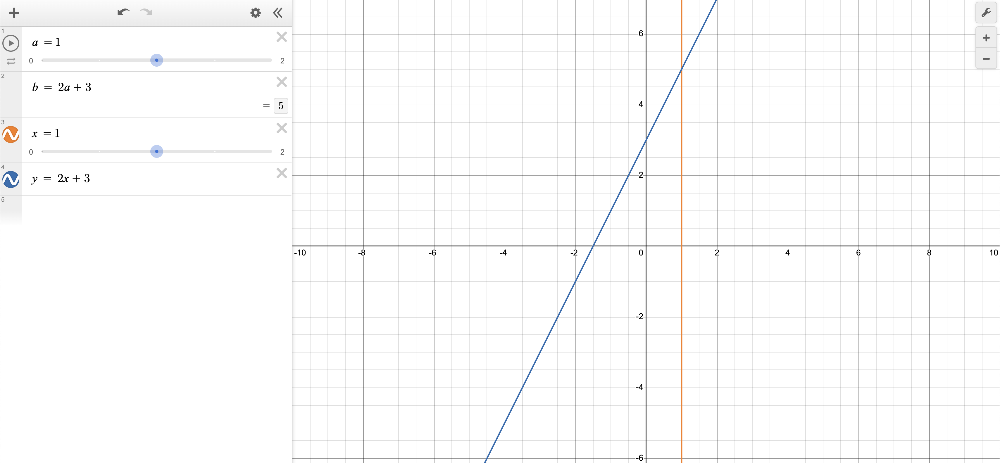
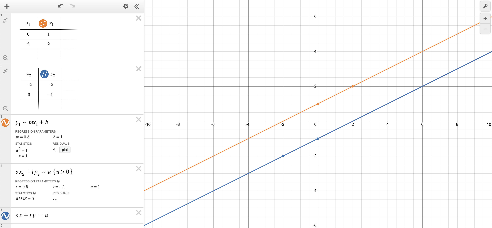
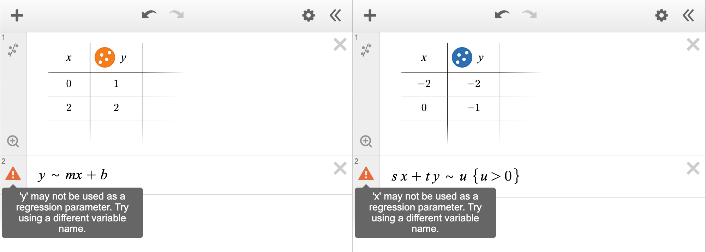

# Key concepts

This document is arranged so that every major concept has a heading associated with it
which begins with `concept::`. For example, if you want to learn about `if` statements,
then you can search for `concept::if`. When a concept involves more than one word,
the words are separated-by-dashes. For example, if you want to learn about `for` loops,
then you can search for `concept::for-loop`. Multiple headings are often given so
that your searches are more likely to succeed. Headings list words in singular, so
searching for `concept::directory` is better than searching for `concept::directories`.

All coding concepts are approached through the Python coding language.


## concept::filename-extension, concept::file-extension, concept::extension

Most filenames end with a period and
a sequence of one or more characters,
e.g. `.pdf`, `.jpg`, and `.mp3`.
These suffixes to the names of computer files are called *filename extensions*.
They are often used to indicate characteristics of the file and/or its intended use,
and so it is always helpful for us to be able to see them...

### Viewing file extensions on MacOS
 - Go to Finder.
 - Choose "Finder > Settings".
 - Click "Advanced".
 - Select "Show all filename extensions".

### Viewing file extensions on Windows 10
 - Go to File Explorer.
 - Choose the "View" tab.
 - Select "File name extensions" (in the "Show/hide" group).

### Viewing file extensions on Windows 11
 - Go to File Explorer and maximize the window.
 - Select "View".
 - Select "Show > File name extensions".


## concept::txt, concept::csv, concept::bmp, concept::jpg, concept::png, concept::pdf, concept::wav, concept::aiff, concept::flac, concept::mp3, concept::m4a, concept::mp4, concept::mov, concept::html, concept::py, concept::ipynb

Here are some common file extensions.
Do not worry if you have not encountered them all.

|  Extension              | Purpose                                                                                                 |
| ----------------------: | :------------------------------------------------------------------------------------------------------ |
|  `.txt`                 | Text file consisting of plain text (no formatting)                                                      |
|  `.csv`                 | Text file containing tabular data where columns are separated by commas                                 |
|  `.bmp`, `.jpg`, `.png` | Image file                                                                                              |
|  `.pdf`                 | Nicely formatted documents which can include text and images                                            |
|  `.wav`                 | Uncompressed audio (originated on Microsoft Windows)                                                    |
|  `.aiff`                | Uncompressed audio (originated on Apple Macintosh)                                                      |
|  `.flac`                | Compressed (lossless) audio file                                                                        |
|  `.mp3`                 | Compressed (lossy) audio file                                                                           |
|  `.m4a`                 | A container for audio files allowing storage of ALAC (lossless compression) and AAC (lossy compression) |
|  `.mp4`                 | Digital multimedia container format (video and audio)                                                   |
|  `.mov`                 | QuickTime file format (originated on Apple Macintosh)                                                   |
|  `.html`                | Document designed to be displayed in a web browser                                                      |
|  `.py`                  | Python script file                                                                                      |
|  `.ipynb`               | Interactive Python NoteBook file                                                                        |
|  `.zip`                 | An archive file format that supports lossless data compression                                          |


## concept::directory, concept::folder

Files on your computer are organized into *directories*.
For example, it is common for computers to have directories called
`Documents`, `Music`, `Pictures`, and `Downloads` within a directory
associated with the user of the computer.

It is possible to navigate through these directories using the
the Terminal on Mac or the Command Prompt on Windows. However,
you are most familiar with navigating through them using Finder
on Mac or the File Explorer on Windows. In this case, they appear
graphically as *folders* which you can double-click on to view
their contents.


## concept::path, concept::file-path, concept::filepath, concept::absolute-path, concept::relative-path

Given a file on your computer. You can repeatedly ask:

> "In what directory does this exist?"

Eventually, the answer to this question will be:

> "The root directory."

This is the top-most directory in a computer's filesystem.
The *path* of the original file stores the answers to all these questions.

 - Suppose the file is called `solutions.txt`,
 - that it is contained in a directory called `HW-1`,
 - that this directory is contained in a directory called `0-Homework-Assignments`,
 - that this directory is contained in a directory called `PIC-1`,
 - that this directory is contained in a directory called `UCLA-Classes`,
 - that this directory is contained in a directory called `Documents`,
 - that this directory is contained in a directory called `YOUR_NAME`,
 - that this directory is contained in a directory called `Users`,
 - and that this directory is contained in the root directory.

Then the path of your file is `/Users/YOUR_NAME/Documents/UCLA-Classes/PIC-1/0-Homework-Assignments/HW-1/solutions.txt`.
Similarly, the folder `HW-1` has the path `/Users/YOUR_NAME/Documents/UCLA-Classes/PIC-1/0-Homework-Assignments/HW-1`.
Both of these are *absolute paths* because they start at the root directory.

When using Finder on Mac or File Explorer on Windows,
your *current working directory* is listed at the top.
It can be convenient to give *relative paths*
relative to this current working directory.
For example, if we are working within the `PIC-1` directory, then
the path of the file `solutions.txt` relative to `PIC-1` is `./0-Homework-Assignments/HW-1/solutions.txt` and
the path of the directory `HW-1` relative to `PIC-1` is `./0-Homework-Assignments/HW-1`.

By analogy, you might like to imagine giving
your best alien friend the directions
to the In-N-Out closest to us:
`/Observable Universe/Laniakea Supercluster/Virgo Supercluster/Local Group/Milky Way Galaxy/Orion Arm/Solar System/Planet Earth/North America/United States of America/California/Los Angeles/Westwood/Gayley Ave/922`.
If they call you and tell you that they are already in Los Angeles,
you can give them directions from `Los Angeles` instead:
`./Westwood/Gayley Ave/922`.
If you believe that addresses are useful,
then you understand why paths are useful!


## concept::find, concept::replace, concept::find-and-replace, concept::find-and-replace-options

Find and Replace are two particularly useful features of Sublime Text (and other text editors).
 - We can use *find* on a piece of text to jump to particular parts of it and
   to count how many times a specified piece of text shows up.
    - Either select "Find > Find..."
    - or use the keyboard shortcut "command + F" on MacOS or "ctrl + F" on Windows.
 - We can use *replace* to change any found text
   to some other specified text.
    - Either select "Find > Replace..."
    - or use the keyboard shortcut "command + option + F" on MacOS or "ctrl + H" on Windows.
 - We can use *replace all* to change
   all occurrences of some looked-for text
   to some other specified text.

Sublime Text provides various find and replace options using the buttons at the bottom,
next to where you type what you would like to find.
 - `.*` enables searching for
   *[regular expressions](https://en.wikipedia.org/wiki/Regular_expression){:target="_blank"}*. 
   These provide clever ways to match text. As examples...
    - `uc[u,c,a,g]` allows one to search for
      `ucu`, `ucc`, `uca`, and `ucg`
      simultaneously using a single search.
    - `\n` allows one to search for the new line character;
    - `.{3}` allows one to search for groups of three characters.

 - `Aa` enables *case sensitivity*.
   ```
   The cat on the mat by the window saw the bird on the branch of the tree in the garden.
   ```
   - Turned off, `the` will be found seven times in the sentence above.
   - Turned on, `the` will be found six times in the sentence above
     since the first occurence has a capital `T`.

 - The quotes enable searching for *whole words*.
   ```
   Yesterday, there was a cat on the mat by the window.
   ```
   - Turned off, `the` will be found three times in the sentence above.
   - Turned on, `the` will be found two times in the sentence above
     since the first occurence is part of the word `there`.

 - One can specify whether to *wrap*
   (go back to the first result
   after the last result) and
   whether to *highlight matches*.

 - The *in selection* option does not work very well
   and I suggest that you ignore it.

 - When replacing, one can select `AB` to *preserve cases*.
   ```
   Test test
   ```
   - With case sensitivity turned off
     and preserve cases turned off,
     finding `test` and replacing all with
     `tester` gives `tester tester`.
   - With case sensitivity turned off
     and preserve cases turned on,
     finding `test` and replacing all with
     `tester` gives `Tester tester`.


## concept::math, concept::sentence, concept::period

The following is a reasonable and correct sentence concerning
the solution to a quadratic equation.

If $a$, $b$, $c$, and $x$ are numbers
and $ax^2 + bx + c = 0$,
then $x = \frac{-b + \sqrt{b^2 - 4ac}}{2a}$
or $x = \frac{-b - \sqrt{b^2 - 4ac}}{2a}$.

 - There are commas after $a$, $b$, $c$, and $0$.
 - There is a period after the last mathematical expression
   because the sentence ends with this expression.
 - The commas and the period are not a part of the math.
 - When discussing math,
   one should still adhere to the usual rules of grammar.


## concept::desmos, concept::desmos-graphing-calculator, concept::desmos-x, concept::desmos-y

Desmos is a graphing calculator. Since it draws graphs in the $xy$-plane,
the variables $x$ and $y$ behave differently to other variables like $a$ and $b$.
(Due to polar coordinates, $r$ and $\theta$ also behave differently.)



For $a$ and $b\ldots$
 - Typing $a\ =\ 1$ creates a variable called $a$, gives it the value $1$,
   and produces a slider for changing its value.
 - Typing $b\ =\ 2a\ +\ 3$ creates a variable called $b$.
   $b$ will originally have the value $5$ because $2\cdot 1\ +\ 3 = 5$.
   As we change the value of $a$ via typing or through the slider,
   $b$'s value will update according to the formula $b\ =\ 2a\ +\ 3$.
 - **WARNING.** This is very different behavior to the variables
   we will learn about in Python for storing integers,
   numbers with a fractional part, and sequences of characters.

For $x$ and $y\ldots$
 - Typing $x\ =\ 1$ draws a vertical line consisting of all points with coordinates like $(1,\ y)$
   and produces a slider so that we can slide between other vertical lines.
 - Typing $y\ =\ 2x\ +\ 3$ draws the line consisting of all points with coordinates like $(x,\ 2x\ +\ 3)$.
   Changing the equation $x\ =\ 1$ has no impact on the line drawn by $y\ =\ 2x\ +\ 3$.
   This is very different to the behavior described for $b$ above.


## concept::desmos-superscript

  - The `^` key (`shift + 6`) will allow you to start typing a *superscript*.
  - To exit typing superscripted text, you will need to press the right arrow key `→`.


## concept::desmos-subscript

  - An underscore `_` will allow you to start typing a *subscript*.
  - To exit typing subscripted text, you will need to press the right arrow key `→`.


## concept::desmos-fitting, concept::desmos-fitting-x-error, concept::desmos-fitting-y-error, concept::desmos-fitting-error

In Desmos, a tilde `~` (next to `1` on US keyboards and
next to `z` on British keyboards) is used to perform
[curve fitting](https://en.wikipedia.org/wiki/Curve_fitting){:target="_blank"}.
We often talk about Desmos *learning* values
because algorithms which perform curve fitting
are some of the earliest machine learning algorithms!
The tilde `~` tells Desmos to learn the values of any variables that
it has not already encountered (by using regression techniques).
The above remarks about $x$ and $y$ have
a consequence when learning with tilde `~`.

 - If we make two tables,
   the first using column headings $x_1$ and $y_1$,
   the second using column headings $x_2$ and $y_2$,
   then we can learn values for $m$ and $b$, and
   $s$, $t$, and $u$ by typing the following expressions.

   - $y_1\ \sim\ m x_1\ +\ b$
   - $s\ x_2\ +\ t\ y_2\ \sim\ u\ \\{u>0\\}$

   Desmos successfully learns about two lines.
   

 - Using $x$ and $y$ in place of $x_1$ and $y_1$      gives an error.
   Using $x$ and $y$ in place of $x_2$ and $y_2$ also gives an error.
   

 - **These are our first programming errors!**
   A programmer encounters many errors during their life,
   so we should celebrate this important moment!!
   We have learned that we are not allowed to use $x$ and $y$
   when we are using tilde `~` to perform curve fitting.


## concept::desmos-fitting-quadratic

There are two steps
to fitting a *quadratic curve* to a set of $(X,\ Y)$ pairs.

 - Make a table containing at least three $(X,\ Y)$ pairs.
 - Type $Y\ \sim\ a X^2\ +\ b X\ +\ c$ in a new cell to learn $a$, $b$, and $c$ and to plot the *parabola*.


## concept::desmos-fitting-circle

There are three steps
to fitting a circle to a set of $(X,\ Y)$ pairs.

 - Make a table containing at least three $(X,\ Y)$ pairs.
 - Type $(X\ -\ x_0)^2\ +\ (Y\ -\ y_0)^2\ \sim\ r_0^2$ in a new cell to learn $x_0$, $y_0$, and $r_0$.
 - Type $(x\ -\ x_0)^2\ +\ (y\ -\ y_0)^2\    =\ r_0^2$ in a new cell to plot the circle.

If there is more than one circle,
then you will need to use subscripts for each $X$ and $Y$,
and you will need to use more informative subscripts than $0$ for $x_0$, $y_0$, and $r_0$.
For an example, see the [second Desmos example](./2-Desmos/2-2.md){:target="_blank"}.


## concept::desmos-fitting-constraints

You can add learning *constraints* using curly brackets $\\{ \\}$.
For example, when fitting a circle, by typing
<div>
  \[
    (X\ -\ x_0)^2\ +\ (Y\ -\ y_0)^2\ \sim\ r_0^2\ \ \ \ \{r_0 > 0\}
  \]
</div>

you will ensure that Desmos learns a positive $r_0$.
In some applications, constraining learned values is essential in order
to avoid solutions that do not make sense to the problem being solved.
For an example, see the [rings of Saturn exercise](./2-Desmos/2-3e-rings.md).

For another example,
[this instance of Desmos](https://www.desmos.com/calculator/e1ygxp8z65){:target="_blank"}
may be helpful.
 - $x^2\ =\ 1$ describes two vertical lines.
 - $y^2\ =\ 1$ describes two horizontal lines.
 - $x^2\ +\ y^2\ =\ 2$ describes a circle of radius $\sqrt{2}$.
 - All of these graphs pass through the points $(1,\ 1)$, $(1, -1)$, $(-1,\ 1)$, and $(-1, -1)$.


## concept::desmos-conventions

Throughout our Desmos examples, we adopt the following conventions.

| Type of quantity | Variables used                                                             |
| ---------------: | :------------------------------------------------------------------------- |
|        Data      | Capitalized letters                                                        |
|     Learned      | Lowercase, not $x$, $y$ or $r$, but subscripted $x$, $y$, and $r$ are fine |
|     Plotted      | $x$, $y$ (in pairs that make a specified equation true)                    |

**These conventions concern the naming of quantities.
Naming quantities carefully and clearly is a very important skill in programming.
By naming variables carefully, you will minimize other people's confusion,
and most importantly, you will minimize your own confusion.**

Here, we provide some justification for our conventions.
Different people may prefer other conventions.
However, when writing an expository document,
it is most important to be consistent,
and hopefully those who prefer other
conventions respect our consistency.
**When writing code, consistency is just as important,
so understanding our thought process may be useful to you.**

In the [first Desmos example](./2-Desmos/2-1.md){:target="_blank"},
we could have used $x_1$ and $y_1$ instead of $X$ and $Y$.
 - By using $X$ and $Y$, we avoided having to use subscripts and
   we avoided the error that using $x$ and $y$ would have produced.
 - We think our equations look nicer. Which do you prefer?
   The first equation or the second equation?
   <div>
     \[Y\   \sim\ a X^2\   +\ b X\   +\ c\ \ \ \ \ \ \ \ \ \ \ \ 
       y_1\ \sim\ a x_1^2\ +\ b x_1\ +\ c\]
   </div>
 - Finally, $a$, $b$, and $c$ are being learned by Desmos whereas
   $X$ and $Y$ label data being entered by us, the users of Desmos.
   The different cases serve as a quick reminder to ourselves
   of the different roles of $X$, $Y$, $a$, $b$, and $c$.

These type of issues become more significant in the
[second Desmos example](./2-Desmos/2-2.md){:target="_blank"}.
When working with the pepperoni pizza,
we need to consider three types of values.
 1. Coordinates of points on the boundary of the pizza entered by us.
 2. Coordinates of the center of the pizza learned by Desmos.
 3. Coordinates of points on the boundary of the pizza drawn by Desmos.

Coordinates consist of an $x$- and $y$-coordinate.
 - Do you want to name an $x$-coordinate by a letter other than $x$ or $X$?
 - Do you want to name a  $y$-coordinate by a letter other than $y$ or $Y$?
 - These are leading questions because the people writing this answered "no"
   to both questions. Someone else might argue that points on the boundary
   and the center point feel different in nature. They might want us to
   label the center using $a$ and $b$, or $c$ together with some subscripts.
   Because $a$, $b$, and $c$ show up in the
   [tilt of Saturn exercise](./2-Desmos/2-3f-tilt.md)
   in a different context, this choice did not seem like the best one to us.

If the remarks above convince you to label
$x$-coordinates with the letters $x$ and $X$ and
$y$-coordinates with the letters $y$ and $Y$,
then we now have to distinguish the different appearances of these letters.
We have no choice over what to call the coordinates that Desmos draws (3) because
Desmos mandates that we use $x$ and $y$ for these coordinates.
For (1) and (2), subscripts are a possibility.
Desmos does not allow subscripts to be very complicated,
but perhaps $x_{boundarypepperoni}$ and $x_{centerpepperoni}$
seem like acceptable choices to you for $x$-coordinates.
Since capitals already worked out nicely in the first example for avoiding
unnecessary subscripts, $X_{pepperoni}$ and $x_{pepperoni}$ seemed like
good choices to us. One just has to remember that $X_{pepperoni}$
corresponds to the data we provide, that is, points on the boundary,
and that $x_{pepperoni}$ is learned by Desmos,
and so it corresponds to the center.
These decisions also have the nice consequence
that the equation of a circle is written
completely in lowercase as is most common.

Finally, using $x_1$, $x_2$, $x_3$, and $x_4$ in place of
$X_{pepperoni}$, $x_{pepperoni}$, $X_{mushroom}$, and $x_{mushroom}$
felt totally unacceptable to us. **It would have been much too easy to
make an error that was very difficult to track down.** On the other hand,
mistyping $pepperoni$ or $mushroom$ is easily noticed and fixed.


## concept::wikipedia

We have used [Wikipedia](https://www.wikipedia.org/){:target="_blank"}
as a reference a number of times in this course.
As with any other resource, the truth of Wikipedia should be questioned.
For example, articles about people can be edited in defamatory ways.
However, mathematical articles are normally edited by mathematicians who
do not have hidden agendas; they simply want to share mathematics with others.
Of course, some pages may have errors, but in our experience, these are rare.
Most of the pages shared in this course are only shared with you
to encourage you to explore a topic further, if you find it interesting.
If you track down inaccuracies because you read very carefully about a topic,
this is a positive outcome! In any case, Wikipedia is currently much more
reliable than ChatGPT when it comes to mathematics and computer science!


## concept::sheets, concept::table

In [Google Sheets](https://docs.google.com/spreadsheets){:target="_blank"},
*tables* are convenient because they allow one
to specify *datatypes* for each column.
After selecting a collection of cells,
you can select `Format > Convert to table`
from the top menu.
Using the arrows in the column headings,
you can select `Edit column type`
to select the appropriate datatype.


## concept::sheets, concept::filter

When using spreadsheets,
*filters* allow us to focus
on a subset of our data.

You can create a *filter view* as follows.
 - Click on the calculator to the right of the table heading.
 - Click `Create filter view`.
 - Click `Save view`.
 - Name the view.
 - Click `Save`.

You can apply a filter as follows.
 - Click the filter icon to the right of the column name.
   It is supposed to look like a [funnel](https://en.wikipedia.org/wiki/Funnel#/media/File:Kitchen_Funnel.jpg){:target="_blank"}.
 - Choose the desired settings for the filter.
 - Click `OK`.

You can exit a filter view as follows.
 - Click on the calculator to the right of the table heading.
 - Click `Exit view`.


## concept::sheets, concept::pivot-table

When using spreadsheets,
*pivot tables* allow us to display our data in different ways
to highlight the information that concerns us the most.
You can create one as follows.

 - Make sure to exit any filter views.
 - Click anywhere on the original table.
 - Select `Insert > Pivot table` from the top menu.
 - Click `Create`.
 - Ponder what you want the rows and/or columns to be,
   and what information you would like to be displayed.
 - Upon making such decisions, you can click `Add`
   next to a heading in the *pivot table editor*
   that says **Rows**, **Columns**, or **Values**,
   and make your chosen selections.


## concept::sheets, concept::formula

In a spreadsheet,
one can begin a formula by typing `=`.
 - By typing `= A1 * B1` into cell `C1`,
   we make sure that `C1` calculates the product
   of the values contained in cells `A1` and `B1`.
 - By typing `= SUM(A1: A10)` into `A11`,
   we make sure that `A11` calculates the
   sum of the values contained in cells
   `A1`, `A2`,  `A3`, ..., `A10`.

When typing a formula,
you can also select cells with your mouse.
 - To arrive at the formula `= A1 * B1` in cell `C1`...
   - Click on cell `C1`.
   - Type `=`.
   - Click on cell `A1`.
   - Type `*`.
   - Click on cell `B1`.
   - Hit `ENTER`.
 - To arrive at the formula `= SUM(A1: A10)` in cell `A11`...
   - Click on cell `A11`.
   - Type `= SUM()`.
   - Press `←` to go back to between the parentheses.
   - Highlight cells `A1` to `A10`.
   - Hit `ENTER`.


## concept::sheets, concept::formula-and-dollar, concept::formula-dollar

A formula from one cell can be used to create formulae in other cells
by hovering the mouse where the blue circle is until a cross (+) appears,
and then clicking and dragging.

 - Suppose that columns `B` and `C` contain some data.
 - To fill column `A` with the numbers 1, 2, 3,...
   - Type 1 into `A1`.
   - Type 2 into `A2`.
   - Highlight `A1` and `A2`.
   - Hover your mouse where the blue circle is:
     at the bottom-right of the highlighted region.
     A cross (+) will appear.
   - Click and drag down to where you like.
 - When using a formula...
   - As we drag it into new columns
     `A`s will change to `B`s,
     `B`s to `C`s, `C`s to `D`s,
     and so on.
   - As we drag it into new rows
     `1`s will change to `2`s,
     `2`s to `3`s, `3`s to `4`s,
     and so on.
   - We can prevent such changes using `$`s.
     If we type `= SUM(B$1:B1) / $A1` into `D1` and drag it to `E8`,
     `E8` will contain the formula `= SUM(C$1:C8) / $A8` so that
     `$A` has remained as `$A`,
     `$1` has remained as `$1`,
     but the `B`s (without `$`s)
     have changed to `C`s and
     the `1`s without a `$`s
     have changed to `8`s.


## concept::sheets, concept::datatype, concept::text

In [Google Sheets](https://docs.google.com/spreadsheets){:target="_blank"},
when a cell's datatype is *text*,
it can store up to 50,000 characters.

 - Characters from the English alphabet are allowed.
 - All the digits (0 to 9) are allowed.
 - Some special characters like spaces are allowed too.


## concept::sheets, concept::datatype, concept::number

In [Google Sheets](https://docs.google.com/spreadsheets){:target="_blank"},
when a cell's datatype is *number*,
it can store many numerical values.
However,
there are limitations to which numbers can
be stored and which numbers can be entered.

We can use *numbers* for arithmetic. However,
the accuracy of arithmetic is not always perfect.
In many applications, this lack of precision can be ignored,
but this issue can matter much more than you might expect.


## concept::sheets, concept::to_text, concept::value

 - Any *number* can be used to produce some *text*
   by using the `TO_TEXT` function.
 - We can use a function called `VALUE`
   to attempt to obtain a *number*
   from some *text*.
   This will only work when
   the text is appropriately numeric.


## concept::sheets, concept::pow, concept::left

 - `POW` is a function that accepts two *numbers* $c$ and $d$.
   `POW(c, d)` calculates $c^d$. For example, typing
   `= POW(2, 3)` into a cell will calculate $2^3 = 8$.
 - `LEFT` is a function that accepts *text*
   and gives the left-most character.


## concept::unicode, concept::characters

[Unicode](https://en.wikipedia.org/wiki/Unicode){:target="_blank"} is a
[list of over 140,000 characters](https://en.wikipedia.org/wiki/List_of_Unicode_characters){:target="_blank"}
together with their "code points".


## concept::string, concept::characters

A *string* is a sequence of unicode characters.
In most programming languages one can specify a *string*
by typing a sequence of characters between double quotes.
For example, in Python,
`"a sequence of characters"`
is a string of length 24.

Python provides a few different ways to create strings.
 - `'A string created using single quotes.'`
 - `"A string created using double quotes."`
 - `"""A string created using three double quotes."""`

To see the benefits of each, consider the following three pieces of text.

1. Someone said, "I like single quotes." Good for them!

2. Double quotes are someone else's favorite.

3. One person likes single quotes.<br>
   Another likes double quotes.<br>
   What about the person who likes new lines?


Let's see how we can create strings containing these characters.

1. First example.
   - `'Someone said, "I like single quotes." Good for them!'`
   - `"Someone said, \"I like single quotes.\" Good for them!"`<br>
     Because double quotes are used to start and end the string,
     the double quotes in the string need to be specified
     using a backslash: `\"`.
   - `"""Someone said, "I like single quotes." Good for them!"""`

2. Second example.
   - `'Double quotes are someone else\'s favorite.'`<br>
     Because single quotes are used to start and end the string,
     the single quote in the string needs to be specified
     using a backslash: `\'`.
   - `"Double quotes are someone else's favorite."`
   - `"""Double quotes are someone else's favorite."""`

3. Third example.
   - `'One person likes single quotes.\nAnother likes double quotes.\nWhat about the person who likes new lines?'`<br>
     The new line character needs to be typed as `\n`.
   - `"One person likes single quotes.\nAnother likes double quotes.\nWhat about the person who likes new lines?"`<br>
     The new line character needs to be typed as `\n`.
   - `"""One person likes single quotes.`<br>
     `Another likes double quotes.`<br>
     `What about the person who likes new lines?"""`<br>
     The new line character can be typed normally as a new line by pressing `ENTER`.


## concept::charset, concept::encoding

When you store text in a `.txt` file,
an *encoding* is used to translate
between characters and bytes,
what the file really consists of.

For an example,
suppose that files called
`1.txt`, `2.txt`, and `3.txt`
each store the following text.

!\\$<br>
\\$!<br>
$\mathbb{Z}$

A *byte* can be understood as a value between 0 and 255.

1. If `1.txt` is encoded with
   [UTF-8](https://en.wikipedia.org/wiki/UTF-8){:target="_blank"},
   then the following 9 bytes are used.
   <div>
     \[ 33\ 36\ 10\ 36\ 33\ 10\ 226\ 132\ 164 \]
   </div>

   - ! is encoded using the byte 33.
   - $ is encoded using the byte 36.
   - The new line character is encoded using the byte 10.
   - $\mathbb{Z}$ is encoded using the three bytes 226 132 164.

2. If `2.txt` is encoded with
   [UTF-16-LE](https://en.wikipedia.org/wiki/UTF-16#Byte-order_encoding_schemes){:target="_blank"},
   then the following 14 bytes are used.
   <div>
     \[ 33\ 0\ 36\ 0\ 10\ 0\ 36\ 0\ 33\ 0\ 10\ 0\ 36\ 33 \]
   </div>

   - ! is encoded using the two bytes 33 0.
   - $ is encoded using the two bytes 36 0.
   - The new line character is encoded using the two bytes 10 0.
   - $\mathbb{Z}$ is encoded using the two bytes 36 33.

3. If `3.txt` is encoded with
   [UTF-16-BE](https://en.wikipedia.org/wiki/UTF-16#Byte-order_encoding_schemes){:target="_blank"},
   then the following 14 bytes are used.
   <div>
     \[ 0\ 33\ 0\ 36\ 0\ 10\ 0\ 36\ 0\ 33\ 0\ 10\ 33\ 36 \]
   </div>

   - ! is encoded using the two bytes 0 33.
   - $ is encoded using the two bytes 0 36.
   - The new line character is encoded using the two bytes 0 10.
   - $\mathbb{Z}$ is encoded using the two bytes 33 36.

4. Notice that 33 encodes ! in UTF-8 and that
   it shows up as part of the encoding of
   ! and $\mathbb{Z}$ in UTF-16.

   Notice that 36 encodes \\$ in UTF-8 and that
   it shows up as part of the encoding of
   \\$ and $\mathbb{Z}$ in UTF-16.

   Therefore, opening a file using the wrong encoding
   could produce text that looks very different to intended!

In this course, we will not consider encodings carefully,
but just in case it is necessary for you to specify
a *charset* or an *encoding* at some point,
we want you to know that `'utf-8'`
is the most common character encoding,
and it is normally best to choose this option.
UTF-8 is able to encode all [unicode](https://en.wikipedia.org/wiki/Unicode){:target="_blank"} characters,
and the most common characters ([ASCII](https://en.wikipedia.org/wiki/ASCII#Character_set){:target="_blank"})
are encoded using only one byte.


## concept::print

`print` is likely to be the first function you use in Python.
 - By default, new lines are printed after the arguments that you provide.
   You can change this by using `end = ` (see below).
 - By default, multiple arguments are each seperated by a single space.
   You can change this by using `sep = ` (see below).

For example, consider the following code.
```python
print('Testing...')
print('1, 2')
print()
print('1 + 2 is equal to', 1 + 2, 'and 4 + 5 is equal to', 4 + 5)
print()
print('Some great sportspeople:', end = ' ')
print('Carlos Alcaraz', 'Max Verstappen', 'Serena Williams', sep = ', ')
```

When it executes, the output is as follows.
```
Testing...
1, 2

1 + 2 is equal to 3 and 4 + 5 is equal to 9

Some great sportspeople: Carlos Alcaraz, Max Verstappen, Serena Williams
```

Notice that the sportspeople are on the same line as the word "sportspeople" thanks to `end = ' '`
and that they are each separated by a comma and a space thanks to `sep = ', '`.


## concept::comment

*Comments* allow you to explain your code to other humans including your future self.
In Python, after typing `#`, the rest of the line will be ignored by the interpreter.
For example, consider the following code.
```python
print('Line 1')
# Line 2. Since this line is a comment, it will not produce output (or an error).
print('Line 3')
print('Line 4') # Since this is a comment, it will not produce further output.
```

When it executes, the output is as follows.
```
Line 1
Line 3
Line 4
```


## concept::int, concept::arithmetic, concept::comparison

The *numeric type* `int`
is for storing integers.
`int`s allow arithmetic
like `+`, `*`, `-`, `/`
and we can calculate
$2^3 = 2\times 2\times 2$ and $3^2 = 3\times 3$
by typing `2 ** 3` and `3 ** 2`, respectively.
For example, consider the following code.
```python
print('1 + 2 is', 1 + 2)
print('3 * 4 is', 3 * 4)
print('5 - 6 is', 5 - 6)
print('7 / 8 is', 7 / 8)
print()

print('2 ** 3 is', 2 ** 3)
print('3 ** 2 is', 3 ** 2)
print('2 ** 63 is', 2 ** 63)
```

When it executes, the output is as follows.
```
1 + 2 is 3
3 * 4 is 12
5 - 6 is -1
7 / 8 is 0.875

2 ** 3 is 8
3 ** 2 is 9
2 ** 63 is 9223372036854775808
```

In many programming languages,
integer datatypes impose constraints
on the integers than can be stored,
but in Python, the `int` data type
has no such limitations. For example,
it has no issues calculating $2^{63}$
(recall [how Google Sheets handles *numbers*](./3-Spreadsheets/3-4-pow2.html#the-text-datatype-and-the-number-datatype){:target="_blank"}).

We can also compare `int`s using
`==` (equals),
`!=` (not equal),
`<` (less than),
`>` (greater than),
`<=` (less than or equal to),
and `>=` (greater than or equal to).
For example, consider the following code.
```python
print('0 == 1 is', 0 == 1)
print('0 != 1 is', 0 != 1)
print('1 + 2 <= 2 is', 1 + 2 <= 2)
print('1 + 2 <= 3 is', 1 + 2 <= 3)
print('1 + 2 <= 4 is', 1 + 2 <= 4)
print('1 < 2 is', 1 < 2)
print('1 < 2 < 3 is', 1 < 2 < 3)
print('4 > 5 is', 4 > 5)
```

When it executes, the output is as follows.
```
0 == 1 is False
0 != 1 is True
1 + 2 <= 2 is False
1 + 2 <= 3 is True
1 + 2 <= 4 is True
1 < 2 is True
1 < 2 < 3 is True
4 > 5 is False
```

`True` and `False` are called *booleans*.
See [concept::boolean](#conceptbool-conceptboolean-conceptequals-conceptequal-to-concept) for more information.


## concept::list, concept::len, concept::length-of-a-list, concept::length-of-list

*Lists* keep track of a collection of objects in a sequential order.
You can ask for a *list*'s length using `len`.
For example, consider the following code.
```python
print([1, 1, 2, 3, 5, 8])
print(len([1, 1, 2, 3, 5, 8]))
```

When it executes, the output is as follows.
```
[1, 1, 2, 3, 5, 8]
6
```

## concept::min, concept::max, concept::sum 

When we have a *list* of `int`s (or some other numeric type),
we can ask for the minimum, maximum, and sum of its elements
using functions `min`, `max`, and `sum`, respectively.
For example, consider the following code.
```python
print('min:', min([1, 1, 2, 3, 5, 8]))
print('max:', max([1, 1, 2, 3, 5, 8]))
print('sum:', sum([1, 1, 2, 3, 5, 8]))
```

When it executes, the output is as follows.
```
min: 1
max: 8
sum: 20
```


## concept::variable, concept::assignment, concept::assign, concept::=

 - *Variables* allow us to store values and
   to give descriptive names to useful quantities.
 - We can update the value stored by a variable using the *assignment operator* `=`.
   The assignment operator updates the value of a variable written on the left side
   of it by evaluating the expression written on the right side of it.


### Example 1

For example, consider the following code
which is related to [a previous spreadsheet exercise](./3-Spreadsheets/3-4-pow2.md){:target="_blank"}.
```python
# a value to experiment with...
n = 63

# calculate two to the n as an int and a string...
two_tt_n = 2 ** n
two_tt_n_str = str(two_tt_n)

# calculate the first digit of two to the n as a string and an int...
fst_dig_two_tt_n_str = two_tt_n_str[0]
fst_dig_two_tt_n = int(fst_dig_two_tt_n_str)

# print the result of the calculation...
print('The first digit of 2 to the', n, 'is', fst_dig_two_tt_n)
```
We use `str` to create a *string* from an `int`,
`int` to create an `int` from a *string*,
and `two_tt_n_str[0]` to obtain
the first character of `two_tt_n_str` (see [concept::string-index](#conceptstring-index-conceptlist-index-conceptindex)).
When the code executes,

 - `n` stores the `int` `63`,
 - `two_tt_n` stores the `int` `9223372036854775808`,
 - `two_tt_n_str` stores the *string* `'9223372036854775808'`,
 - `fst_dig_two_tt_n_str` stores the *string* `'9'`,
 - `fst_dig_two_tt_n` stores the `int` `9`,

and so the output is as follows.
```
The first digit of 2 to the 63 is 9
```


### Example 2

As another example, the following code produces the same output as Example 1.
```python
n = 63

a = 2 ** n
a = str(a)
a = a[0]
a = int(a)

print('The first digit of 2 to the', n, 'is', a)
```

When it executes,
 - `n` stores the `int` `63`,
 - after `a = 2 ** n`, `a` stores the `int` `9223372036854775808`,
 - after `a = str(a)`, `a` stores the *string* `'9223372036854775808'`,
 - after `a = a[0]`, `a` stores the *string* `'9'`,
 - after `a = int(a)`, `a` stores the `int` `9`.


### Comparing the examples

The first example is a little bit nicer to read
because the variables are named descriptively
and the type of each variable never changes.
In the second example,
`a` is not a very descriptive name
and `a` starts life as an `int`,
dynamically changes to a *string*,
and then back to an `int`.
Some programmers might look
upon this code with disdain.


## concept::assign-arithmetic, concept::+=

Assignment and arithmetic combine to give `+=`, `*=`, `-=`, and `/=`.
For example, consider the following code.
```python
i = 2
print('i:', i)

i += 5
print('i:', i)

i *= 4
print('i:', i)

i -= 20
print('i:', i)
```

When it executes, the output is as follows.
```
i: 2
i: 7
i: 28
i: 8
```

- `i = 2` makes `i` store `2`. 
- `i += 5` adds `5` to `i` so that `i` stores `7`.
- `i *= 4` multiplies `i` by `4` so that `i` stores `28`.
- `i -= 20` subtracts `20` from `i` so that `i` stores `8`.


## concept::bool, concept::boolean, concept::equals, concept::equal-to, concept::==

The datatype `bool`, the boolean data type, is named after
[George Boole](https://en.wikipedia.org/wiki/George_Boole){:target="_blank"}.
Booleans have one of two possible values: `False` and `True`.
Very frequently, booleans are obtained as the result of comparisons.
For example, consider the following code.
```python
b = False
print(b)

b = (2 + 2 == 5)
print(b)

b = ('2' + '34' == '234')
print(b)

b = (1 + 2 < 4)
print(b)

b = (len([1, 1, 2, 3, 5, 8]) == 6)
print(b)
```

When it executes, the output is as follows.
```
False
False
True
True
True
```

Recall...
 - `=` is the assignment operator and
   it is used to update the value of `b`
   five times in this code.
 - `==` checks two expressions for equality.
   - In the second example, four is not equal to five.
   - In the last example, the length of `[1, 1, 2, 3, 5, 8]` is six.
   - The third example shows that when we use `+` with two *strings*,
     the result is the concatenation of the strings (see [concept::concatenation](#conceptconcatenation)).


## concept::not, concept::and, concept::or

Booleans can produce other booleans
by using the *connectives* `not`, `and`, and `or`.

For example, consider what
a self-driving car does
when turning right at
an intersection
with traffic lights
in the United States.
Note that in the United States,
one can turn right during a red light
as long as there is not a sign
prohibiting doing so. Therefore,
you might have booleans called
`things_to_hit`, `green_light`,
and `no_right_turn_on_red`, and
it would be useful to specify
another boolean as follows.
```python
go = (not things_to_hit) and (green_light or not no_right_turn_on_red)
```
The following table shows how
the value of `go` depends on
the values of `things_to_hit`,
`green_light`, and `no_right_turn_on_red`.

| `things_to_hit` | `green_light` | `no_right_turn_on_red` |   `go`   |
| :-------------: | :-----------: | :--------------------: | :------: |
|     `True`      |    `True`     |         `True`         |  `False` |
|     `True`      |    `True`     |         `False`        |  `False` |
|     `True`      |    `False`    |         `True`         |  `False` |
|     `True`      |    `False`    |         `False`        |  `False` |
|     `False`     |    `True`     |         `True`         |  `True`  |
|     `False`     |    `True`     |         `False`        |  `True`  |
|     `False`     |    `False`    |         `True`         |  `False` |
|     `False`     |    `False`    |         `False`        |  `True`  |

The individual rules for `not`, `and`, and `or`
can be expressed by the following tables.

- `not` swaps `True` and `False`.

  |   `b`   | `not b` |
  | :-----: | :-----: |
  | `True`  | `False` |
  | `False` | `True`  |

- `and` produces `True` only when both booleans are `True`.

  |   `b1`   |   `b2`   | `b1 and b2` |
  | :------: | :------: | :---------: |
  |  `True`  |  `True`  |   `True`    |
  |  `True`  |  `False` |   `False`   |
  |  `False` |  `True`  |   `False`   |
  |  `False` |  `False` |   `False`   |

- `or` produces `False` only when both booleans are `False`.

  |   `b1`   |   `b2`   | `b1 or b2` |
  | :------: | :------: | :--------: |
  |  `True`  |  `True`  |   `True`   |
  |  `True`  |  `False` |   `True`   |
  |  `False` |  `True`  |   `True`   |
  |  `False` |  `False` |   `False`  |

You can confirm these tables in Python
with the following code.

```python
for b in [True, False]:
  print('not', b, '==', not b)

print()

for b1 in [True, False]:
  for b2 in [True, False]:
    print(b1, 'and', b2, '==', b1 and b2)

print()

for b1 in [True, False]:
  for b2 in [True, False]:
    print(b1, 'or', b2, '==', b1 or b2)
```

This code uses `for` loops (see [concept::for-loop](#conceptfor-conceptfor-loop-conceptcontainer)).
When it executes, the output is as follows.
```
not True == False
not False == True

True and True == True
True and False == False
False and True == False
False and False == False

True or True == True
True or False == True
False or True == True
False or False == False
```

- Notice that `or` is inclusive:
  when `b1` and `b2` are `True`,
  `b1 or b2` is `True`.
  For some English sentences this can sound strange, but
  there are many examples where this usage sounds normal.
  - Provided that there are no things to hit,
    when does a self-driving car turn right
    at an intersection with traffic lights?
    "When the light is green or when there
    is not a no-right-turn-on-red sign"
    seems like a reasonable answer.
    This answer includes the situation
    when the light is green *and* there
    is not a no-right-turn-on-red sign.
  - Also, consider the more mathematical statement,
    "the absolute value of a real number $x$ is equal
    to $x$ or $-x$." This is correct. However, note that
    when $x$ is zero, the absolute value of $x$ is
    also equal to $x$ *and* $-x$.

- "Exclusive or" is `True` when
  exactly one of the booleans given to it is `True`.
  This can be calculated with `!=`.

  |   `b1`   |   `b2`   | `b1 != b2` |
  | :------: | :------: | :--------: |
  |  `True`  |  `True`  |   `False`  |
  |  `True`  |  `False` |   `True`   |
  |  `False` |  `True`  |   `True`   |
  |  `False` |  `False` |   `False`  |


## concept::string-index, concept::list-index, concept::index

Consider the following code.
```python
alphabet = 'abcdefghijklmnopqrstuvwxyz'

print(alphabet[0])
print(alphabet[1])
print(alphabet[2])
print(alphabet[3])
print(alphabet[25])
print(alphabet[len(alphabet) - 1])
print(alphabet[-1])
```

When it executes, the output is as follows.
```
a
b
c
d
z
z
z
```

This tells us the following.
 - `a` is the `0`-th character of `alphabet`.
 - `b` is the `1`-th character of `alphabet`.
 - `c` is the `2`-th character of `alphabet`.
 - `d` is the `3`-th character of `alphabet`.
 - `z` is the `25`-th character of `alphabet`.

In computer science, one starts counting at `0`.
This can cause a confusing ambiguity for the word "first".
Is the first or 1-st character of `alphabet` `a` or `b`?
For this reason, for clarity, some instructors say
zero-th, one-th, two-th, and three-th
even if this sounds a bit weird.
Some instructors also write
`0`-th, `1`-th, `2`-th, and `3`-th
for clarity even if this reads weirdly.

| character | `a` | `b` | `c` | `d` | ... |  `z` |
| --------: | :-: | :-: | :-: | :-: | :-: | :--: |
|     index | `0` | `1` | `2` | `3` | ... | `25` |

The numbers describing the positions in a *string* are referred to as *indices*.
Due to counting from `0` (`0`-indexing), the last element in `alphabet` is given by the index `25` element
even though there are `26` characters. Therefore, if we need to obtain the last character algorithmically,
then we need to use index `len(alphabet) - 1`, not index `len(alphabet)`.
Python allows us to access the last element using the magic index `-1` as well.

We can index *lists* in a similar way.
For example, consider the following code.
```python
L = [3, 5, 7, 13, 23, 17, 19, 23, 37, 61]

print(L[0], L[1], '...', L[7], L[8], L[-1])
```

When it executes, the output is as follows.
```
3 5 ... 23 37 61
```


## concept::concatenation

We can *concatenate* *strings* and *lists* using `+`.
For example, consider the following code.
```python
s1 = 'conc'
s2 = "ate"
s3 = """nate"""

L1 = [3, 5, 7, 13, 23]
L2 = [17, 19, 23, 37, 61]

print(s1 + s2 + s3)
print(L1 + L2)
```

When it executes, the output is as follows.
```
concatenate
[3, 5, 7, 13, 23, 17, 19, 23, 37, 61]
```


## concept::control, concept::control-flow

The simplest bits of code that you encounter execute line-by-line
with each line executing once and only once. *Control flow*
allows us to control the flow of the code! For example,
a line of code may execute more than once or not at all
depending on the values of variables in the code.

There are three common ways to control the flow of code.

 1. `if` statements
    (see [concept::if-no-for-loop](#conceptif-conceptif-statement-conceptif-no-for-loop)
    and [concept::if-with-for-loop](#conceptif-conceptif-statement-conceptif-with-for-loop))
    - You can think of these as turning a block of code on or off.
    - When "on", the lines of code execute **once** (unless wrapped in other control flow).
    - When "off", the lines of code do not execute.

 2. `while` loops (see [concept::while-loop](#conceptwhile-conceptwhile-loop))
    - You can also think of these as turning a block of code on or off.
    - When "on", the lines of code execute **repeatedly**.
    - When "off", the lines of code stop executing.

 3. `for` loops
    - Any code written using a `for` loop can be written with a `while` loop.
      However, `for` loops are normally used...
       - for repeating code a specific number of times (see [concept::range](#conceptfor-conceptfor-loop-conceptrange)) or...
       - for repeating code for each element in a container like a *list* (see [concept::for-loop](#conceptfor-conceptfor-loop-conceptcontainer)).

These constructs are described in a logical and different order below.


## concept::if, concept::if-statement, concept::if-no-for-loop


### Example 1

The following code uses `if` statements to give
useful information to someone learning to drive
based on the status of their surroundings.

```python
things_to_hit = False
green_light = False
no_right_turn_on_red = False

go = (not things_to_hit) and (green_light or not no_right_turn_on_red)

if go:
  print('It is okay to hit the gas!')

if things_to_hit:
  print('It is not okay to go because there are things to hit.')

if no_right_turn_on_red and not green_light:
  print('It is not okay to go because')
  print('there is not a green light and')
  print('there is a no-right-turn-on-red sign.')
```

When the code above executes,
the output is as follows.
```
It is okay to hit the gas!
```

- `print('It is okay to hit the gas!')` executes because `go` is `True`.
  - `things_to_hit` is `False`, so `not things_to_hit` is `True`.
  - `no_right_turn_on_red` is `False`, so `not no_right_turn_on_red` is `True`.
  - `not no_right_turn_on_red` is `True`, so `green_light or not no_right_turn_on_red` is `True`.
  - `not things_to_hit` is `True` and `green_light or not no_right_turn_on_red` is `True`, so `go` is `True`.
- `print('It is not okay to go because there are things to hit.')` does not execute because `things_to_hit` is `False`.
- The remaining 3 print statements do not execute because `no_right_turn_on_red and not green_light` is `False`.


### Example 2

Changing the value of `no_right_turn_on_red` causes the code to execute very differently.

```python
things_to_hit = False
green_light = False
no_right_turn_on_red = True

go = (not things_to_hit) and (green_light or not no_right_turn_on_red)

if go:
  print('It is okay to hit the gas!')

if things_to_hit:
  print('It is not okay to go because there are things to hit.')

if no_right_turn_on_red and not green_light:
  print('It is not okay to go because')
  print('there is not a green light and')
  print('there is a no-right-turn-on-red sign.')
```

When the code above executes,
the output is as follows.
```
It is not okay to go because
there is not a green light and
there is a no-right-turn-on-red sign.
```

- `print('It is okay to hit the gas!')` does not execute because `go` is `False`.
  - `no_right_turn_on_red` is `True`, so `not no_right_turn_on_red` is `False`.
  - `green_light` is `False` and `not no_right_turn_on_red` is `False`, so `green_light or not no_right_turn_on_red` is `False`.
  - `green_light or not no_right_turn_on_red` is `False`, so `go` is `False`.
- `print('It is not okay to go because there are things to hit.')` does not execute because `things_to_hit` is `False`.
- The remaining 3 print statements execute because `not green_light and no_right_turn_on_red` is `True`.


## concept::for, concept::for-loop, concept::container

The code below uses a `for` loop
to access each element of a *list* `L` one by one.
```python
L = [1, 22, 3, 44, 5, 66, 7, 88]

for el in L:
  print('el:', el)
```

When the code above executes,
`print(el)` executes 8 times,
once for each element in the *list*,
and the output is as follows.
```
el: 1
el: 22
el: 3
el: 44
el: 5
el: 66
el: 7
el: 88
```


## concept::if, concept::if-statement, concept::if-with-for-loop

The following code uses an `if` statement to
toggle a line of code inside a `for` loop
between "on" and "off".
```python
L = [1, 22, 3, 44, 5, 66, 7, 88]

for el in L:
  if el < 10:
    print('el:', el)
```

When the code above executes, `print(el)` executes 4 times,
once for each element in the *list* that is less than 10;
it does not execute for the other elements in the *list*.
The output is as follows.
```
el: 1
el: 3
el: 5
el: 7
```


## concept::if-else, concept::else, concept::elif

- The following code uses an `if-else` statement
  to select between two different lines of code.
  ```python
  L = [1, 22, 3, 44, 5, 66, 7, 88]

  for el in L:
    if el < 10:
      print('small:', el)
    else:
      print('large:', el)
  ```

  When it executes, the output is as follows.
  ```
  small: 1
  large: 22
  small: 3
  large: 44
  small: 5
  large: 66
  small: 7
  large: 88
  ```

- The following code uses an `if-elif-else` statement
  to select between three different lines of code.
  ```python
  L = [1, 22, 3, 44, 5, 66, 7, 88]

  for el in L:
    if el < 10:
      print(' small:', el)
    elif el < 50:
      print('medium:', el)
    else:
      print(' large:', el)
  ```

  When it executes, the output is as follows.
  ```
   small: 1
  medium: 22
   small: 3
  medium: 44
   small: 5
   large: 66
   small: 7
   large: 88
  ```

- `elif` is abbreviation for "else-if".
  The previous code could also be written as follows.
  ```python
  L = [1, 22, 3, 44, 5, 66, 7, 88]

  for el in L:
    if el < 10:
      print(' small:', el)
    else:
      if el < 50:
        print('medium:', el)
      else:
        print(' large:', el)
  ```
  Since this code uses more indentations,
  the other code using `elif` is preferable.


## concept::for, concept::for-loop, concept::range

- The following code uses a `for` loop with `range`
  to obtain the integers from 0 up to and *excluding* 4.
  ```python
  for i in range(4):
    print(i)
  ```

  When it executes, the output is as follows.
  ```
  0
  1
  2
  3
  ```

- The following code uses the looping variable `i`
  to index a *list* and loop through part of the *list*.
  ```python
  L = [1, 22, 3, 44, 5, 66, 7, 88]

  for i in range(4):
    print(L[i])
  ```

  When the code above executes, the output is as follows.
  ```
  1
  22
  3
  44
  ```

- By using `len(L)`,
  we obtain a second way
  to loop through all the values in a *list*.
  ```python
  L = [1, 22, 3, 44, 5, 66, 7, 88]

  for i in range(len(L)):
    print(L[i])
  ```

  When the code above executes, the output is as follows.
  ```
  1
  22
  3
  44
  5
  66
  7
  88
  ```

- Looping through a *list* using an index like `i` is
  necessary if you wish to edit the values `L[i]`.
  For example, consider the following code.
  ```python
  L = [1, 22, 3, 44, 5, 66, 7, 88]

  for i in range(len(L)):
    L[i] *= 10

  print(L)
  ```  

  When it executes, the output is as follows.
  ```
  [10, 220, 30, 440, 50, 660, 70, 880]
  ```

- Looping through a *string* using an index like
  `i` is also useful if the index is needed.
  For example, consider the following code.
  ```python
  s = 'The secret numbers are given by the indices of the letter e'

  print('The secret numbers are', end = ' ')

  for i in range(len(s)):
    if s[i] == 'e':
      print(i, end = ' ')

  print()
  ```  

  When it executes, the output is as follows.
  ```
  The secret numbers are 2 5 8 15 21 26 34 41 49 52 55 58 
  ```


## concept::while, concept::while-loop

A `while` loop is a more general coding construct than a `for` loop:
in most coding languages, a `for` loop can be written in terms of a `while` loop.
In this course, `for` loops will normally provide enough functionality for us and
we will not explain how a `for` loop can be written in terms of a `while` loop (using iterators).
However, for completeness, we provide some examples of `while` loops.

<br>
<br>

### Using a `while` loop to loop through a list

The following code shows how we can use a `while` loop
to loop through a *list*.
```python
L = [1, 22, 3, 44, 5, 66, 7, 88]

i = 0

while i < len(L):
  print(L[i])
  i += 1

print('i ==', i)
```

- An index `i` is introduced and given the value `0`.
- The lines `print(L[i])` and `i += 1` repeatedly execute as long as `i < len(L)`,
  that is, for the indices `0`, `1`, `2`, `3`, `4`, `5`, `6`, and `7`.
  In this way, the values `L[0]`, `L[1]`, `L[2]`, `L[3]`, `L[4]`,
  `L[5]`, `L[6]`, and `L[7]` are printed.
- When `i` has the value `7`, `i += 1` increments its value to `8`.
  `8` is equal to `len(L)`, not less than `len(L)`. Therefore,
  the code in the `while` loop stops executing.
- Finally, `print('i ==', i)` executes to print `i == 8`.

In summary, when the code above executes,
the output is as follows.
```
1
22
3
44
5
66
7
88
i == 8
```

<br>
<br>

### Using a `while` loop to account for randomness

After typing `from random import choice`,
we are able to use a function called `choice`
(see [concept::choice](#conceptrandom-conceptrandint-conceptchoice)).
When we provide a *list* to this function,
we obtain a random element of the *list*.
For example, `choice([1, 2, 3, 4, 5, 6])`
produces either `1`, `2`, `3`, `4`,
`5`, or `6` at random.
This type of function could be
used for rolling a die during a game.

The following code repeatedly chooses
`1`, `2`, `3`, `4`, `5`, or `6` at
random and prints the chosen value
until `6` has been selected.

```python
from random import choice

i = 0

while i != 6:
  i = choice([1, 2, 3, 4, 5, 6])
  print(i)

print('You rolled a 6!')
```

When the code above executes,
there are many possible outputs.
The person typing this document
observed the following outputs
the first four times that
they executed the code.

- **Output 1.**
  ```
  5
  5
  4
  2
  4
  1
  6
  You rolled a 6!
  ```

- **Output 2.**
  ```
  3
  1
  2
  6
  You rolled a 6!
  ```

- **Output 3.**
  ```
  1
  4
  3
  2
  1
  5
  2
  4
  2
  6
  You rolled a 6!
  ```

- **Output 4.**
  ```
  1
  4
  6
  You rolled a 6!
  ```

When writing the code, we know that the two lines
`i = choice([1, 2, 3, 4, 5, 6])` and `print(i)`
will always execute one or more times,
but due to the randomness used by the function `choice`,
it is impossible to know exactly how many times these two lines will execute.
For this reason, a `while` loop is the simplest construct that allows us to write the code.
In this context `while i != 6:` says, "if `i` is not equal to `6`, execute the next two lines of code
and then read these instructions again; if `i` is equal to `6`, move beyond the next two lines of code."

<br>
<br>

### A trickier example where a `while` loop is more suitable than a `for` loop

In mathematics,
the first 12 terms of
*the standard [Ulam sequence](https://en.wikipedia.org/wiki/Ulam_number){:target="_blank"}*
are given by 1, 2, 3, 4, 6, 8, 11, 13, 16, 18, 26, 28.

- The sequence begins with 1 and 2.

- 3, 4, 6, 8, 11, 13, 16, 18, 26, 28 are in the sequence because
  they can be expressed as a sum of two *distinct* earlier terms
  in exactly one way (1 + 2 is regarded as the same as 2 + 1).

  <div>
  \[\begin{aligned}
  1 +  2\ &=\  3\\
  1 +  3\ &=\  4\\
  2 +  4\ &=\  6\\
  2 +  6\ &=\  8\\
  3 +  8\ &=\ 11\\
  2 + 11\ &=\ 13\\
  3 + 13\ &=\ 16\\
  2 + 16\ &=\ 18\\
  8 + 18\ &=\ 26\\
  2 + 26\ &=\ 28\\
  \end{aligned}\]
  </div>

- 5, 7, 9, 10, 12, 14, 15, 17, 19, 20, 21, 22, 24, 27 are not in the sequence because
  they can be expressed as a sum of two distinct earlier terms in more than one way.

  <div>
  \[\begin{aligned}
  1 +  4\ =\  2 +  3\ &=\  5\\
  1 +  6\ =\  3 +  4\ &=\  7\\
  1 +  8\ =\  3 +  6\ &=\  9\\
  2 +  8\ =\  4 +  6\ &=\ 10\\
  1 + 11\ =\  4 +  8\ &=\ 12\\
  1 + 13\ =\  3 + 11\ &=\ 14\\
  2 + 13\ =\  4 + 11\ &=\ 15\\
  1 + 16\ =\  4 + 13\ &=\ 17\\
  1 + 18\ =\  3 + 16\ &=\ 19\\
  2 + 18\ =\  4 + 16\ &=\ 20\\
  3 + 18\ =\  8 + 13\ &=\ 21\\
  4 + 18\ =\  6 + 16\ &=\ 22\\
  6 + 18\ =\  8 + 16\ &=\ 24\\
  1 + 26\ =\ 11 + 16\ &=\ 27\\
  \end{aligned}\]
  </div>

- 23 and 25 are not in the list because they cannot be expressed as a sum of two earlier terms.


The following code successfully prints the first 12 terms of the standard Ulam sequence.
```python
L = [1, 2]

for n in range(29):   # n is the next potential number in the sequence;
  c = 0               # we count how many ways it can be expressed
                      # as a sum of two distinct earlier terms.
  for a in L:
    b = n - a         # this forces n == a + b,
                      # but b might not be in L.

    if not a < b:     # we only want to count
      break           # n == a + b if a < b.

    if b in L:
      c += 1          # we increase the count.

  if c == 1:
    L.append(n)       # if the count is 1, we add n to the list.

print(L)
```
Some new syntax is used in this code.
 - `break` provides a way of stopping the `for` loop that `for a in L:` started.
 - `b in L` tests whether `b` is an element of `L`.
 - `L.append(n)` provides a way of inserting `n` to the end of the *list* `L`.

These tricky bits of code are not the point of this example.
Instead, ask yourself, "where on earth did `29` come from???"
This section began by telling you the first 12 numbers in the sequence,
the last number is 28 and `for n in range(29)` will consider `n` up to `28`.
If we change our minds and want to print the first 100 terms of the sequence,
then it is very unclear how to edit `29`.

Consider the following code.
```python
L = [1, 2]
n = 3                 # n is the next potential number in the sequence.

while len(L) < 12:    # we make sure to obtain 12 terms in the sequence.
  c = 0               # we count how many ways n can be expressed
                      # as a sum of two distinct earlier terms.
  for a in L:
    b = n - a         # this forces n == a + b,
                      # but b might not be in L.

    if not a < b:     # we only want to count
      break           # n == a + b if a < b.

    if b in L:
      c += 1          # we increase the count.

  if c == 1:
    L.append(n)       # if the count is 1, we add n to the list.

  n += 1              # we increment n.

print(L)
```

When it executes, the output is as follows.
```
[1, 2, 3, 4, 6, 8, 11, 13, 16, 18, 26, 28]
```

Therefore, it is still good code for calculating
the first 12 terms of the standard Ulam sequence.
Moreover, we can change 12 to other numbers of our choice!
In this more suitable code, the `while` loop keeps executing
until the *list* contains the number of elements we want.

```python
L = [1, 2]
n = 3                 # n is the next potential number in the sequence.

while len(L) < 123:   # we make sure to obtain 123 terms in the sequence.
  c = 0               # we count how many ways n can be expressed
                      # as a sum of two distinct earlier terms.
  for a in L:
    b = n - a         # this forces n == a + b,
                      # but b might not be in L.

    if not a < b:     # we only want to count
      break           # n == a + b if a < b.

    if b in L:
      c += 1          # we increase the count.

  if c == 1:
    L.append(n)       # if the count is 1, we add n to the list.

  n += 1              # we increment n.

print(L)
```

When the code above executes, the output is as follows.
```
[1, 2, 3, 4, 6, 8, 11, 13, 16, 18, 26, 28, 36, 38, 47, 48, 53, 57, 62, 69, 72, 77, 82, 87, 97, 99, 102, 106, 114, 126, 131, 138, 145, 148, 155, 175, 177, 180, 182, 189, 197, 206, 209, 219, 221, 236, 238, 241, 243, 253, 258, 260, 273, 282, 309, 316, 319, 324, 339, 341, 356, 358, 363, 370, 382, 390, 400, 402, 409, 412, 414, 429, 431, 434, 441, 451, 456, 483, 485, 497, 502, 522, 524, 544, 546, 566, 568, 585, 602, 605, 607, 612, 624, 627, 646, 668, 673, 685, 688, 690, 695, 720, 722, 732, 734, 739, 751, 781, 783, 798, 800, 820, 847, 849, 861, 864, 866, 891, 893, 905, 927, 949, 983]
```


## concept::float, concept::float-division, concept::round, concept::floor, concept::ceil

The numerical type `int` is good for storing integers,
but when a number has a fractional part, the numerical type `float` is needed.

- We have the expected arithmetic operations: `+`, `-`, `*`, `/`, and `**`.
  For example, consider the following code.

  ```python
  f1 = 2.25
  f2 = 0.5

  print(f1 + f2)
  print(f1 - f2)
  print(f1 * f2)
  print(f1 / f2)
  print(f1 ** f2)
  ```

  When it executes, the output is as follows.
  ```
  2.75
  1.75
  1.125
  4.5
  1.5
  ```

  We also have `+=`, `-=`, `*=`, and `/=`.

- Even when a `float` stores an integer,
  you can tell it apart from an `int` when printing it.
  For example, consider the following code.
  ```python
  i = 1
  f = 1.0

  print(i, f)
  ```

  When it executes, the output is as follows.
  ```
  1 1.0
  ```

- The result of `/` is always a `float`.
  For example, consider the following code.
  ```python
  i1 = 1
  i2 = 2

  print(i1 / i1)
  print(i1 / i2)
  print(i2 / i2)
  ```

  When it executes, the output is as follows.
  ```
  1.0
  0.5
  1.0
  ```

- We can create a `float` from an `int`
  and we can create an `int` from a `float`.
  For example, consider the following code.
  ```python
  i1 = 1
  i2 = 2

  f1 =  1.1
  f2 =  2.8
  f3 = -3.3
  f4 = -4.8
  f5 =  5.0

  print(float(i1), float(i2))
  print(int(f1), int(f2), int(f3), int(f4), int(f5))
  ```

  When it executes, the output is as follows.
  ```
  1.0 2.0
  1 2 -3 -4 5
  ```

  An `int` is created from a `float` by *truncation*,
  that is, discarding the fractional part of the number.

- There is a function called `round` and
  after typing `from math import floor, ceil`,
  we are able to use functions called `floor` and `ceil`.
  For example, consider the following code.
  ```python
  from math import floor, ceil

  f1 =  1.1
  f2 =  2.8
  f3 = -3.3
  f4 = -4.8
  f5 =  5.0

  print(floor(f1), floor(f2), floor(f3), floor(f4), floor(f5))
  print(round(f1), round(f2), round(f3), round(f4), round(f5))
  print( ceil(f1),  ceil(f2),  ceil(f3),  ceil(f4),  ceil(f5))
  ```

  When it executes, the output is as follows.
  ```
  1 2 -4 -5 5
  1 3 -3 -5 5
  2 3 -3 -4 5
  ```

  `(floor(f) <= f <= ceil(f)) and (round(f) == floor(f) or round(f) == ceil(f))` is always `True`.
  - `floor` rounds *down* to the next `int`.
  - `ceil` rounds *up* to the next `int`.
  - `round` rounds to the *nearest* `int`.


## concept::int-division, concept::mod

For two `int`s `i` and `j`,
 - `i // j` calculates `floor(i / j)` and
 - `i % j` calculates `i - ((i // j) * j)`.

`i // j` is referred to as *int-division*.
`i % j` is read as `i` *mod* `j` and
calculates the *remainder*
when performing the division `i // j`.
For example, consider the following code.
```python
i = 28
j = 10

print(' ',  i,  ' ==  ',  i // j,  '* ',  j,  ' +  ',  i % j,  ' ',  i  ==  ((i // j) * j)  +  (i % j))

i *= -1
print('',   i,  ' == ',   i // j,  '* ',  j,  ' +  ',  i % j,  ' ',  i  ==  ((i // j) * j)  +  (i % j))

j *= -1
print('',   i,  ' ==  ',  i // j,  '*',   j,  ' + ',   i % j,  ' ',  i  ==  ((i // j) * j)  +  (i % j))

i *= -1
print(' ',  i,  ' == ',   i // j,  '*',   j,  ' + ',   i % j,  ' ',  i  ==  ((i // j) * j)  +  (i % j))
```

When it executes, the output is as follows.
```
  28  ==   2 *  10  +   8   True
 -28  ==  -3 *  10  +   2   True
 -28  ==   2 * -10  +  -8   True
  28  ==  -3 * -10  +  -2   True
```


## concept::floating-point-imprecision

The data type `float` suffers from imprecision.
For example, consider the following code.

```python
f  =  4 / 3  -  1  -  1 / 3

print(      f  == 0)                # False
print(      f  <  0)                # True
print(      f  == -(2 ** -54))      # True
print(round(f) == 0)                # True
print()

f  =  20.15
f *=  100.0

print(      f  == 2015)             # False
print(round(f) == 2015)             # True
print()

f  =  107.0

print(      f * (1 / f)  == f / f)  # False
print(round(f * (1 / f)) == f / f)  # True
print()

i  =  2 ** 63
f  =  float(i)

print(1 + i - i == 1)               # True
print(1 + f - f == 0)               # True
print()

l  =  9223372036854770000

print(i - l == 5808)                # True
print(f - l == 6144)                # True
```

Its output is indicated by the comments.
The printed booleans highlight the result of
some comparisons that might be very surprising to you.

 - `4 / 3  -  1  -  1 / 3` does not equal `0.0`.
   Instead, it gives a negative `float` very close to `0.0`. 

 - `20.15 * 100.0` does not equal `2015.0`.
   Instead, it gives a `float` very close to `2015.0`. 

 - `107.0 * (1 / 107.0)` does not equal `1.0`.
   Instead, it gives a `float` very close to `1.0`.

 - The `int` `i` with value `2 ** 63` behaves mathematically correctly
   when used in the arithmetic `1 + i - i` and `i - 9223372036854770000`.

 - The `float` `f` with value `2.0 ** 63.0` behaves mathematically **incorrectly**
   when used in the arithmetic `1 + f - f` and `f - 9223372036854770000`.
   The second calculation coincides with [Google Sheets](./3-Spreadsheets/3-4-pow2.html#the-text-datatype-and-the-number-datatype){:target="_blank"}.

It is not important to understand
the exact reasons for the imprecision of `float`s.
However, it is important to be aware that such issues can arise
so that one can avoid such issues ever having negative consequences.


## concept::function, concept::method

## concept::random, concept::randint, concept::choice

`choice(L)`: picks from a list `L`

`randint(a, b)`: gives an `int` in $[a, b]$

`random()`: gives a `float` in $[0, 1)$.


## concept::range-more

## concept::sort, concept::sorted


## concept::dictionary

## concept::set

## concept::comprehension, concept::list-comprehension, concept::dictionary-comprehension, concept::set-comprehension


## concept::numpy

## concept::scipy

## concept::fitting, concept::line-fitting, concept::curve-fitting

## concept::matplotlib, concept::plotting, concept::plt

