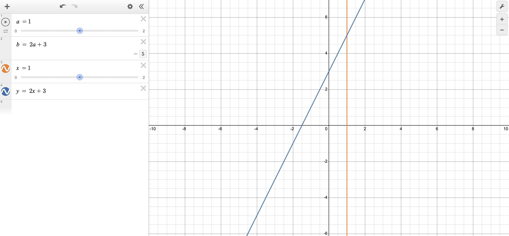
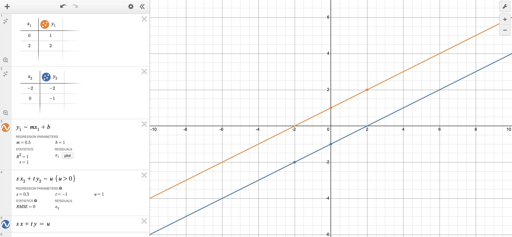
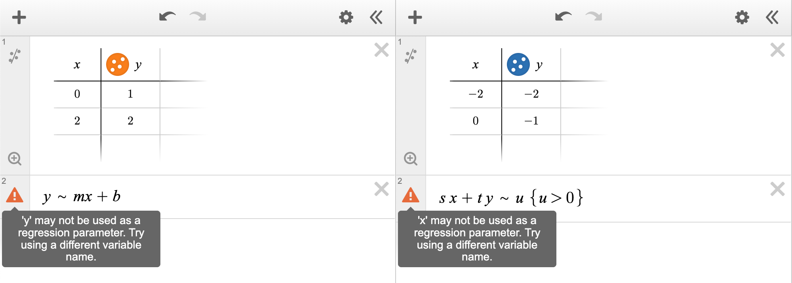

# Key concepts

This document is arranged so that every major concept has a heading associated with it
which begins with `concept::`. For example, if you want to learn about `if` statements,
then you can search for `concept::if`. When a concept involves more than one word,
the words are separated-by-dashes. For example, if you want to learn about `for` loops,
then you can search for `concept::for-loop`. Multiple headings are often given so
that your searches are more likely to succeed. Headings list words in singular, so
searching for `concept::directory` is better than searching for `concept::directories`.

All coding concepts are approached through the Python coding language.


## concept::filename-extension, concept::file-extension, concept::extension

Most filenames end with a period and
a sequence of one or more characters,
e.g. `.pdf`, `.jpg`, and `.mp3`.
These suffixes to the names of computer files are called *filename extensions*.
They are often used to indicate characteristics of the file and/or its intended use,
and so it is always helpful for us to be able to see them...

### Viewing file extensions on MacOS
 - Go to Finder.
 - Choose "Finder > Settings".
 - Click "Advanced".
 - Select "Show all filename extensions".

### Viewing file extensions on Windows 10
 - Go to File Explorer.
 - Choose the "View" tab.
 - Select "File name extensions" (in the "Show/hide" group).

### Viewing file extensions on Windows 11
 - Go to File Explorer and maximize the window.
 - Select "View".
 - Select "Show > File name extensions".


## concept::txt, concept::csv, concept::bmp, concept::jpg, concept::png, concept::pdf, concept::wav, concept::aiff, concept::flac, concept::mp3, concept::m4a, concept::mp4, concept::mov, concept::html, concept::py, concept::ipynb

Here are some common file extensions.
Do not worry if you have not encountered them all.

|  Extension              | Purpose                                                                                                 |
| ----------------------: | :------------------------------------------------------------------------------------------------------ |
|  `.txt`                 | Text file consisting of plain text (no formatting)                                                      |
|  `.csv`                 | Text file containing tabular data where columns are separated by commas                                 |
|  `.bmp`, `.jpg`, `.png` | Image file                                                                                              |
|  `.pdf`                 | Nicely formatted documents which can include text and images                                            |
|  `.wav`                 | Uncompressed audio (originated on Microsoft Windows)                                                    |
|  `.aiff`                | Uncompressed audio (originated on Apple Macintosh)                                                      |
|  `.flac`                | Compressed (lossless) audio file                                                                        |
|  `.mp3`                 | Compressed (lossy) audio file                                                                           |
|  `.m4a`                 | A container for audio files allowing storage of ALAC (lossless compression) and AAC (lossy compression) |
|  `.mp4`                 | Digital multimedia container format (video and audio)                                                   |
|  `.mov`                 | QuickTime file format (originated on Apple Macintosh)                                                   |
|  `.html`                | Document designed to be displayed in a web browser                                                      |
|  `.py`                  | Python script file                                                                                      |
|  `.ipynb`               | Interactive Python NoteBook file                                                                        |
|  `.zip`                 | An archive file format that supports lossless data compression                                          |


## concept::directory, concept::folder

Files on your computer are organized into *directories*.
For example, it is common for computers to have directories called
`Documents`, `Music`, `Pictures`, and `Downloads` within a directory
associated with the user of the computer.

It is possible to navigate through these directories using the
the Terminal on Mac or the Command Prompt on Windows. However,
you are most familiar with navigating through them using Finder
on Mac or the File Explorer on Windows. In this case, they appear
graphically as *folders* which you can double-click on to view
their contents.


## concept::path, concept::file-path, concept::filepath, concept::absolute-path, concept::relative-path

Given a file on your computer. You can repeatedly ask:

> "In what directory does this exist?"

Eventually, the answer to this question will be:

> "The root directory."

This is the top-most directory in a computer's filesystem.
The *path* of the original file stores the answers to all these questions.

 - Suppose the file is called `solutions.txt`,
 - that it is contained in a directory called `HW-1`,
 - that this directory is contained in a directory called `0-Homework-Assignments`,
 - that this directory is contained in a directory called `PIC-1`,
 - that this directory is contained in a directory called `UCLA-Classes`,
 - that this directory is contained in a directory called `Documents`,
 - that this directory is contained in a directory called `YOUR_NAME`,
 - that this directory is contained in a directory called `Users`,
 - and that this directory is contained in the root directory.

Then the path of your file is `/Users/YOUR_NAME/Documents/UCLA-Classes/PIC-1/0-Homework-Assignments/HW-1/solutions.txt`.
Similarly, the folder `HW-1` has the path `/Users/YOUR_NAME/Documents/UCLA-Classes/PIC-1/0-Homework-Assignments/HW-1`.
Both of these are *absolute paths* because they start at the root directory.

When using Finder on Mac or File Explorer on Windows,
your *current working directory* is listed at the top.
It can be convenient to give *relative paths*
relative to this current working directory.
For example, if we are working within the `PIC-1` directory, then
the path of the file `solutions.txt` relative to `PIC-1` is `./0-Homework-Assignments/HW-1/solutions.txt` and
the path of the directory `HW-1` relative to `PIC-1` is `./0-Homework-Assignments/HW-1`.

By analogy, you might like to imagine giving
your best alien friend the directions
to the In-N-Out closest to us:
`/Observable Universe/Laniakea Supercluster/Virgo Supercluster/Local Group/Milky Way Galaxy/Orion Arm/Solar System/Planet Earth/North America/United States of America/California/Los Angeles/Westwood/Gayley Ave/922`.
If they call you and tell you that they are already in Los Angeles,
you can give them directions from `Los Angeles` instead:
`./Westwood/Gayley Ave/922`.
If you believe that addresses are useful,
then you understand why paths are useful!


## concept::find, concept::replace, concept::find-and-replace, concept::find-and-replace-options

Find and Replace are two particularly useful features of Sublime Text (and other text editors).
 - We can use *find* on a piece of text to jump to particular parts of it and
   to count how many times a specified piece of text shows up.
    - Either select "Find > Find..."
    - or use the keyboard shortcut "command + F" on MacOS or "ctrl + F" on Windows.
 - We can use *replace* to change any found text
   to some other specified text.
    - Either select "Find > Replace..."
    - or use the keyboard shortcut "command + option + F" on MacOS or "ctrl + H" on Windows.
 - We can use *replace all* to change
   all occurrences of some looked-for text
   to some other specified text.

Sublime Text provides various find and replace options using the buttons at the bottom,
next to where you type what you would like to find.
 - `.*` enables searching for
   *[regular expressions](https://en.wikipedia.org/wiki/Regular_expression){:target="_blank"}*. 
   These provide clever ways to match text. As examples...
    - `uc[u,c,a,g]` allows one to search for
      `ucu`, `ucc`, `uca`, and `ucg`
      simultaneously using a single search.
    - `\n` allows one to search for the new line character;
    - `.{3}` allows one to search for groups of three characters.

 - `Aa` enables *case sensitivity*.
   ```
   The cat on the mat by the window saw the bird on the branch of the tree in the garden.
   ```
   - Turned off, `the` will be found seven times in the sentence above.
   - Turned on, `the` will be found six times in the sentence above
     since the first occurence has a capital `T`.

 - The quotes enable searching for *whole words*.
   ```
   Yesterday, there was a cat on the mat by the window.
   ```
   - Turned off, `the` will be found three times in the sentence above.
   - Turned on, `the` will be found two times in the sentence above
     since the first occurence is part of the word `there`.

 - One can specify whether to *wrap*
   (go back to the first result
   after the last result) and
   whether to *highlight matches*.

 - The *in selection* option does not work very well
   and I suggest that you ignore it.

 - When replacing, one can select `AB` to *preserve cases*.
   ```
   Test test
   ```
   - With case sensitivity turned off
     and preserve cases turned off,
     finding `test` and replacing all with
     `tester` gives `tester tester`.
   - With case sensitivity turned off
     and preserve cases turned on,
     finding `test` and replacing all with
     `tester` gives `Tester tester`.


## concept::math, concept::sentence, concept::period

The following is a reasonable and correct sentence concerning
the solution to a quadratic equation.

If $a$, $b$, $c$, and $x$ are numbers
and $ax^2 + bx + c = 0$,
then $x = \frac{-b + \sqrt{b^2 - 4ac}}{2a}$
or $x = \frac{-b - \sqrt{b^2 - 4ac}}{2a}$.

 - There are commas after $a$, $b$, $c$, and $0$.
 - There is a period after the last mathematical expression
   because the sentence ends with this expression.
 - The commas and the period are not a part of the math.
 - When discussing math,
   one should still adhere to the usual rules of grammar.


## concept::desmos, concept::desmos-graphing-calculator, concept::desmos-x, concept::desmos-y

Desmos is a graphing calculator. Since it draws graphs in the $xy$-plane,
the variables $x$ and $y$ behave differently to other variables like $a$ and $b$.
(Due to polar coordinates, $r$ and $\theta$ also behave differently.)



For $a$ and $b\ldots$
 - Typing $a\ =\ 1$ creates a variable called $a$, gives it the value $1$,
   and produces a slider for changing its value.
 - Typing $b\ =\ 2a\ +\ 3$ creates a variable called $b$.
   $b$ will originally have the value $5$ because $2\cdot 1\ +\ 3 = 5$.
   As we change the value of $a$ via typing or through the slider,
   $b$'s value will update according to the formula $b\ =\ 2a\ +\ 3$.
 - **WARNING.** This is very different behavior to the variables
   we will learn about in Python for storing integers,
   numbers with a fractional part, and sequences of characters.

For $x$ and $y\ldots$
 - Typing $x\ =\ 1$ draws a vertical line consisting of all points with coordinates like $(1,\ y)$
   and produces a slider so that we can slide between other vertical lines.
 - Typing $y\ =\ 2x\ +\ 3$ draws the line consisting of all points with coordinates like $(x,\ 2x\ +\ 3)$.
   Changing the equation $x\ =\ 1$ has no impact on the line drawn by $y\ =\ 2x\ +\ 3$.
   This is very different to the behavior described for $b$ above.


## concept::desmos-superscript

  - The `^` key (`shift + 6`) will allow you to start typing a *superscript*.
  - To exit typing superscripted text, you will need to press the right arrow key `→`.


## concept::desmos-subscript

  - An underscore `_` will allow you to start typing a *subscript*.
  - To exit typing subscripted text, you will need to press the right arrow key `→`.


## concept::desmos-fitting, concept::desmos-fitting-x-error, concept::desmos-fitting-y-error, concept::desmos-fitting-error

In Desmos, a tilde `~` (next to `1` on US keyboards and
next to `z` on British keyboards) is used to perform
[curve fitting](https://en.wikipedia.org/wiki/Curve_fitting){:target="_blank"}.
We often talk about Desmos *learning* values
because algorithms which perform curve fitting
are some of the earliest machine learning algorithms!
The tilde `~` tells Desmos to learn the values of any variables that
it has not already encountered (by using regression techniques).
The above remarks about $x$ and $y$ have
a consequence when learning with tilde `~`.

 - If we make two tables,
   the first using column headings $x_1$ and $y_1$,
   the second using column headings $x_2$ and $y_2$,
   then we can learn values for $m$ and $b$, and
   $s$, $t$, and $u$ by typing the following expressions.

   - $y_1\ \sim\ m x_1\ +\ b$
   - $s\ x_2\ +\ t\ y_2\ \sim\ u\ \\{u>0\\}$

   Desmos successfully learns about two lines.
   

 - Using $x$ and $y$ in place of $x_1$ and $y_1$      gives an error.
   Using $x$ and $y$ in place of $x_2$ and $y_2$ also gives an error.
   

 - **These are our first programming errors!**
   A programmer encounters many errors during their life,
   so we should celebrate this important moment!!
   We have learned that we are not allowed to use $x$ and $y$
   when we are using tilde `~` to perform curve fitting.


## concept::desmos-fitting-quadratic

There are two steps
to fitting a *quadratic curve* to a set of $(X,\ Y)$ pairs.

 - Make a table containing at least three $(X,\ Y)$ pairs.
 - Type $Y\ \sim\ a X^2\ +\ b X\ +\ c$ in a new cell to learn $a$, $b$, and $c$ and to plot the *parabola*.


## concept::desmos-fitting-circle

There are three steps
to fitting a circle to a set of $(X,\ Y)$ pairs.

 - Make a table containing at least three $(X,\ Y)$ pairs.
 - Type $(X\ -\ x_0)^2\ +\ (Y\ -\ y_0)^2\ \sim\ r_0^2$ in a new cell to learn $x_0$, $y_0$, and $r_0$.
 - Type $(x\ -\ x_0)^2\ +\ (y\ -\ y_0)^2\    =\ r_0^2$ in a new cell to plot the circle.

If there is more than one circle,
then you will need to use subscripts for each $X$ and $Y$,
and you will need to use more informative subscripts than $0$ for $x_0$, $y_0$, and $r_0$.
For an example, see the [second Desmos example](./2-Desmos/2-2.md){:target="_blank"}.


## concept::desmos-fitting-constraints

You can add learning *constraints* using curly brackets $\\{ \\}$.
For example, when fitting a circle, by typing
<div>
  \[
    (X\ -\ x_0)^2\ +\ (Y\ -\ y_0)^2\ \sim\ r_0^2\ \ \ \ \{r_0 > 0\}
  \]
</div>

you will ensure that Desmos learns a positive $r_0$.
In some applications, constraining learned values is essential in order
to avoid solutions that do not make sense to the problem being solved.
For an example, see the [rings of Saturn exercise](./2-Desmos/2-3e-rings.md).

For another example,
[this instance of Desmos](https://www.desmos.com/calculator/e1ygxp8z65){:target="_blank"}
may be helpful.
 - $x^2\ =\ 1$ describes two vertical lines.
 - $y^2\ =\ 1$ describes two horizontal lines.
 - $x^2\ +\ y^2\ =\ 2$ describes a circle of radius $\sqrt{2}$.
 - All of these graphs pass through the points $(1,\ 1)$, $(1, -1)$, $(-1,\ 1)$, and $(-1, -1)$.


## concept::desmos-conventions

Throughout our Desmos examples, we adopt the following conventions.

| Type of quantity | Variables used                                                             |
| ---------------: | :------------------------------------------------------------------------- |
|        Data      | Capitalized letters                                                        |
|     Learned      | Lowercase, not $x$, $y$ or $r$, but subscripted $x$, $y$, and $r$ are fine |
|     Plotted      | $x$, $y$ (in pairs that make a specified equation true)                    |

**These conventions concern the naming of quantities.
Naming quantities carefully and clearly is a very important skill in programming.
By naming variables carefully, you will minimize other people's confusion,
and most importantly, you will minimize your own confusion.**

Here, we provide some justification for our conventions.
Different people may prefer other conventions.
However, when writing an expository document,
it is most important to be consistent,
and hopefully those who prefer other
conventions respect our consistency.
**When writing code, consistency is just as important,
so understanding our thought process may be useful to you.**

In the [first Desmos example](./2-Desmos/2-1.md){:target="_blank"},
we could have used $x_1$ and $y_1$ instead of $X$ and $Y$.
 - By using $X$ and $Y$, we avoided having to use subscripts and
   we avoided the error that using $x$ and $y$ would have produced.
 - We think our equations look nicer. Which do you prefer?
   The first equation or the second equation?
   <div>
     \[Y\   \sim\ a X^2\   +\ b X\   +\ c\ \ \ \ \ \ \ \ \ \ \ \ 
       y_1\ \sim\ a x_1^2\ +\ b x_1\ +\ c\]
   </div>
 - Finally, $a$, $b$, and $c$ are being learned by Desmos whereas
   $X$ and $Y$ label data being entered by us, the users of Desmos.
   The different cases serve as a quick reminder to ourselves
   of the different roles of $X$, $Y$, $a$, $b$, and $c$.

These type of issues become more significant in the
[second Desmos example](./2-Desmos/2-2.md){:target="_blank"}.
When working with the pepperoni pizza,
we need to consider three types of values.
 1. Coordinates of points on the boundary of the pizza entered by us.
 2. Coordinates of the center of the pizza learned by Desmos.
 3. Coordinates of points on the boundary of the pizza drawn by Desmos.

Coordinates consist of an $x$- and $y$-coordinate.
 - Do you want to name an $x$-coordinate by a letter other than $x$ or $X$?
 - Do you want to name a  $y$-coordinate by a letter other than $y$ or $Y$?
 - These are leading questions because the people writing this answered "no"
   to both questions. Someone else might argue that points on the boundary
   and the center point feel different in nature. They might want us to
   label the center using $a$ and $b$, or $c$ together with some subscripts.
   Because $a$, $b$, and $c$ show up in the
   [tilt of Saturn exercise](./2-Desmos/2-3f-tilt.md)
   in a different context, this choice did not seem like the best one to us.

If the remarks above convince you to label
$x$-coordinates with the letters $x$ and $X$ and
$y$-coordinates with the letters $y$ and $Y$,
then we now have to distinguish the different appearances of these letters.
We have no choice over what to call the coordinates that Desmos draws (3) because
Desmos mandates that we use $x$ and $y$ for these coordinates.
For (1) and (2), subscripts are a possibility.
Desmos does not allow subscripts to be very complicated,
but perhaps $x_{boundarypepperoni}$ and $x_{centerpepperoni}$
seem like acceptable choices to you for $x$-coordinates.
Since capitals already worked out nicely in the first example for avoiding
unnecessary subscripts, $X_{pepperoni}$ and $x_{pepperoni}$ seemed like
good choices to us. One just has to remember that $X_{pepperoni}$
corresponds to the data we provide, that is, points on the boundary,
and that $x_{pepperoni}$ is learned by Desmos,
and so it corresponds to the center.
These decisions also have the nice consequence
that the equation of a circle is written
completely in lowercase as is most common.

Finally, using $x_1$, $x_2$, $x_3$, and $x_4$ in place of
$X_{pepperoni}$, $x_{pepperoni}$, $X_{mushroom}$, and $x_{mushroom}$
felt totally unacceptable to us. **It would have been much too easy to
make an error that was very difficult to track down.** On the other hand,
mistyping $pepperoni$ or $mushroom$ is easily noticed and fixed.


## concept::wikipedia

We have used [Wikipedia](https://www.wikipedia.org/){:target="_blank"}
as a reference a number of times in this course.
As with any other resource, the truth of Wikipedia should be questioned.
For example, articles about people can be edited in defamatory ways.
However, mathematical articles are normally edited by mathematicians who
do not have hidden agendas; they simply want to share mathematics with others.
Of course, some pages may have errors, but in our experience, these are rare.
Most of the pages shared in this course are only shared with you
to encourage you to explore a topic further, if you find it interesting.
If you track down inaccuracies because you read very carefully about a topic,
this is a positive outcome! In any case, Wikipedia is currently much more
reliable than ChatGPT when it comes to mathematics and computer science!


## concept::sheets, concept::table

In [Google Sheets](https://docs.google.com/spreadsheets){:target="_blank"},
*tables* are convenient because they allow one
to specify *datatypes* for each column.
After selecting a collection of cells,
you can select `Format > Convert to table`
from the top menu.
Using the arrows in the column headings,
you can select `Edit column type`
to select the appropriate datatype.


## concept::sheets, concept::filter

When using spreadsheets,
*filters* allow us to focus
on a subset of our data.

You can create a *filter view* as follows.
 - Click on the calculator to the right of the table heading.
 - Click `Create filter view`.
 - Click `Save view`.
 - Name the view.
 - Click `Save`.

You can apply a filter as follows.
 - Click the filter icon to the right of the column name.
   It is supposed to look like a [funnel](https://en.wikipedia.org/wiki/Funnel#/media/File:Kitchen_Funnel.jpg){:target="_blank"}.
 - Choose the desired settings for the filter.
 - Click `OK`.

You can exit a filter view as follows.
 - Click on the calculator to the right of the table heading.
 - Click `Exit view`.


## concept::sheets, concept::pivot-table

When using spreadsheets,
*pivot tables* allow us to display our data in different ways
to highlight the information that concerns us the most.
You can create one as follows.

 - Make sure to exit any filter views.
 - Click anywhere on the original table.
 - Select `Insert > Pivot table` from the top menu.
 - Click `Create`.
 - Ponder what you want the rows and/or columns to be,
   and what information you would like to be displayed.
 - Upon making such decisions, you can click `Add`
   next to a heading in the *pivot table editor*
   that says **Rows**, **Columns**, or **Values**,
   and make your chosen selections.


## concept::sheets, concept::formula

In a spreadsheet,
one can begin a formula by typing `=`.
 - By typing `= A1 * B1` into cell `C1`,
   we make sure that `C1` calculates the product
   of the values contained in cells `A1` and `B1`.
 - By typing `= SUM(A1: A10)` into `A11`,
   we make sure that `A11` calculates the
   sum of the values contained in cells
   `A1`, `A2`,  `A3`, ..., `A10`.

When typing a formula,
you can also select cells with your mouse.
 - To arrive at the formula `= A1 * B1` in cell `C1`...
   - Click on cell `C1`.
   - Type `=`.
   - Click on cell `A1`.
   - Type `*`.
   - Click on cell `B1`.
   - Hit `ENTER`.
 - To arrive at the formula `= SUM(A1: A10)` in cell `A11`...
   - Click on cell `A11`.
   - Type `= SUM()`.
   - Press `←` to go back to between the parentheses.
   - Highlight cells `A1` to `A10`.
   - Hit `ENTER`.


## concept::sheets, concept::formula-and-dollar, concept::formula-dollar

A formula from one cell can be used to create formulae in other cells
by hovering the mouse where the blue circle is until a cross (+) appears,
and then clicking and dragging.

 - Suppose that columns `B` and `C` contain some data.
 - To fill column `A` with the numbers 1, 2, 3,...
   - Type 1 into `A1`.
   - Type 2 into `A2`.
   - Highlight `A1` and `A2`.
   - Hover your mouse where the blue circle is:
     at the bottom-right of the highlighted region.
     A cross (+) will appear.
   - Click and drag down to where you like.
 - When using a formula...
   - As we drag it into new columns
     `A`s will change to `B`s,
     `B`s to `C`s, `C`s to `D`s,
     and so on.
   - As we drag it into new rows
     `1`s will change to `2`s,
     `2`s to `3`s, `3`s to `4`s,
     and so on.
   - We can prevent such changes using `$`s.
     If we type `= SUM(B$1:B1) / $A1` into `D1` and drag it to `E8`,
     `E8` will contain the formula `= SUM(C$1:C8) / $A8` so that
     `$A` has remained as `$A`,
     `$1` has remained as `$1`,
     but the `B`s (without `$`s)
     have changed to `C`s and
     the `1`s without a `$`s
     have changed to `8`s.


## concept::sheets, concept::datatype, concept::text

In [Google Sheets](https://docs.google.com/spreadsheets){:target="_blank"},
when a cell's datatype is *text*,
it can store up to 50,000 characters.

 - Characters from the English alphabet are allowed.
 - All the digits (0 to 9) are allowed.
 - Some special characters like spaces are allowed too.


## concept::sheets, concept::datatype, concept::number

In [Google Sheets](https://docs.google.com/spreadsheets){:target="_blank"},
when a cell's datatype is *number*,
it can store many numerical values.
However,
there are limitations to which numbers can
be stored and which numbers can be entered.

We can use *numbers* for arithmetic. However,
the accuracy of arithmetic is not always perfect.
In many applications, this lack of precision can be ignored,
but this issue can matter much more than you might expect.


## concept::sheets, concept::to_text, concept::value

 - Any *number* can be used to produce some *text*
   by using the `TO_TEXT` function.
 - We can use a function called `VALUE`
   to attempt to obtain a *number*
   from some *text*.
   This will only work when
   the text is appropriately numeric.


## concept::sheets, concept::pow, concept::left

 - `POW` is a function that accepts two *numbers* $c$ and $d$.
   `POW(c, d)` calculates $c^d$. For example, typing
   `= POW(2, 3)` into a cell will calculate $2^3 = 8$.
 - `LEFT` is a function that accepts *text*
   and gives the left-most character.


## concept::unicode

[Unicode](https://en.wikipedia.org/wiki/Unicode){:target="_blank"} is a
[list of over 140,000 characters](https://en.wikipedia.org/wiki/List_of_Unicode_characters){:target="_blank"}
together with their "code points".


## concept::string

A *string* is a sequence of unicode characters.
In most programming languages one can specify a *string*
by typing a sequence of characters between double quotes.
For example, in Python,
`"a sequence of characters"`
is a string of length 24.

Python provides a few different ways to create strings.
 - `'A string created using single quotes.'`
 - `"A string created using double quotes."`
 - `"""A string created using three double quotes."""`

To see the benefits of each, consider the following three pieces of text.

1. Someone said, "I like single quotes." Good for them!

2. Double quotes are someone else's favorite.

3. One person likes single quotes.<br>
   Another likes double quotes.<br>
   What about the person who likes new lines?


Let's see how we can create strings containing these characters.

1. First example.
   - `'Someone said, "I like single quotes." Good for them!'`
   - `"Someone said, \"I like single quotes.\" Good for them!"`<br>
     Because double quotes are used to start and end the string,
     the double quotes in the string need to be specified
     using a backslash: `\"`.
   - `"""Someone said, "I like single quotes." Good for them!"""`

2. Second example.
   - `'Double quotes are someone else\'s favorite.'`<br>
     Because single quotes are used to start and end the string,
     the single quotes in the string need to be specified
     using a backslash: `\'`.
   - `"Double quotes are someone else's favorite."`
   - `"""Double quotes are someone else's favorite."""`

3. Third example.
   - `'One person likes single quotes.\nAnother likes double quotes.\nWhat about the person who likes new lines?'`<br>
     The new line character needs to be typed as `\n`.
   - `"One person likes single quotes.\nAnother likes double quotes.\nWhat about the person who likes new lines?"`<br>
     The new line character needs to be typed as `\n`.
   - `"""One person likes single quotes.`<br>
     `Another likes double quotes.`<br>
     `What about the person who likes new lines?"""`
     The new line character can be typed normally by pressing `ENTER`.


## concept::charset, concept::encoding

When you store text in a `.txt` file,
an *encoding* is used to translate
between characters and bytes.

For an example,
suppose that files called
`1.txt`, `2.txt`, and `3.txt`,
each store the following text.

!$<br>
$!<br>
$\mathbb{Z}$

A byte can be thought of as a value between 0 and 255.

1. If `1.txt` is encoded with UTF-8,
   the following 9 bytes are used.
   <div>
     \[ 33 36 10 36 33 10 226 132 164 \]
   </div>

   - ! is encoded using the byte 33.
   - $ is encoded using the byte 36.
   - new line is encoded using the byte 10.
   - $\mathbb{Z}$ is encoded using the bytes 226 132 164.

2. If `2.txt` is encoded with UTF-16-LE,
   the following 14 bytes are used.
   <div>
     \[ 33 0 36 0 10 0 36 0 33 0 10 0 36 33 \]
   </div>

   - ! is encoded using the bytes 33 0.
   - $ is encoded using the bytes 36 0.
   - new line is encoded using the bytes 10 0.
   - $\mathbb{Z}$ is encoded using the bytes 36 33.

3. If `3.txt` is encoded with UTF-16-BE,
   the following 14 bytes are used.
   <div>
     \[ 0 33 0 36 0 10 0 36 0 33 0 10 33 36 \]
   </div>

   - ! is encoded using the bytes 0 33.
   - $ is encoded using the bytes 0 36.
   - new line is encoded using the bytes 0 10.
   - $\mathbb{Z}$ is encoded using the bytes 33 36.

4. Notice that 33 encodes ! in UTF-8 and that
   it shows up as part of the encoding of
   ! and $\mathbb{Z}$ in UTF-16.

   Notice that 36 encodes $ in UTF-8 and that
   it shows up as part of the encoding of
   $ and $\mathbb{Z}$ in UTF-16.


## concept::print


## concept::int

## concept::arithmetic

## concept::comparison


## concept::list

## concept::index

## concept::len, concept::length-of-a-list, concept::length-of-list


## concept::assignment, concept::assign, concept::=


## concept::bool, concept::boolean

## concept::equals, concept::equal-to, concept::==

## concept::and, concept::or, concept::not


## concept::control, concept::control-flow

## concept::if, concept::if-statement

## concept::while, concept::while-loop

## concept::for, concept::for-loop

## concept::range


## concept::float, concept::int-division, concept::float-division

## concept::floating-point-imprecision


## concept::function, concept::method

## concept::sort, concept::sorted


## concept::dictionary

## concept::set

## concept::comprehension, concept::list-comprehension, concept::dictionary-comprehension, concept::set-comprehension


## concept::numpy

## concept::scipy

## concept::fitting, concept::line-fitting, concept::curve-fitting

## concept::matplotlib, concept::plotting, concept::plt
