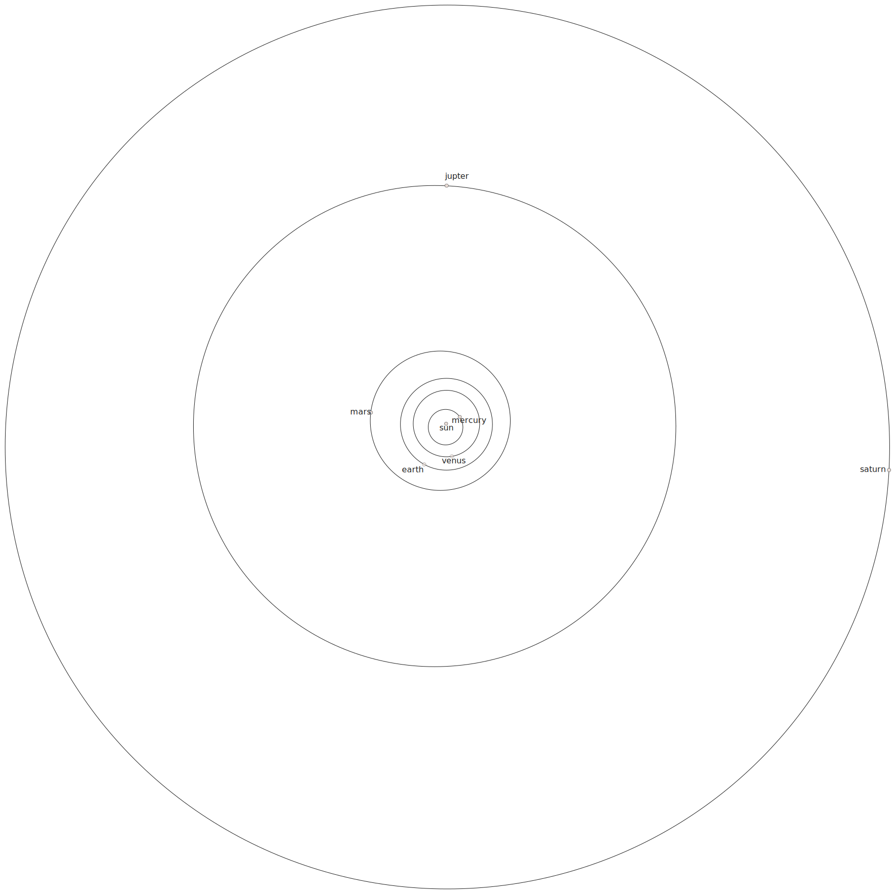

# Orbit of Saturn

A cartoon depiction of the orbits of the planets in our solar system is drawn below.

## Task 1 - The Ratio of the Radii Of Orbits

Using this cartoon, estimate the ratio of
the radius of Saturn's orbit to the radius of Earth's orbit.
The real orbits are elliptical,
but you can assume they are circular
(like the pizzas in [example 2](2-2.md){:target="_blank"}).

## Task 2 - The Centers of the Orbits

 - Based on the values you calculated in task 1,
   determine whether the center point of Earth's orbit lies within the Sun?

 - Based on the values you calculated in task 1,
   determine whether the center point of Saturn's orbit lies within the Sun?

 - Calculate another interesting ratio...
   - Start with the $y$-coordinate Desmos learned for the center point of Saturn's orbit.
   - Subtract the $y$-coordinate Desmos learned for the center point of Earth's orbit.
   - Divide the difference by the value Desmos learned for the radius of Earth's orbit.

## Task 3 - Compare with Data from the Internet

 - Look up "the radius of the orbit of Saturn in astronomical units, perihelion, aphelion".
 - If your search result raises any new questions, look up answers to these questions too!
 - Based on the values you calculated in task 1 and task 2,
   in what ways is the cartoon depiction close-to-accurate
   regarding the orbits of Saturn and Earth?
 - In what ways is the cartoon depiction inaccurate?

