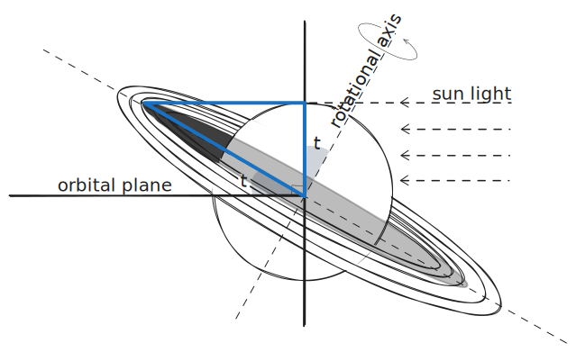
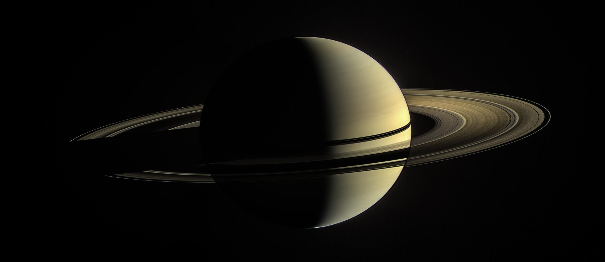
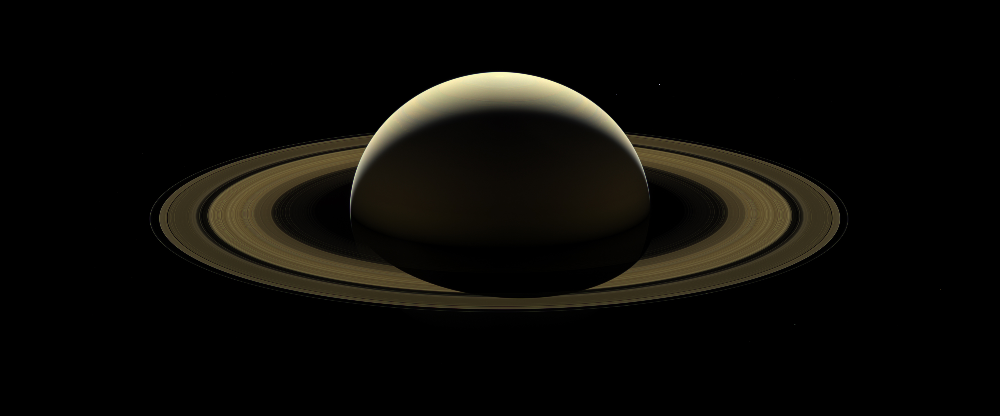

# Tilt of Saturn

Saturn actually rotates about a tilted axis
with respect to its plane of orbit around the sun.
This is similar to our planet Earth.
The tilt is what causes different seasons:
Autumn, Winter, Spring, and Summer!

 1. **We can estimate Saturn's axial tilt by using the shadow it casts onto its rings.**

    

    - The axial tilt angle $t$ is the labeled angle in the following right-angled triangle.

      

    - Therefore,
      $t = \arcsin\left(\frac{\text{Saturn's radius}}{\text{Saturn's shadow length}}\right)$
      when measured in radians.

    - **NOTE.**
      Do not worry if you do not remember trigonometry.
      Regardless of whether you fully understand a formula,
      it can still be useful to use a formula that
      a scientist or mathematician has given you.

 2. **IMPORTANT.**
    Notice that the diagram drawn above assumes that it is the northern hemisphere's summer.

    - The following image was captured during Autumn/Spring and there is a very big shadow.

      

    - The following image was captured during Winter/Summer and there is a much smaller shadow.

      

    - **For the formula from part 1 to work correctly,
      we should use the last image when performing our calculations.**

    - **IMPORTANT**.
      When using a formula,
      especially if you do not fully understand it,
      it is important to know when it is valid.
      Scientists and mathematicians often explain
      when their formulae can be used correctly
      using the words surrounding their formulae.
      **Do not ignore words when pondering formulae!**

    - **ASIDE.**
      This image is called *A Farewell to Saturn*.
      It was captured by NASA's [Cassini Spacecraft](https://svs.gsfc.nasa.gov/12735){:target="_blank"} in 2017,
      two days before crashing into Saturn's atmosphere,
      ending its 13-year stay.

 3. *A Farewell to Saturn* is also convenient because the shadow is almost coming towards us.

    - As in the [previous example](2-3e-rings.md){:target="_blank"},
      we can use the equation of an ellipse to describe the **F ring**.
      

        \[\frac{(x\ -\ x_{ring})^2}{r_{ring}^2}\ +\ \frac{(y\ -\ y_{ring})^2}{p_{ring}^2}\ =\ 1\]
      

    - **The dilation factor $d = \frac{r_{ring}}{p_{ring}}$ is
      the value that we need to multiply by
      to correct for perspective
      when calculating the length of the shadow.**

 4. To calculate the ratio of Saturn's radius and Saturn's shadow length,
    we can fit an ellipse to the shadow.

    - Unfortunately, the ellipse is at an angle,
      and so the following equation for an ellipse is needed.
      

        \[a(x\ -\ x_{shadow})^2\ +\ b(y\ -\ y_{shadow})^2\ +\ c(x\ -\ x_{shadow})(y\ -\ y_{shadow})\ =\ 1\]
      

    - The radii can be calculated from $a$, $b$, and $c$ using the formulae...
      

        \[\begin{aligned}
          r_1\ &=\ \sqrt{\frac{2}{(a\ +\ b)\ -\ \sqrt{(a\ -\ b)^2\ +\ c^2}}}\\
          r_2\ &=\ \sqrt{\frac{2}{(a\ +\ b)\ +\ \sqrt{(a\ -\ b)^2\ +\ c^2}}}
        \end{aligned}\]
      

      - **$r_1$ provides an approximation to Saturn's radius.**
      - **$d\cdot r_2$ provides an approximation to Saturn's shadow length.**
      - Some of this can seem a bit strange disorienting
        because of the angle of the shadow.
        We are only approximating!

 5. **Summarizing the entire procedure...**
    - Use the image entitled *A Farewell to Saturn*.

    - Fit the ellipse
      $\frac{(x\ -\ x_{ring})^{2}}{r_{ring}^{2}}\ +\ \frac{(y\ -\ y_{ring})^{2}}{p_{ring}^{2}}\ =\ 1$
      to the ring of Saturn.
      Five points together with
      constraints on $x_{ring}$ and $y_{ring}$ and
      the constraints $2 < r_{ring} < 4$ and $0 < p_{ring} < 2$
      might be necessary.

      

    - Record $d = \frac{r_{ring}}{p_{ring}}$.

    - Fit the ellipse
      $a(x\ -\ x_{shadow})^2\ +\ b(y\ -\ y_{shadow})^2\ +\ c(x\ -\ x_{shadow})(y\ -\ y_{shadow})\ =\ 1$
      to the shadow created by Saturn on its rings.
      Around 12 points together with
      the constraints $a>0$ and $b>0$,
      and constraints on $x_{shadow}$ and $y_{shadow}$
      might be necessary.

    - Calculate...
      

        \[\begin{aligned}
          r_1\ &=\ \sqrt{\frac{2}{(a\ +\ b)\ -\ \sqrt{(a\ -\ b)^2\ +\ c^2}}}\\
          r_2\ &=\ \sqrt{\frac{2}{(a\ +\ b)\ +\ \sqrt{(a\ -\ b)^2\ +\ c^2}}}
        \end{aligned}\]
      

    - Calculate $t$ in degrees using the following formula.
      

        \[\begin{aligned}
          t\ &=\ \frac{180}{\pi}\ \arcsin\left(\frac{\text{Saturn's radius}}{\text{Saturn's shadow length}}\right)\\
             &=\ \frac{180}{\pi}\ \arcsin\left(\frac{r_1}{d\ r_2}\right)
        \end{aligned}\]
      

    - Look up a value for $t$ and compare it with your estimate.
      It can be quite difficult to find documentation of
      the method by which this angle was calculated.
      You have performed a substantial calculation
      in Desmos using NASA's image!
