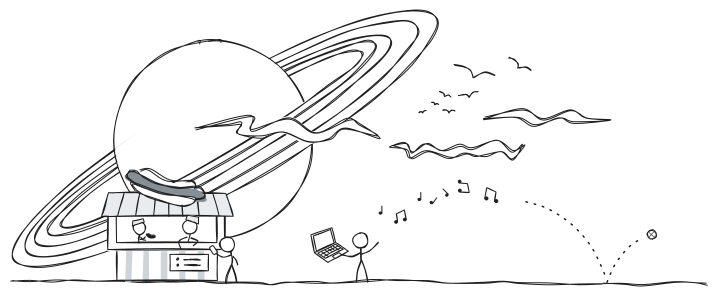
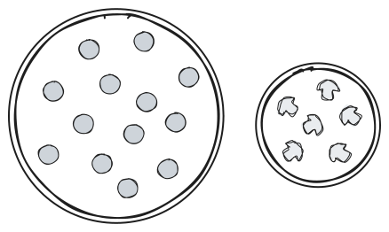

# Desmos Graphing Calculator - Example 2

## A circle - an implicitly defined curve

The equation of a circle with center $(x_0,\ y_0)$ and radius $r_0 \geq 0$ is given by

  \[(x - x_0)^2\ +\ (y - y_0)^2\ =\ r_0^2.\]

What does this really mean?
The circle is a collection of points with $x$ and $y$ coordinates.
A point $(x,\ y)$ lies on the circle exactly when its $x$ and $y$
values make the equation above true.

We can ask Desmos to draw a circle by typing in this equation,
although we have to specify values for $x_0$, $y_0$, and $r_0$.
Have a look at [this instance of Desmos](https://www.desmos.com/calculator/402dqupgex){:target="_blank"}.

 - $x_0$ was set to be $1$ by typing `x_0→ = 1`.
   This automatically generated a slider
   where a range of values were specified by someone.
 - Similary, $y_0$ was set to be $0$ by typing `y_0→ = 0` and
   $r_0$ was set to be $2$ by typing `r_0→ = 2`.
 - The main takeaways here are that...
    - you can introduce names for important quantities;
    - Desmos lets you edit their values intuitively;
    - you can use an underscore to start typing a *subscript*.
 - Finally, the center of the circle and the circle itself are plotted.
 - **Move the sliders around and press some of the play buttons.**

   Pressing play for $x_0$ and $y_0$ with $r_0 = 2$ looks good
   when the plotted region is $[-10, 10]\times [-7, 7]$.

The equation for a circle is a bit different than our previous example.
For a given $x$ coordinate, there may be...
 - no corresponding $y$ coordinate (the red line);
 - exactly one corresponding $y$ coordinate (the blue line);
 - or two corresponding $y$ coordinates (the green line).

This is because there is not
an explicit formula for $y$
which always makes sense.
The equation for a circle is given *implicitly*.

## Fitting an implicit curve

Amazingly, Desmos can also fit curves that are defined implicitly.
This is great because I am feeling hungry...

## Plotting an implicit curve

## Constraining value ranges to obtain a better fit

