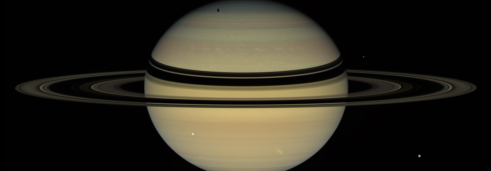
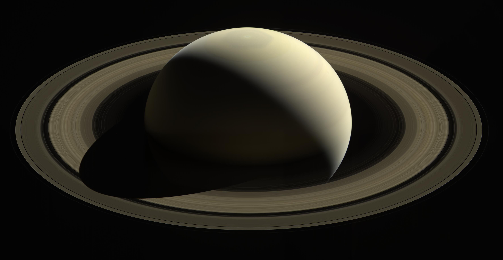

# Rings of Saturn

The image below shows Saturn and its rings.
 - Saturn looks elliptical because it bulges near the equator.
 - Its rings appear to make an ellipse due to the angle at which the image has been captured.

Estimate the ratio $\frac{r_{ring}}{r_saturn}$$ where...
 - $r_{saturn}$ is the radius of Saturn at its equator and...
 - $r_{ring}$ is the radius of the outermost part of the *A ring*.
   This is where you would think the outermost part of all the rings are
   until you stare really hard at the second image below and notice
   the *F ring*, a really, really thin ring.

You will need the equations for two ellipses.
 - $\frac{(x\ -\ x_{saturn})^2}{r_{saturn}^2}$$\ +\ \frac{(y\ -\ y_{saturn})^2}{p_{saturn}^2}$$\ =\ 1$
 - $\frac{(x\ -\ x_{ring})^2}{r_{ring}^2}$$\ +\ \frac{(y\ -\ y_{ring})^2}{p_{ring}^2}$$\ =\ 1$
 - $r$ is indended to stand for *radius* and
   $p$ is vaguely intended to stand for *momentum* (the reason for Saturn's bulge) or *perspective*.

You may also need to constrain some of the values that Desmos learns.
 - $x_{saturn}$ and $x_{ring}$ can be constrained to lie with the $x$-values of the image.
 - $y_{saturn}$ and $y_{ring}$ can be constrained to lie with the $y$-values of the image.
 - $1 < r_{saturn} < 3$, $4 < r_{ring} < 5$ are sensible constraints.
 - $1 < p_{saturn} < 3$, $0 < p_{ring} < 3$ are sensible constraints.

