# Google Sheets - Tables, Types, and Filters

## Opening a CSV File

 - Download [this file](./data/tutoring.csv).
 - Save it in the folder `/Users/YOUR_NAME/Documents/UCLA-Classes/PIC-1/3-Spreadsheets`.
 - Through your g.ucla.edu email, open Google Sheets.
   - Click on the icon with 9 dots, next to UCLA, in the top-right.
   - Select `Sheets`.
 - Click on `Blank spreadsheet`.
 - Select `File > Open`.
 - Select `Upload > Browse`.
   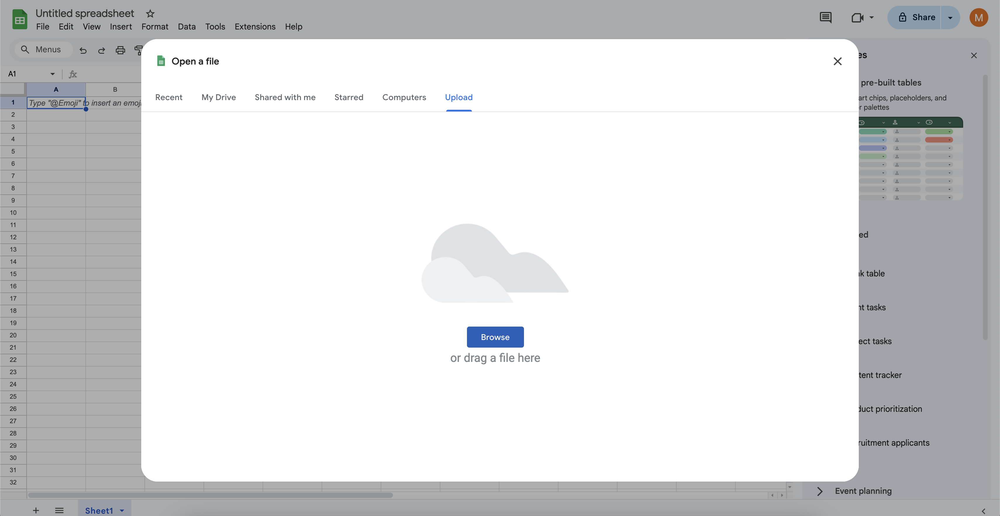
 - Open the file that you just downloaded.

## Converting to a Table and Specifying Types

 - Select `Format > Convert to table` from the top menu.
 - Click at the top of the table (dark green)
   where it says `Table1` and edit it to say `Tutoring`.
 - Now use the arrows in the column headings.
   - Select `Name > Edit column type > Text`.
   - Select `Course > Edit column type > Text`.
   - Select `UID > Edit column type > Number > Number`.
   - Select `Time (minutes) > Edit column type > Number > Number`.
   - Select `Timestamp > Edit column type > Date > Date time`.
   - These selections specified the most appropriate *datatype* for each column.
 - Select columns `A` to `E` and then
   select `Format > Alignment > Center` from the top menu.
 - If your table looks like the following screenshot, well done!
   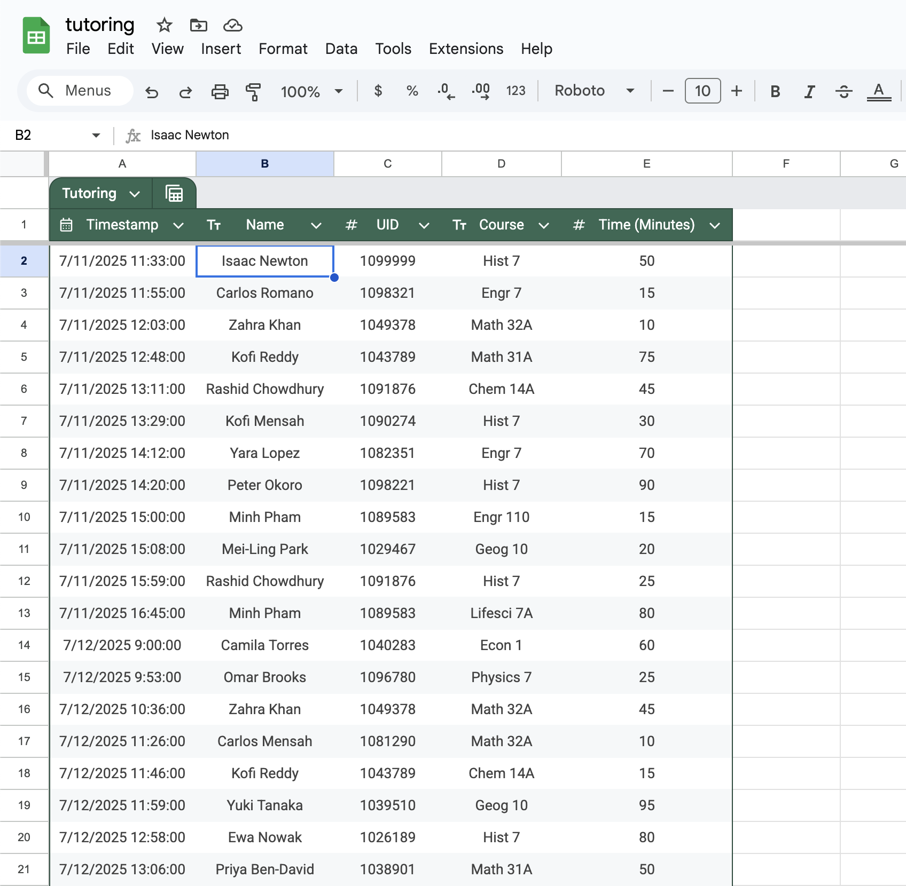

## Sorting a Column

We can sort columns by
using the arrows in the column headings again.

 - Select `Name > Sort Column > Sort A to Z`.
 - Select `Time (minutes) > Sort Column > Sort Z to A`.
    - Notice that the times are sorted in decreasing order.
    - Notice that the names are still sorted for each time.
   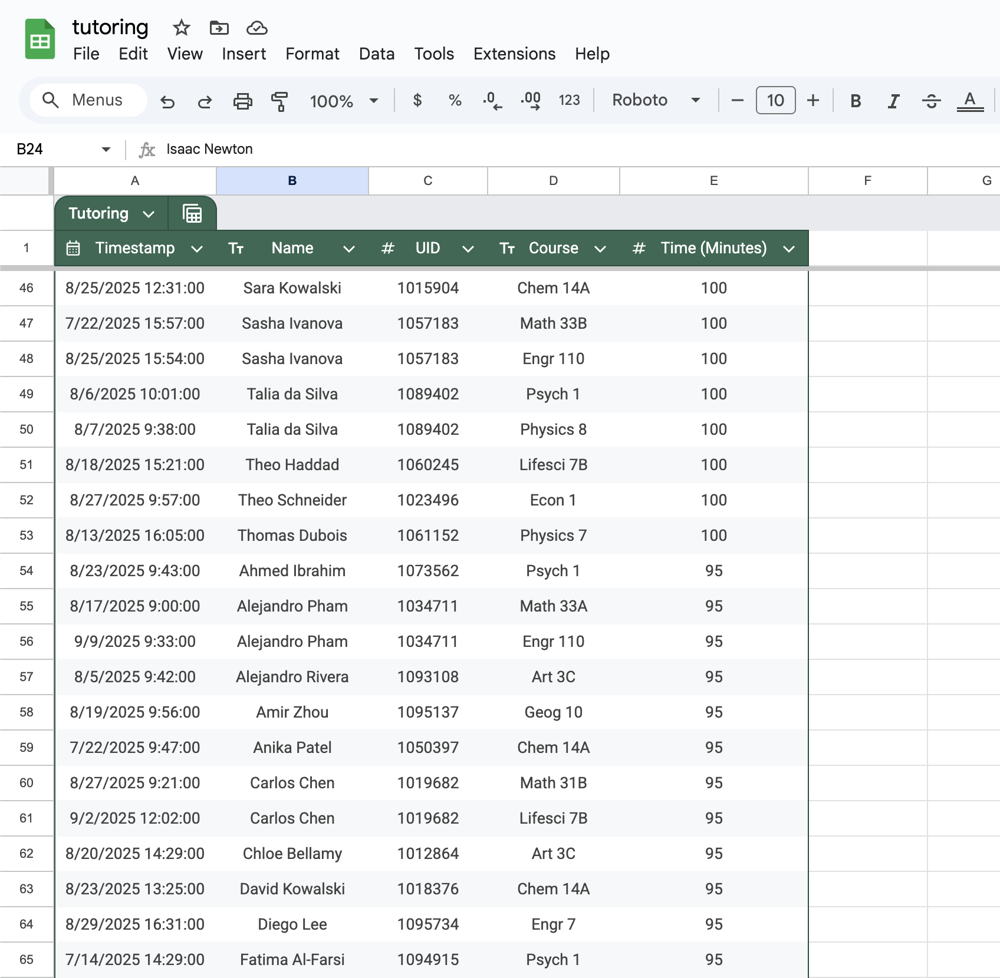
 - Select `Timestamp > Sort Column > Sort A to Z`.
 - Notice that it is a little strange that the options always say
   "Sort A to Z" and "Sort Z to A" even when we are sorting
   Numbers and Dates.

## Quick Summary of Selected Values or Columns

Quick summaries of cells' data can be useful.
There are different options for Text, Numbers, and Dates.

 - Highlight `D2` to `D8`.
   At the bottom-right, it shows `Count: 7`.
 - Highlight `E2` to `E8`.
   At the bottom-right, one can select between Sum, Avg, Min, Max, Count, and Count Numbers.
 - Highlight all of column `E`.
   Compare Count and Count Numbers.
   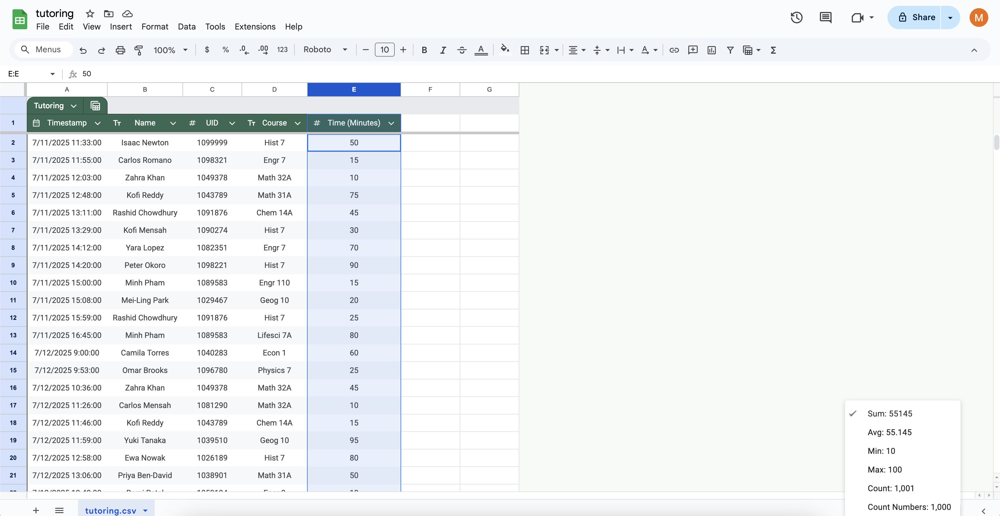
   "Count" includes the column heading, whereas "Count Numbers" does not.
 - Highlight `A2` to `A8`.
   At the bottom-right, one can select between Min, Max, Count, and Count Numbers.

## Some Questions About The Data

 - How many times did Ahmed Ibrahim attend tutoring?
 - What was the total time Ahmed attended tutoring for?
 - What was Ahmed's longest tutoring session?
 - Which course did Ahmed receive the most tutoring sessions for?
 - Which course did Ahmed dedicate the most time to during their tutoring sessions?

## Filters - What Are They For?

To answer the last two questions, it was helpful to...
 - sort the `Course` column from A to Z;
 - sort the `Name` column from A to Z.

This way Ahmed Ibrahim's information is shown at the top
and their different courses are grouped together.
We can see they attended tutoring for Art 3C
more than any other course (4 times).
By selecting `E2` to `E5`, `E6`, `E7` to `E8`, `E9` to `E11`,
and looking at the sum recorded at the bottom-right,
we can see they dedicated the most time to Engr 7
(175 minutes).

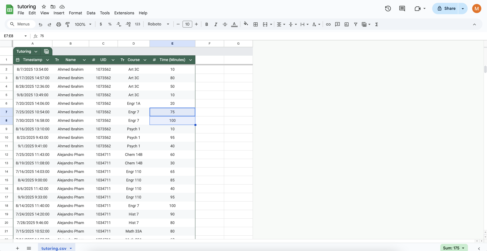

This was not too tricky,
but if our data set was larger,
you can imagine that these questions
could become tedious to answer.
*Filters* and *Pivot Tables* help us
to answer such questions more easily.
A filter does so
by allowing us to focus
on a subset of our data.
Suppose, for a minute,
that we had asked the questions
about Carlos Mensah.
 - You would have had
   to scroll all the way down to row 167.
 - When selecting the data,
   you would have had to be careful
   not to accidentally record data from
   Carlos Chen and Carlos Romano.

A filter will allow us to restrict to only
the entries that involve Carlos Mensah.

## Creating and Saving a Filter View

 - Click on the calculator to the right of where it says `Tutoring`
   (where it used to say `Table1`).
 - Click `Create filter view`.
   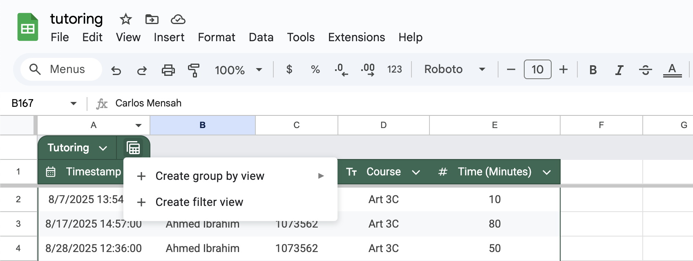
 - Click `Save view`.
   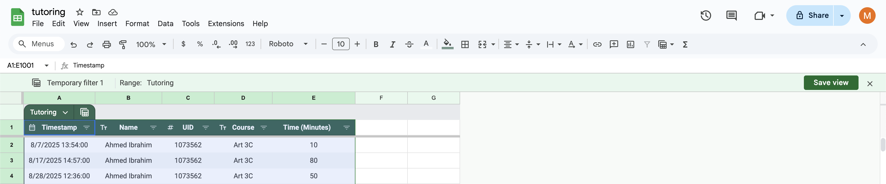
 - Name the *view* as `Carlos Mensah`.
   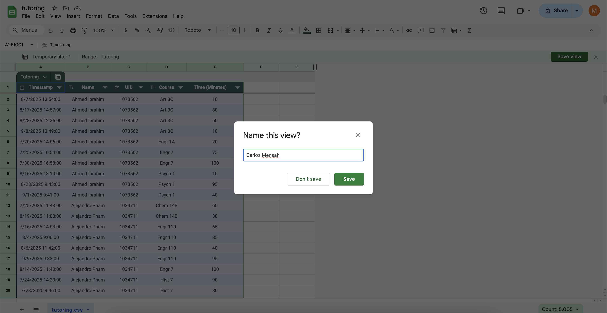
 - Click `Save`.

## Filtering By Value

 - Click the filter icon to the right of where it says `Name`.
   It is supposed to look like a [funnel](https://en.wikipedia.org/wiki/Funnel#/media/File:Kitchen_Funnel.jpg){:target="_blank"}.
   
 - Click `Clear`.
 - Type `Carlos` in the search box.
 - Click on the `Carlos Mensah` search result.
   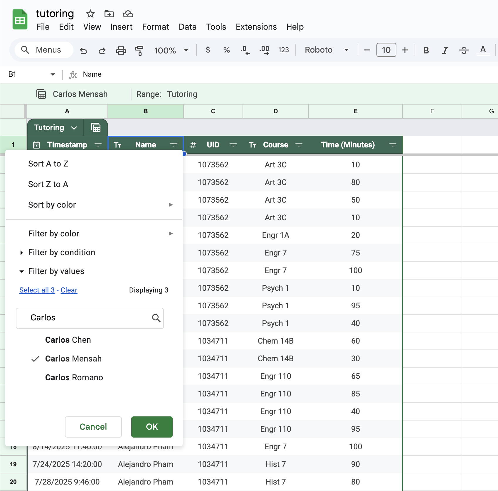
 - Click `OK`.
 - Conveniently, you can now see just the information associated with Carlos Mensah,
   and the filter icon looks even more like a funnel!
   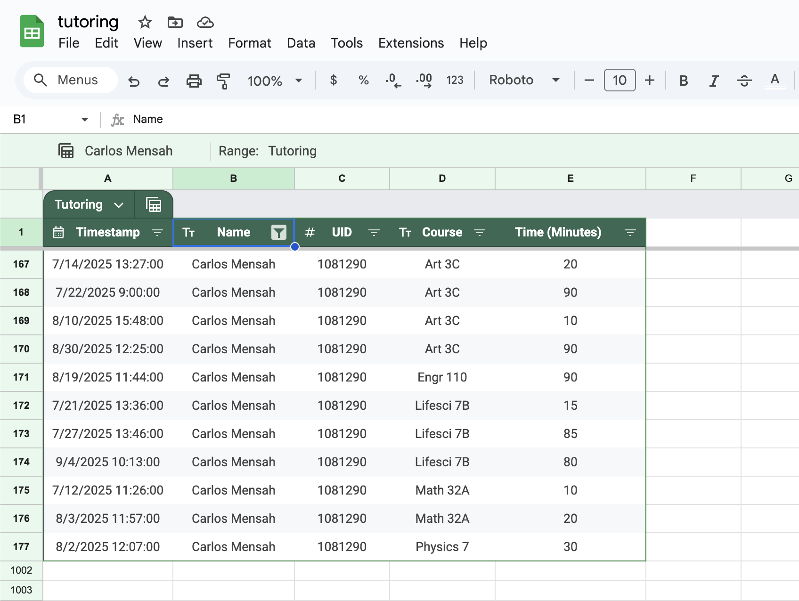

## Exiting a Filter View

 - Click on the calculator to the right of where it says `Tutoring`
   (where it used to say `Table1`).
 - Click `Exit view`.
   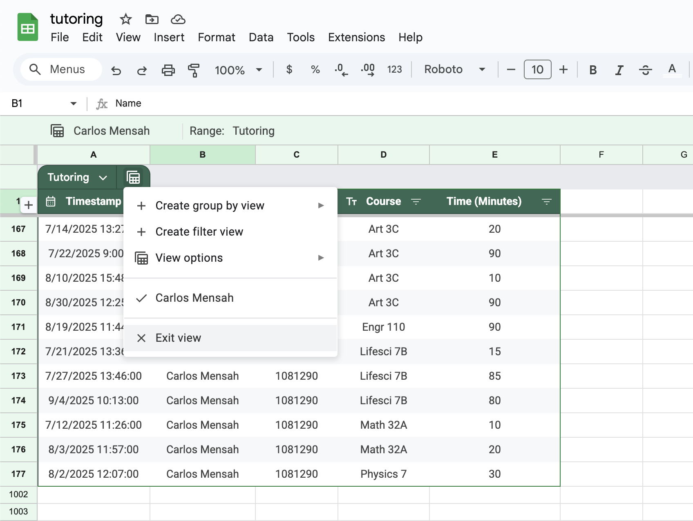

## Filtering By Condition

 - Create another Filter View called `Long sessions`.
   - Click on the calculator to the right of where it says `Tutoring`
     (where it used to say `Table1`).
   - Click `Create filter view`.
   - Click `Save view`.
   - Name the view as `Long sessions`.
   - Click `Save`.

 - Click the filter icon next to `Time (Minutes)`.
 - Click `Filter by condition`
 - Click on the box below that says `None` and select `Greater than`.
 - Type `90` in the box below.
   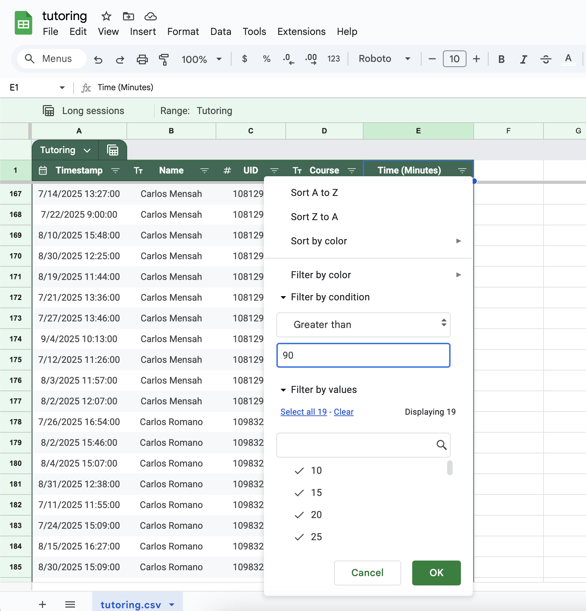
 - Click `OK`.
 - Notice that "greater than" is different
   to "greater than or equal to":
   90-minute sessions are excluded.
   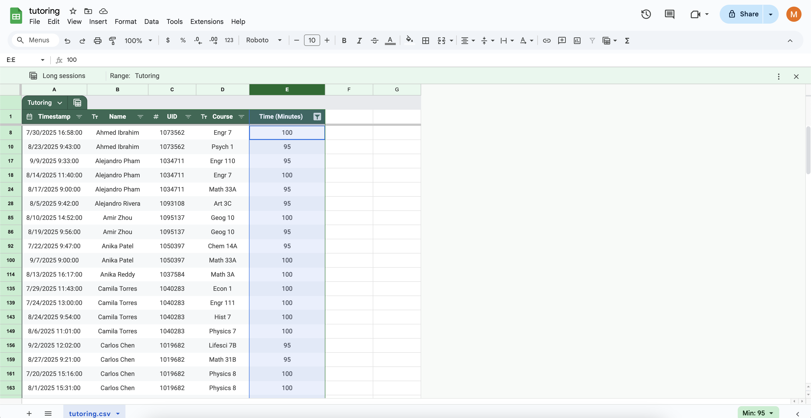

## Deleting a Filter View

 - Click on the calculator to the right of where it says `Tutoring`
   (where it used to say `Table1`).
 - You can now see that the views `Carlos Mensah` and `Long sessions`
   are easily available.
 - Let's delete the `Carlos Mensah` view.
 - Select the `Carlos Mensah` view.
 - `Data > View options > Delete view` will delete this view.
   Take note of other useful options that are available.
   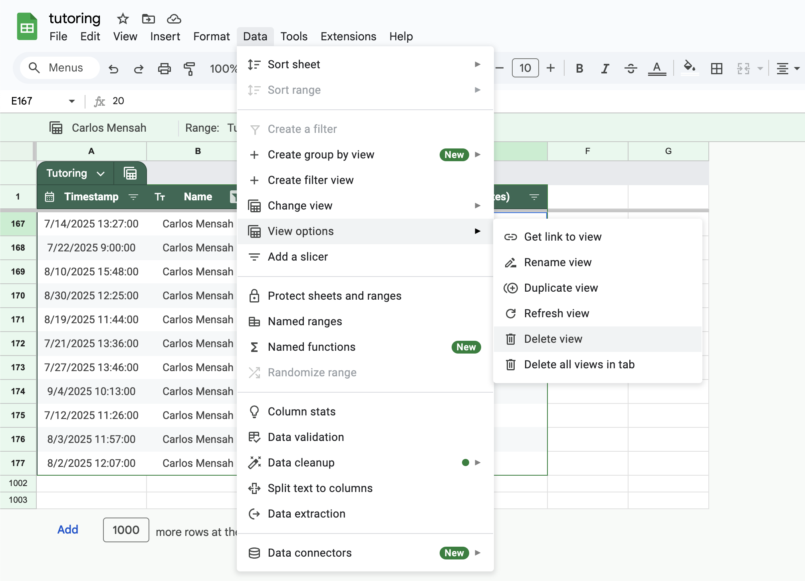

## Some Questions About The Data

**Using filters, sorting, and selecting columns,**
answer the following questions.

 - How many students who attended tutoring are called Elena?
 - Which Elena spent the most time at tutoring sessions?
 - What was the total time this Elena attended tutoring for?
 - How many students who attended tutoring are called Amina?
 - Which Amina attended the most tutoring sessions?
 - What was the total number of tutoring sessions this Amina attended?
 - Which three students are tied for attending the most tutoring sessions greater than 90 minutes long?

On to [Pivot Tables](3-2-pivot.md)!!