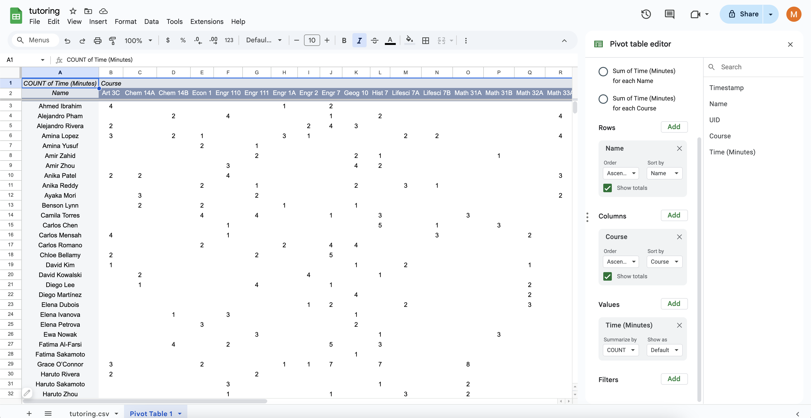

# Google Sheets - Pivot Tables

## Creating a Pivot Table and Selecting a Suggested Option

 - **Make sure to exit any filter views you used to answer the previous questions.**
   - Click on the calculator to the right of where it says `Tutoring`
     (where it used to say `Table1`).
   - Click `Exit view`.
 - Click anywhere on the table.
 - Select `Insert > Pivot table` from the top menu.
   
   - "Data range: Tutoring" is perfect.
   - "Insert to: New sheet" is perfect.
   - Click `Create`.
 - Select the suggested "Sum of Time (Minutes) for each Name by Course".
   
 - Select all columns by
   clicking to the left of the column heading `A` and above the row label `1`.
   While all columns are selected...
    - Select `Format > Alignment > Center`.
    - If you like, also double-click on the boundary between the column headings `B` and `C`.
      This will make the columns shrink or expand to fit their current contents,
      although you may have to do this again in the future.
   

## Essential Functionality

 - Scrolling between different sheets.
   - At the bottom, click `tutoring.csv` to go back to the original table.
   - At the bottom, click `Pivot Table 1` to go to the table that you just created.
   - The little arrow next to these names allows you to rename them, if you want.

 - Freezing rows.
   - When scrolling down through the pivot table,
     the column headings go out of view.
   - Select `View > Freeze > 2 rows` from the top menu.
   - When scrolling down through the pivot table,
     the column headings now stay in view.

 - Hiding and displaying the pivot table editor.
   - Where you selected "Sum of Time (Minutes) for each Name by Course"
     is called the *pivot table editor*.
   - You can click the cross at the top-right to close it.
     
   - A little green pencil is often displayed at the bottom-left of the table.
     Hovering near it will cause the word "Edit" to appear.
     Clicking on it will display the pivot table editor again.
     

## Different ways to process the values

 - Scrolling to the bottom of the pivot table editor,
   there is a heading saying **Values**.
   Try the following options.
   - SUM
   - COUNT
     
   - MAX
   - MIN
   - AVERAGE
 - Go back to SUM.

## Using Filters

 - Scrolling to the bottom of the pivot table editor,
   there is a heading saying **Filters**.
 - Click `Add`.
 - Click `Name`.
   
 - Click the box that currently says "Showing all items".
 - Click `Clear`.
 - Type `Mitchel` in the search box.
 - Click on the `Mitchel Anders` search result.
   
 - Click `OK`.
 - Scroll up to see the data for Mitchel Anders.

The behavior of the filter is a little buggy.
Suppose we want to see the data for
Mitchel Anders and Benson Lynn.
You would hope to...
 - Click the box that currently says "Showing 1 item".
 - Type `Benson` in the search box.
 - Click on the `Benson Lynn` search result.
 - Click `OK`.

However, sometimes
`Benson Lynn` is not displayed after
typing `Benson` in the search box.

If this occurs for you...

 - Click `OK` anyway.
 - Then click "Showing 1 item" again.
   Now `Benson Lynn` is displayed. 
 - Click on the `Benson Lynn` search result.
 - Click `OK`.
 - You can now see the data for Mitchel Anders and Benson Lynn.
   

Remove the filter by clicking the
cross just below where it says "Add".
Now, let's filter by date.
 - Scroll to the bottom of the pivot table editor,
   where the heading says **Filters**.
 - Click `Add`.
 - Click `Timestamp`.
 - Click the box that currently says "Showing all items".
 - Click `Filter by condition`.
 - Click where it says `None` and select `Date is`.
 - Click where it says `today` and select `exact date`.
 - Type `09/08/2025` into the "Value or formula" box.
   
 - Click `OK`.
   

## Sorting and Toggling Totals

 - Under both the **Rows** and **Columns** headings,
   one can toggle "Show totals".
   - Turning on "Show totals" for rows creates a new row
     which stores the sums of the values in each column.
   - Turning on "Show totals" for columns creates a new column
     which stores the sums of the values in each row.

 - Under both the **Rows** and **Columns** heading,
   one can specify "Order" and "Sort by".
   - The rows are currently arranged so that
     the names are in alphabetical order.
   - Under the **Rows** heading,
     change "Sort by" to "SUM of Time (Minutes) in Grand Total".
     Click on the image below to see what to expect.
     
     

   - The student who spent the most time at tutoring sessions
     on 09/08/2025 --- Mariana da Silva --- is at the bottom now.
     
   - Under the **Rows** heading,
     change "Order" to "Descending".
   - Mariana da Silva is at the top now.
   - The columns are currently arranged so that
     the class names are in alphabetical order.
   - Under the **Columns** heading,
     change "Sort by" to "SUM of Time (Minutes) in Grand Total".
   - You can see Econ 1 to the right because
     it was the most popular for tutoring that day.
     

## Some Questions About The Data

Use Pivot Tables to **elegantly** answer the following questions
with **minimal scrolling through data**.

 - How many times did Isabel Nguyen attend tutoring?
   - <textarea id="isabel_1" rows="1" cols="18"></textarea>
 - Which course did Isabel receive the most tutoring sessions for?
   - <textarea id="isabel_2" rows="1" cols="18"></textarea>
 - How many times did Fatima Al-Farsi attend tutoring?
   - <textarea id="fatima_1" rows="1" cols="18"></textarea>
 - Which course did Fatima dedicate the least time to during their tutoring sessions?
   - <textarea id="fatima_2" rows="1" cols="18"></textarea>
 - Which Elena spent the most time at tutoring sessions?
   - <textarea id="elenas_1" rows="1" cols="18"></textarea>
 - What was the total time this Elena attended tutoring for?
   - <textarea id="elenas_2" rows="1" cols="18"></textarea>
 - Which course did the Elenas dedicate the most time to during their tutoring sessions?
   - <textarea id="elenas_3" rows="1" cols="18"></textarea>
 - What was the total tutoring time the Elenas dedicated to this course?
   - <textarea id="elenas_4" rows="1" cols="18"></textarea>
 - What was the total time that all Elenas attended tutoring for?
   - <textarea id="elenas_5" rows="1" cols="18"></textarea>
 - <input type="button" value="Submit solutions" id="isabel_fatima_elenas_submit">
   -   
   

                  
                  
                  
                  
                  
                  
                  
                  
                  
                  
                  
                  
                  
                  
                  
                  

## Pivot Tables - What Are They For?

The previous questions can be answered elegantly using pivot tables.

 - How many times did Isabel Nguyen attend tutoring?
   - Under the **Values** heading,
     change "Summarize by" to COUNT.
   - Under the **Filters** heading,
     add a filter which selects only Isabel Nguyen.
   - Under the **Columns** heading,
     make sure "Show totals" is selected.
   - We can see the answer: *20*.

 - Which course did they receive the most tutoring sessions for?
   - Under the **Columns** heading,
     change "Sort by" to "COUNT of Time (Minutes) in Grand Total".
   - We can see the answer: *Math 31A*.
     

 - How many times did Fatima Al-Farsi attend tutoring?
   - Remove the filter for Isabel Nguyen.
   - Add a filter which selects only Fatima Al-Farsi.
   - We can see the answer: *20* (the same as Isabel Nguyen).
     

 - Which course did they dedicate the least time to during their tutoring sessions?
   - Under the **Values** heading,
     change "Summarize by" to SUM.
   - Under the **Columns** heading,
     "Sort by" has conveniently changed to "SUM of Time (Minutes) in Grand Total".
   - We can see the answer: *Engr 110*.
     

 - Which Elena spent the most time at tutoring sessions?
   - Remove the filter for Fatima Al-Farsi.
   - Add a filter which selects the Elenas.
   - Under the **Rows** heading,
     change "Sort by" to "SUM of Time (Minutes) in Grand Total".
   - We can see the answer: *Elena Ivanova*.

 - What was the total time this Elena attended tutoring for?
   - We can see the answer: *685*.

 - Which course did the Elenas dedicate the most time to during their tutoring sessions?
   - Under the **Rows** heading,
     make sure "Show totals" is selected.
   - We can see the answer: *Physics 7*.

 - What was the total tutoring time the Elenas dedicated to this course?
   - We can see the answer: *385*.

 - What was the total time that all Elenas attended tutoring for?
   - We can see the answer: *1725*.
     

The ease with which we could
answer these questions by
using pivot tables effectively
demonstrates how useful they are.

 - By using filters, we could ignore irrelevant information.
 - By changing the "Summarize by" option and selecting "Show totals",
   we did not have to highlight any cells at all.
 - By changing the "Sort by" option,
   we did not have to look at cells anywhere other than those furthest left, right, up, or down.

Some of the problems below are a little more complicated,
and they will further highlight the utility of pivot tables.

## Creating Your Own Custom Pivot Table From Scratch

 - Scroll to the top of the pivot table editor.
 - Click `Clear all`.
 - Select `View > Freeze > no rows`.
 - We will now experiment with selecting
   categories for rows, columns, and values.

## Just Rows and Values

 - Next to the heading saying **Rows**...
   - Click `Add`.
   - Click `Course`.
 - Next to the heading saying **Values** (not columns)...
   - Click `Add`.
   - Click `Time (Minutes)`.
 - We now have a table showing us
   how many tutoring minutes were spent on each course.
   

## Grouping

 - Next to the heading saying **Rows** (again, not columns)...
   - Click `Add`.
   - Click `Timestamp`.
 - Now we see all the timestamps
   and they are organized by course.
   However, this presentation is somewhat overwhelming.
   - Right-click (or two-finger tap) on any of the timestamps.
   - Select `Create pivot date group > Day of the week`.
     
 - We now have a table showing us how many tutoring minutes
   were spent on each course, broken down by the day of the week.
 - In the pivot table editor,
   drag the gray box that says
   "Timestamp - Day of the week"
   to under the columns header.
 - Click on the image below. Wow!!
   
   

## Two Rows, a Column, and Values

 - Clear your previous pivot table.
   - Scroll to the top of the pivot table editor.
   - Click `Clear all`.
   - Select `View > Freeze > 2 rows`.
 - We will now reconstruct our first pivot table step-by-step.
   - Next to the heading saying **Rows**...
     - Click `Add`.
     - Click `Name`.
   - Next to the heading saying **Columns**...
     - Click `Add`.
     - Click `Course`.
   - Next to the heading saying **Values**...
     - Click `Add`.
     - Click `Time (Minutes)`.
 - Now we add some more row information.
   Next to the heading saying **Rows**...
   - Click `Add`.
   - Click `UID`.
 - On rows 9 and 10, we can see that there are two students called Amina Lopez.
   
 - Let's account for students with the same name more elegantly.
   - In the pivot table editor,
     drag the gray box that says "UID"
     above the gray box that says "Name".
   - Deselect "Show totals" for "Name".
 - Now we have a table where students with the same name
   and different UIDs are acknowledged as different students,
   and the information is displayed clearly.
   
   We see two students named Grace O'Connor on row 40 and row 63.

## Some Questions About The Data

Try to answer the following questions using pivot tables as effectively as possible.

 - How many students who attended tutoring are called Grace?
 - Which Grace attended the most tutoring sessions?
 - What was the total number of tutoring sessions they attended?
 - Which three students spent the most time at the tutoring sessions?
 - Which three students attended the most tutoring sessions greater than 90 minutes long?
 - Still need to add some of the other questions that Bon-Soon came up with.

  

Next: [Hamilton Or Not Hamilton? That Is The Question!](3-3-hamilton.md)

