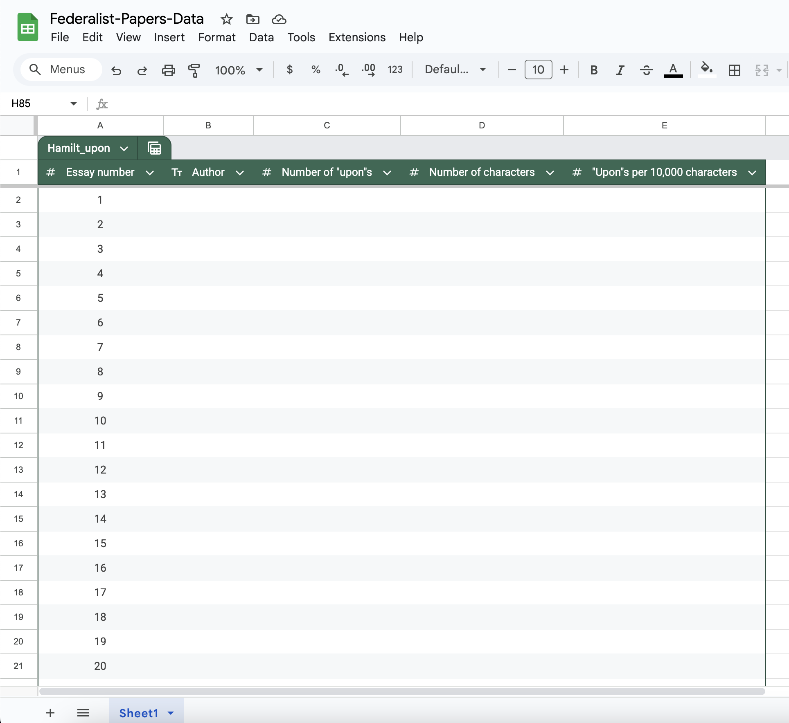

# Google Sheets - Hamilton Or Not Hamilton? That Is The Question!

## The Federalist Papers

 - Download [federalist.zip](./data/federalist.zip).
 - Save it in the folder `/Users/YOUR_NAME/Documents/UCLA-Classes/PIC-1/3-Spreadsheets`.
 - Unzip it to obtain a folder with path
   `/Users/YOUR_NAME/Documents/UCLA-Classes/PIC-1/3-Spreadsheets/The-Federalist-Papers`.
 - Within this folder, you will find a file called `all.txt`.
   `all.txt` file was downloaded from [The Project Gutenberg](https://www.gutenberg.org/).
   It is for use within the United States in accordance with
   the Project Gutenberg License included with the ebook.
 - There are also files called `00.txt`, `01.txt`, `02.txt`, ..., `85.txt`.
   These were obtained from `all.txt`.
   A few minor edits were made for educational purposes.

*The Federalist Papers* are a collection of essays written by
Alexander Hamilton, John Jay, and James Madison
under the pseudonym *Publius*.
They were published from 1787 to 1788.

The essays were intended to persuade New Yorkers
at the time to ratify the new U.S. Constitution.
Over time, these essays became highly influential in
the interpretation of United States constitutional theory.

## Essays 49 to 57, 62, and 63

As you look through `01.txt` to `85.txt`,
you will notice that most essays are
attributed to Hamilton, Jay, or Madison;
some are attributed to Madison with Hamilton.
However, if you look at `49.txt` to `57.txt`,
`62.txt` and `63.txt`, the author is listed as
Madison **or** Hamilton.

> "... The original manuscripts have never been found and were most likely destroyed at the time of printing (except for the drafts of Jay's essays)...
The number [Madison] claimed [to have written] in a list first made public in 1818...
differed significantly from one attributed to Hamilton, which had appeared ten years earlier in *The Port Folio*, a Philadelphia magazine.
The 14 November 1807 issue of that magazine reproduced a memorandum, said to be in Hamilton's handwriting...
The discrepancy between these two lists gave rise to a famous literary dispute over the authorship of certain numbers of *The Federalist*..."
[https://founders.archives.gov/documents/Madison/01-10-02-0177](https://founders.archives.gov/documents/Madison/01-10-02-0177){:target="_blank"}

In this exercise, we will try to resolve the dispute!

## Recording the frequency of the word "upon"

Our attempt to resolve the dispute is focussed on the usage of the word "upon".
For each essay, we will record
the essay number, the author, the number of "upon"s,
the number of characters, and the "Upon"s per 10000 characters.

 - Through your g.ucla.edu email, open `Sheets`.
   - Click on the icon with 9 dots, next to UCLA, in the top-right.
   - Select `Sheets`.
 - Click on `Blank spreadsheet`.
 - Title your document as `Federalist-Papers-Data`
   by replacing the text that says "Untitled spreadsheet".
 - Make the following column headings.
   - Essay number
   - Author
   - Number of "upon"s
   - Number of characters
   - "Upon"s per 10000 characters
 - We want the first column to contain the numbers 1 to 85.
   - Type 1 into `A2`.
   - Type 2 into `A3`.
   - Highlight `A2` and `A3`.
   - Hover your mouse where the blue circle is:
     at the bottom-right of the highlighted region.
     A cross (+) will appear.
   - Click and drag down to cell `A86`.
   - BOOM!
 - We want to use a *table* as before.
   - Highlight from `A1` to `E86`.
   - Select `Format > Convert to table` from the top menu.
   - Click at the top of the table (dark green)
     where it says `Table1` and edit it to say `Hamilt_upon`.
   - Using the arrows in the column headings.
     - Select `Author > Edit column type > Text`.
     - Select `Essay number > Edit column type > Number > Number`.
     - Select `Number of "upon"s > Edit column type > Number > Number`.
     - Select `Number of characters > Edit column type > Number > Number`.
     - Select `"Upon"s per 10000 characters > Edit column type > Number > Number`.
   - Select columns `A` to `E` and then
     select `Format > Alignment > Center` from the top menu.
 - If your table looks like the following screenshot, well done!
   

## Analyzing the frequency of the word "upon" using Pivot Tables

## Conditional Formatting

## Conjecturing the Authorship of Essays 49 to 57, 62, and 63

