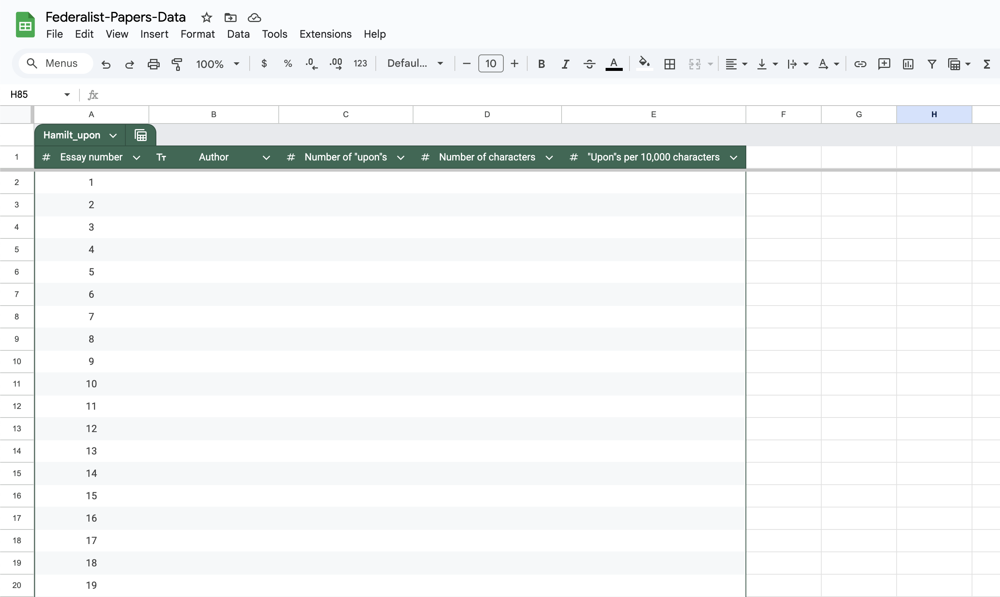
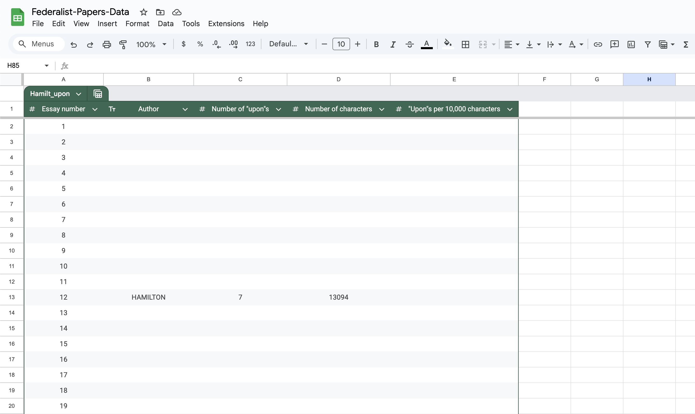
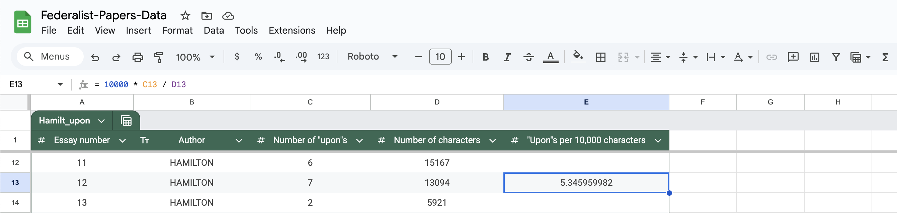
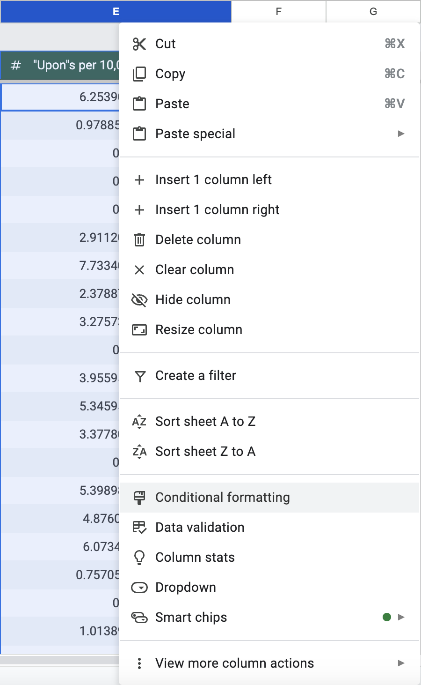

# Google Sheets - Hamilton Or Not Hamilton? That Is The Question!


## The Federalist Papers

 - Download [federalist.zip](./data/federalist.zip).
 - Save it in the folder `/Users/YOUR_NAME/Documents/UCLA-Classes/PIC-1/3-Spreadsheets`.
 - Unzip it to obtain a folder with path
   `/Users/YOUR_NAME/Documents/UCLA-Classes/PIC-1/3-Spreadsheets/The-Federalist-Papers`.
 - Within this folder, you will find a file called `all.txt`.
   `all.txt` was downloaded from [The Project Gutenberg](https://www.gutenberg.org/){:target="_blank"}.
   It is for use within the United States in accordance with
   the Project Gutenberg License included with the ebook.
 - There are also files called `00.txt`, `01.txt`, `02.txt`, ..., `85.txt`.
   These were obtained from `all.txt`.
   A few minor edits were made for educational purposes.

*The Federalist Papers* are a collection of essays written by
Alexander Hamilton, John Jay, and James Madison
under the pseudonym *Publius*.
They were published from 1787 to 1788.
The essays were intended to persuade New Yorkers
at the time to ratify the new U.S. Constitution.
Over time, these essays strongly influenced
the United States' constitutional theory.


## Essays 49 to 57, 62, and 63

As you look through `01.txt` to `85.txt`,
you will notice that most of the essays are
attributed to Hamilton, Jay, or Madison.
Some are also attributed to Madison with Hamilton.
However, if you look at `49.txt` to `57.txt`,
`62.txt`, and `63.txt`, the author is listed as
"MADISON **or** HAMILTON".

> "... The original manuscripts have never been found and were most likely destroyed at the time of printing (except for the drafts of Jay's essays)...
The number [Madison] claimed [to have written] in a list first made public in 1818...
differed significantly from one attributed to Hamilton, which had appeared ten years earlier in *The Port Folio*, a Philadelphia magazine.
The 14 November 1807 issue of that magazine reproduced a memorandum, said to be in Hamilton's handwriting...
The discrepancy between these two lists gave rise to a famous literary dispute over the authorship of certain numbers of *The Federalist*..."
[https://founders.archives.gov/documents/Madison/01-10-02-0177](https://founders.archives.gov/documents/Madison/01-10-02-0177){:target="_blank"}

In this exercise, you will try to resolve the dispute,
attempting to deduce who wrote essays
[49 to 57, 62, and 63](https://guides.loc.gov/federalist-papers/full-text){:target="_blank"}!


## Making a table that is appropriate for addressing the problem

One of our strategies to attempt to resolve the dispute
will focus on the use of the word "upon".
For each essay, we will record
the essay number, the author, the number of "upon"s,
the number of characters, and the "upon"s per 10,000 characters.

 - Through your g.ucla.edu email,
   open [Google Sheets](https://docs.google.com/spreadsheets){:target="_blank"}.
   - Click on the icon with 9 dots at the top-right, next to UCLA.
   - Select `Sheets`.
 - Click on `Blank spreadsheet`.
 - Title your document as `Federalist-Papers-Data`
   by replacing the text that says "Untitled spreadsheet".
 - Make the following column headings.
   - Essay number
   - Author
   - Number of "upon"s
   - Number of characters
   - "Upon"s per 10,000 characters
 - We want the first column to contain the numbers 1 to 85.
   - Type 1 into `A2`.
   - Type 2 into `A3`.
   - Highlight `A2` and `A3`.
   - Hover your mouse where the blue circle is:
     at the bottom-right of the highlighted region.
     A cross (+) will appear.
   - Click and drag down to cell `A86`.
   - BOOM!
 - We want to use a table as before.
   - Highlight from `A1` to `E86`.
   - Select `Format > Convert to table` from the top menu.
   - Click at the top of the table (dark green)
     where it says `Table1` and edit it to say `Hamilt_upon`.
   - Now use the arrows in the column headings.
     - Select `Author > Edit column type > Text`.
     - Select `Essay number > Edit column type > Number > Number`.
     - Select `Number of "upon"s > Edit column type > Number > Number`.
     - Select `Number of characters > Edit column type > Number > Number`.
     - Select `"Upon"s per 10,000 characters > Edit column type > Number > Number`.
   - Select columns `A` to `E` and then
     select `Format > Alignment > Center` from the top menu.
 - If your table looks like the following screenshot, well done!
   


## Collecting data

Fill in columns `B`, `C`, and `D` for essay 12.
 - Open `12.txt`.
 - You can see the author is listed as HAMILTON.
 - You can use Sublime Text to count the number of "upon"s.
   There are seven. Six have a lowercase `u` and one has an uppercase `U`.
   **Deselect the case sensitivity icon `Aa` so that Sublime Text says 7.**
 - Press `ESC` to stop using "Find".
 - By using "Select All"
   (`Selection > Select All`; "command + A" on MacOS; "ctrl + A" on Windows),
   you can quickly count the number of characters as 13,094
   because this number is displayed at the bottom.
 - Enter `HAMILTON`, `7`, and `13094` into
   cells `B13`, `C13`, and `D13`, respectively.
 - **NOTE.** In order to be consistent,
   it is simplest to enter the authors
   exactly as the `.txt` files display them:
   uppercase for names,
   lowercase for the words "or" and "with".



There are 84 essays left to enter information for.
You will complete the data entry as part of a team.

 - Form a group with at least three other students,
   so that there are at least four of you in total.
 - Pick one member of the team to be the owner of the team data.
   This student needs to follow the following steps.
   - Select `File > Make a copy`.
   - Name the file as `Federalist-Papers-Team-Data`,
     i.e. edit the name to include `Team-`.
   - Click `Make a copy`.
   - Select `File > Share > Share with others`.
   - Type a member of your team's g.ucla.edu email address
     in the "Add people, groups, and calendar events" box.
   - Enter the g.ucla.edu email addresses of
     the other members of your team.
   - **Make sure to select "Editor".**
   - Click `Send`.
 - Open the sheet `Federalist-Papers-Team-Data`
   that was just shared with you.
 - Enter the data for the remaining essays.
   - If you are a team of four, distribute the labor as follows.

     | Student |  Essays  |
     | :-----: | :------: |
     |    1    |  1 to 22 |
     |    2    | 23 to 43 |
     |    3    | 44 to 64 |
     |    4    | 65 to 85 |

   - If you are a team of five, distribute the labor as follows.

     | Student |  Essays  |
     | :-----: | :------: |
     |    1    |  1 to 17 |
     |    2    | 18 to 34 |
     |    3    | 35 to 51 |
     |    4    | 52 to 68 |
     |    5    | 69 to 85 |

 - Hopefully, as a team, you can complete the data entry in 10 to 20 minutes.
   Can you enter the data faster **and more accurately** than the team next to you?
   Is it faster to enter the data row-by-row or column-by-column?
 - When you have finished, compare your table with the team next to you to help fix any mistakes.
 - Finally, copy and paste the data from `Federalist-Papers-Team-Data` (your team's Google sheet)
   back to `Federalist-Papers-Data` (your individual Google sheet).

FYI, the writers of this webpage performed their
entire data collection process in under a minute
by running the following Python code,
pasting its output into a CSV file,
and importing that CSV file into Google Sheets.
You are not expected to understand any of the code below,
but hopefully, this example makes you excited to learn some Python.
```python
for i in range(1, 86):
  if i < 10: path = '0' + str(i) + '.txt'
  else:      path =       str(i) + '.txt'

  with open(path, 'r') as f:
    s = f.read()

    j = s.index('\n', s.index('\n', s.index('\n', s.index('\n', s.index('\n', s.index('\n') + 1) + 1) + 1) + 1) + 1) + 1
    k = s.index('\n', s.index('\n', j) + 1)

    upons = s.count('upon') + s.count('Upon')

    print(i, s[j : k].strip(), upons, len(s), sep=', ')
```


## Using a formula in Google Sheets

Think back to essay 12.
Seven "upon"s were used in 13,094 characters.
That means there were five to six "upon"s
for every 10,000 characters.
We can calculate this ratio more precisely.

<div>
  \[\frac{7}{1.3094}\ =\ 10000\ \times\ \frac{7}{13094}\ =\ 5.34596\ \text{(5dp)}\]
</div>

We can perform this calculation in Google Sheets.
 - **Type `= 10000 * C13 / D13` into cell `E13` and hit the `ENTER` key.**
 - There is also a more fun way to enter the same formula.
   - Type `= 10000 * `
   - Click on `C13`
   - Type `/`
   - Click on `D13`
   - Hit the `ENTER` key



This allows for a few bits of magic.
 - We can use the cross (+) that we used before to
   **populate cells `E2` to `E86` with analogous formulae.**
 - In fact, perhaps a "suggested autofill" appeared that
   populated the cells for you already!
 - If we edit the values in cell `C13` and `D13`,
   the value is conveniently updated using
   the formula that we just typed.


## Analyzing the frequency of the word "upon" using Pivot Tables

Hamilton and Madison both claimed
to have written essays 49 to 57, 62, and 63
**without collaborating with the other.**
Therefore, for each "MADISON or HAMILTON" essay,
we will assume the author is
either Madison or Hamilton,
and **not Madison with Hamilton.**


<br>


### Analysis 1

Create a new pivot table.
 - For the rows, use `Author`.
 - For the values, use `Number of "upon"s` and summarize by `SUM`.


Analyze the Federalist Papers data using
**only the pivot table that you just created.**
Forget any insights that you had while collecting the data.
 - What does the pivot table suggest to you about
   the true authors of the "MADISON or HAMILTON" essays?
 - Imagine that a person who you mistrust has shown this pivot table to you,
   and so you are wary of being manipulated by the data that they have presented.
   Can you think of other explanations for the data presented which are currently plausible
   (because the pivot table does not display all the information)?


<br>


### Analysis 2

Create a new pivot table.
 - For the rows, use `Author`.
 - For the columns, use `Number of "upon"s`.
 - For the values, use `Essay number` and summarize by `COUNT`.

Analyze the Federalist Papers data using
**only the pivot tables that you have just created.**
 - What does the pivot table suggest to you about
   the true authors of the "MADISON or HAMILTON" essays?
 - Is the authorship question more nuanced than
   you thought during *analysis 1*? Why?


<br>


### Analysis 3

Create a new pivot table.
 - For the rows, use `Author`.
 - For the columns, use `"Upon"s per 10,000 characters`.
   - Right-click (or two-finger tap) on any of the column headings.
   - Select `Create pivot group rule`.
   - Under "Interval size", type `2`.
   - Click `OK`.
 - For the values, use `Essay number` and summarize by `COUNT`.

Analyze the Federalist Papers data using
**only the pivot table that you just created.**
 - What does the pivot table suggest to you about
   the true authors of the "MADISON or HAMILTON" essays?
 - Imagine that you are a descendent of Hamilton and you wish to argue on his behalf.
   What data in the pivot table that you just created should you point at vigorously?


<br>


### Analysis 4

Use the same pivot table from "Analysis 3".
You could right-click (or two-finger tap)
where it says "Pivot Table 3" and select `Duplicate`.
 - Right-click (or two-finger tap) on any of the column headings.
 - Select `Edit pivot group rule`.
 - Under "Interval size", change `2` to `1.6`.
 - Click `OK`.

Analyze the Federalist Papers data using
**only the current pivot table.**
 - What does the pivot table suggest to you about
   the true authors of the "MADISON or HAMILTON" essays?
 - Based on *analysis 3* and *analysis 4*,
   are there some essays that you would like
   to pay special attention to?


<br>


### Analysis 5

Create a new pivot table.
 - For the rows, use `Author`.
 - For the columns, use `Number of characters`.
   - Right-click (or two-finger tap) on any of the column headings.
   - Select `Create pivot group rule`.
   - Under "Interval size", type `5,600`.
   - Click `OK`.
 - For the values, use `Essay number` and summarize by `COUNT`.

Analyze the Federalist Papers data using
**only the pivot table that you just created.**
 - What does the pivot table suggest to you about
   the true authors of the **shortest** "MADISON or HAMILTON" essays?
 - Do you feel manipulated by *analysis 1 to 4*?


## Reflecting on your analysis

It is a good time to discuss
the results of your analysis
with your classmates and your lecturer.


## Conditional Formatting

Go back to the original sheet. We are going to highlight the cells in
the `"Upons" per 10,000 characters` column using different colors.
If the colors below are not distinct enough for you,
feel free to make different choices.

- **Green cells.**
  - Right-click (or two-finger tap) on column `E`.
    
  - Select `Conditional formatting`.
  - For **Apply to range**, type `E2:E86`.
  - For **Format rules**, select format cells if "Greater than".
  - For the "Value or formula", type `2.1`.
  - For the "Fill color", select a green of your choice.
    
  - Click `Done`.

- **Blue cells.**
  - If necessary, right-click (or two-finger tap) on column `E`
    and select `Conditional formatting`.
  - Click `+ Add another rule`.
  - For **Apply to range**, type `E2:E86`.
  - For **Format rules**, select format cells if "Less than".
  - For the "Value or formula", type `1.6`.
  - For the "Fill color", select a blue of your choice.
  - Click `Done`.

- **Yellow cells.**
  - If necessary, right-click (or two-finger tap) on column `E`
    and select `Conditional formatting`.
  - Click `+ Add another rule`.
  - For **Apply to range**, type `E2:E86`.
  - For **Format rules**, select format cells if "Is between".
  - For the "Value or formula" boxes, type `1.6` and `2.1`.
  - For the "Fill color", select a yellow of your choice.
  - Click `Done`.

- In the following screenshot, columns `C` and `D` are hidden.
  


We will also highlight some cells in
the `Number of characters` column.

- **Orange cells.**
  - Right-click (or two-finger tap) on column `D` (not `E`).
  - Select `Conditional formatting`.
  - For **Apply to range**, type `D2:D86`.
  - For **Format rules**, select format cells if "Less than".
  - For the "Value or formula", type `8000`.
  - For the "Fill color", select an orange of your choice.
  - Click `Done`.


**Analyze the data.**

 - What do you notice about the green boxes?
 - What do you notice about the blue boxes?
 - There are **three** yellow boxes.
   In the table, each yellow box corresponds to a different author.
   Therefore, the significance of each feels quite different.
   For each of the yellow boxes,
   describe the significance of the box being yellow.
 - There are **four** orange boxes.
   Who do you think is the true author of essay 50?


## Conjecturing the Authorship of Essays 49 to 57, 62, and 63

Essays 49 to 57, 62, and 63 amount to 11 papers.
Suppose that you are made to gamble and that
the Google sheet you just created
is the only resource you have
to help decide on your bet.

You are allowed to pick between three options.

 1. The bet is for \$1100. To win,
    you have to specify the true author for each of the 11 papers correctly.
 2. The bet is for \$1000. To win,
    you have to pick 10 of the 11 papers
    and specify the true author for each of those 10 papers correctly.
 3. The bet is for \$900. To win,
    you have to pick 9 of the 11 papers
    and specify the true author for each of those 9 papers correctly.

In each option, if you are correct, you win the money,
but if you are incorrect, you have to pay the money.
 - Which option do you pick?
 - How do you specify the true author for the papers that you chose?
 - Justify your decisions.

Upon completing this activity,
you will appreciate that
people's interpretation of data often
depends upon how the data is presented,
and that if you insist upon knowing the truth,
then you cannot place enough emphasis
upon the importance of careful data analysis,
so you should always make sure to put
your thinking hat upon your head,
and not to be put upon.
Who do you think wrote that last sent<span id="egg">en</span>ce?!
<script>
  const egg = document.getElementById('egg');
  egg.addEventListener('click', function() {
    window.location.assign('3-hmm.html');
  });
</script>


<br><br>


On to [datatypes and powers of two](3-4-pow2.md)!!

