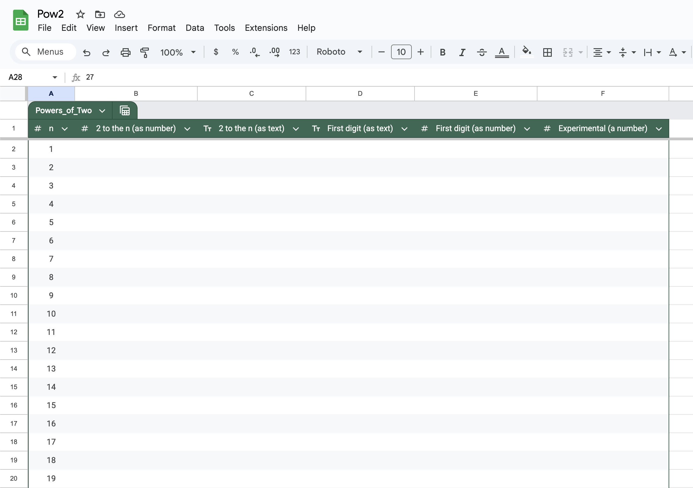
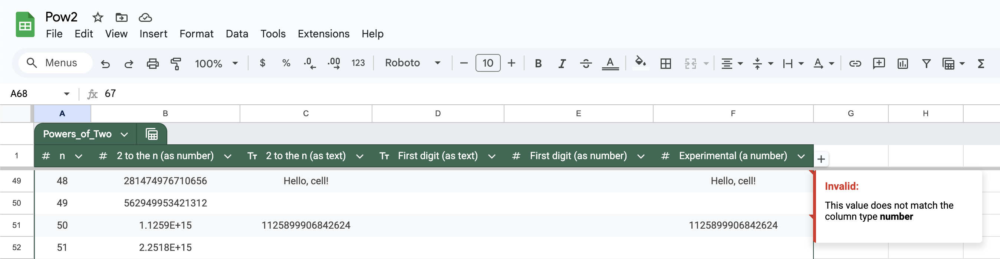
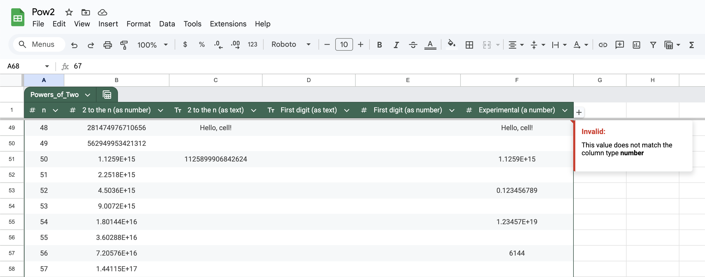
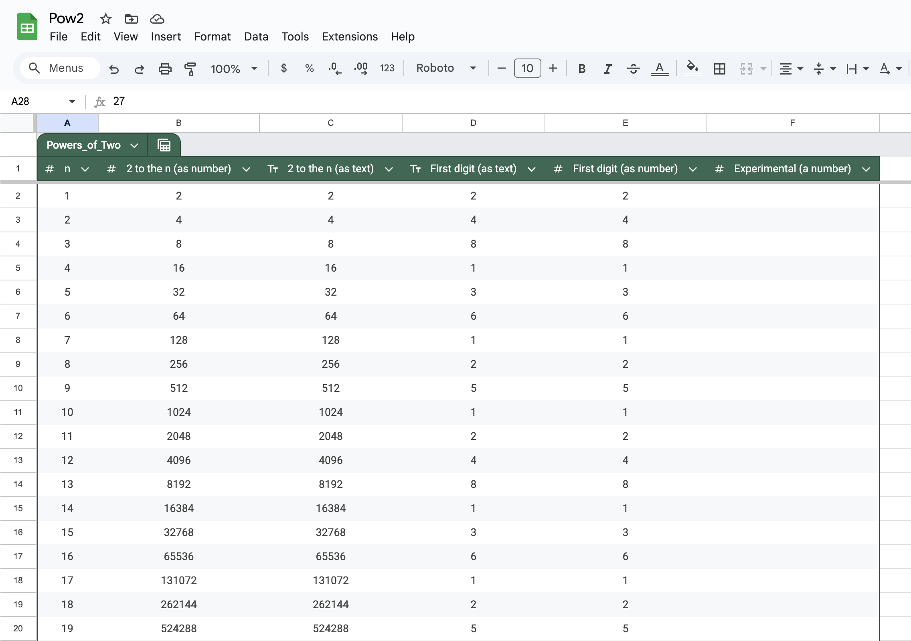

# Google Sheets - 2048 and friends

This exercise has two purposes.
 - It will emphasize the concept of datatypes,
   a foundational concept in all coding languages.
 - It will show you that intimidating math problems can
   often be attacked by a computer without too much difficulty.

## Powers of 2

You might have played the game [2048](https://play2048.co/){:target="_blank"} before.

You can see that this game involves the numbers

  \[
    2,\ 4,\ 8,\ 16,\ 32,\ 64,\ 128,\ 256,\ 512.
  \]

These numbers are called *powers of two* because they
are equal to the following numbers, respectively.

  \[
    2^1,\ 2^2,\ 2^3,\ 2^4,\ 2^5,\ 2^6,\ 2^7,\ 2^8,\ 2^9
  \]

For a positive integer $n$,
we can calculate $2^n$ using the following properties.

 - $2^0 = 1$
 - $2^{k + 1} = 2\times 2^k$ for all possible values of $k$

These properties tell us that we can calculate $2^n$ by
starting with $1$ and doubling it $n$ times.

  \[2048\ =\ 2^{11}\ =\ 2\times 2\times 2\times 2\times 2\times 2\times 2\times 2\times 2\times 2\times 2\]

## The leading digit of powers of two

Here is a question that sounds quite intimidating.

> Suppose someone
  picks a power of two ($2^n$ where $n\geq 1$) at random
  and writes down its first digit on a piece of paper.
  If you had to guess what digit they wrote down,
  is there a best option for your guess?

It is an intimidating question for a few reasons.

 - There is math, the most disliked of all the subjects!
 - The word "random".
 - Powers of two get really big, really fast. $2^{64}$ already has 20 digits.

However,
we have become acquainted with Google Sheets,
and so we can make some progress on this problem!

If we use the nine powers of two
that we have seen so far,

  \[
    2,\ 4,\ 8,\ 16,\ 32,\ 64,\ 128,\ 256,\ 512
  \]

then we can make the following table.

| Digit | Powers of $2$ for which it is the first digit | Number of times it is the first digit of a power of $2$ so far |
| :---: | :-------------------------------------------: | :------------------------------------------------------------: |
|   1   |                  16 and 128                   |                               2                                |
|   2   |                  2 and 256                    |                               2                                |
|   3   |                  32                           |                               1                                |
|   4   |                  4                            |                               1                                |
|   5   |                  512                          |                               1                                |
|   6   |                  64                           |                               1                                |
|   7   |                  none so far                  |                               0                                |
|   8   |                  8                            |                               1                                |
|   9   |                  none so far                  |                               0                                |

This does not reveal a pattern,
but we can hope that a pattern
appears when we use more data.
It would be tedious for us
to enter 999 powers of two by hand,
but we can make Google Sheets
calculate these numbers for us.

## Making a table that is appropriate for addressing the problem

 - Through your g.ucla.edu email,
   open [Google Sheets](https://docs.google.com/spreadsheets){:target="_blank"}.
   - Click on the icon with 9 dots at the top-right, next to UCLA.
   - Select `Sheets`.
 - Click on `Blank spreadsheet`.
 - Title your document as `Pow2`
   by replacing the text that says "Untitled spreadsheet".
 - Make the following column headings
   (including what is written in the parentheses).
   - n
   - 2 to the n (as number)
   - 2 to the n (as text)
   - First digit (as text)
   - First digit (as number)
   - Experimental (a number)
 - We want the first column to contain the numbers 1 to 999.
   - Type 1 into `A2`.
   - Type 2 into `A3`.
   - Highlight `A2` and `A3`.
   - Hover your mouse where the blue circle is:
     at the bottom-right of the highlighted region.
     A cross (+) will appear.
   - Click and drag down all the way to the bottom, cell `A1000`.
   - BOOM!
 - We want to use a table as before.
   - Highlight from columns `A` to `F`.
   - Select `Format > Convert to table` from the top menu.
   - Click at the top of the table (dark green)
     where it says `Table1` and edit it to say `Powers_of_Two`.
   - Use the arrows in the column headings.
     - Select `2 to the n (as text) > Edit column type > Text`.
     - Select `First digit (as text) > Edit column type > Text`.
     - Select `n > Edit column type > Number > Number`.
     - Select `2 to the n (as number) > Edit column type > Number > Number`.
     - Select `First digit (as number) > Edit column type > Number > Number`.
     - Select `Experimental (a number) > Edit column type > Number > Number`.
   - Select columns `A` to `F` and then
     select `Format > Alignment > Center` from the top menu.
 - If your table looks like the following screenshot, well done!
   

## Calculating $2^n$

We can perform this calculation in Google Sheets.
 - **Type `= POW(2, A2)` into cell `B2` and hit the `ENTER` key.**
 - Allow the "suggested autofill".
 - Make sure that you did not type `= POW(A2, 2)` because
   this formula calculates $n^2$ rather than $2^n$.

Scrolling down,
you can see that the numbers get very big.
Google Sheets will not know all the digits of these big numbers,
but it knows the first digit, which is what we care about.

## Picking off the first digit

One can think about picking off the first digit of a number in two distinct ways.
Suppose the number is 314159265, so that the first digit is 3.

 - **METHOD 1 (Difficult).**
   The first method to pick off the first digit involves math.
    

      \[
        3\ =\ \left\lfloor     3.14159265                                          \right\rfloor\ 
           =\ \left\lfloor\frac{314159265}{100000000                              }\right\rfloor\ 
           =\ \left\lfloor\frac{314159265}{10^8                                   }\right\rfloor\ 
           =\ \left\lfloor\frac{314159265}{10^{\lfloor\log_{10}(314159265)\rfloor}}\right\rfloor
      \]
    

    Therefore, $\left\lfloor\frac{m}{10^{\lfloor\log_{10}(m)\rfloor}}\right\rfloor$
    gives a formula for the first digit of a positive integer $m$.

    This can be written in Google Sheets by typing
    `= FLOOR(B2 / POW(10, FLOOR( LOG10(B2) ) ) )`.

    This is completely reasonable,
    but **we do not wish to assume that you know about logarithms or the floor function,**
    and if you do not know them, then this formula is probably quite displeasing to you.
    Moreover, the second method is much simpler.

 2. **METHOD 2 (Easier).**
    Forget about thinking of 314159265 as a number.
    Just think of it as a sequence of characters.
    What is the first character?
    Said another way,
    what is the character furthest to the left?
    It is the character 3, exactly what we are after!
    This is great because there is a function in Google Sheets
    called `LEFT` that gives the left-most
    character in a chunk of text!

For some of our columns, we have specified *number* as the datatype.
For some of our columns, we have specified *text* as the datatype.
The first method is suited to the *number* datatype,
whereas the second method is suited to the *text* datatype.
Throughout this course, we will use *italics* to indicate
when "number" and "text" refer to the datatypes
rather than the ordinary use of these words.

## The *text* datatype and the *number* datatype

Before progressing any further,
it is useful to highlight some differences
between the two datatypes: *text* and *number*.
**Beware: some of this might feel uncomfortable for you because
you are about to see that computers are often far-from-perfect at math!**

 - Some of the numbers used in this part are long
   and you may be tempted to use copy-and-paste.
   - No problems are created if you type the numbers.
   - `0.12345678901234567890` and `12345678901234567890`
     are not too bad to type,
     so we certainly suggest
     that you type them.
   - **If you choose to use copy-and-paste,
     you should make sure to use the "cell editor"**
     which is found where it says "fx",
     above the column labels `A`, `B`, `C`,...

 - In cell `C49`,
   type `Hello, cell!`.
   - The text you just typed is stored without a problem.

 - In cell `C51`,
   type `1125899906842624`
   (the value of $2^{50}$).
   - The text you just typed is stored without a problem.

 - In cell `F49`,
   type `Hello, cell!`.
   - A little red triangle appears at the top-right.
   - Upon hovering over it, you receive a message saying,
     "Invalid: This value does not match the column type **number**".
   - This is reasonable. `Hello, cell!` is not a number!

 - In cell `F51`,
   type `1125899906842624`
   (the value of $2^{50}$).
   - A little red triangle appears at the top-right.
   - Upon hovering over it, you receive a message saying,
     "Invalid: This value does not match the column type **number**".
   - This is confusing!
     Why can the *number* datatype
     not store the numerical value ${1125899906842624}$??
     We need to investigate!

 - In cell `F51`,
   type `1125899906842620` (the value of $2^{50} - 4$),
   or edit the last `4` of what you previously typed to be `0`.
   - This value is stored without a problem.
   - It is displayed as "1.1259E+15".
   - It is confusing that
     the previous numerical value led to problems
     and that this numerical value does not.
     We need to investigate more!

 - In cell `F53`,
   type `0.12345678901234567890` and hit `ENTER`.
   - Click on the cell again.
   - It behaved
     as though you typed
     `0.123456789012345`,
     that is, it ignored 
     the last five digits
     that you typed.
   - Hmm.

 - In cell `F55`,
   type `= 12345678901234567890` and hit `ENTER`.
   **Do not miss the `=` sign.**
   - Click on the cell again.
   - It behaved
     as though you typed
     `= 12345678901234500000`,
     that is, it replaced 
     the last five digits
     that you typed with zeros.
   - Hmm.

 - Cells `F51`, `F53`, and `F55` all demonstrate that
   **Google Sheets will not let you specify
   a value for the *number* datatype to
   more than 15 significant figures.**
   In case you do not remember learning about
   significant figures during high school,
   here are a few examples.
   - The first significant digit of 0.0012345678 is 1, the leftmost non-zero digit.
   - Truncating 0.0012345678 to 3 significant figures gives 0.00123.
   - The first significant digit of 87654321 is 8, the leftmost non-zero digit.
   - Truncating 87654321 to 6 significant figures gives 87654300.

 - In cell `F57`,
   type `= POW(2, 63) - 9223372036854770000` and hit `ENTER`.
   - The calculation gives 6144.
   - The mathematically correct answer to $2^{63} - 9223372036854770000$ is $5808$.
   - **The *number* datatype is not able to perform this arithmetic correctly.**
   - Here is something amazing! Using the spreadsheet that you have created,
     you can do a better job than Google Sheets at calculating
     the last four digits of $2^{63} = 2^{48} \times 2^{15}$.
     Our spreadsheet correctly tells us that
     $2^{48} = {281474976710656}$ and $2^{15} = 32768$.
     When starting to multiply $2^{48}$ and $2^{15}$,
     we find that the last digit is equal to
     the last digit of $6\times 8 = 48$,
     that is $8$.
   - We could keep going to obtain the last four digits.
     This amounts to doing the calculation and ignoring multiples of 10,000.
     

       \[\begin{aligned}
         2^{63}\ &=\            2^{48} \times 2^{15}                         \\
                 &=\ {281474976710656} \times  32768                         \\
            &\equiv\              656  \times   2768\ (\text{modulo}\ 10000) \\
            &\equiv\                         1815808\ (\text{modulo}\ 10000) \\
            &\equiv\                            5808\ (\text{modulo}\ 10000)
       \end{aligned}\]
     

 - You might be interested in how Google, JavaScript, and Python perform
   when faced with the $2^{63} - 9223372036854770000$ calculation.
   - In response to `2**63 - 9223372036854770000`, Google says 0.
   - In JavaScript, `2**63 - 9223372036854770000` gives 6144.
   - Typing `2**63 - 9223372036854770000` into Python gives 5808
     and this is correct!
   - Python is great at integer arithmetic.
     However, later on, we will see that it says that
     the product of 20.15 and 100 is **not** equal to 2015.

 

### The *text* datatype

When a cell's datatype is *text*,
it can store up to 50,000 characters.

 - Characters from the English alphabet are allowed.
 - All the digits (0 to 9) are allowed.
 - Some special characters like spaces are allowed too.

We can use a function called `VALUE`
to attempt to obtain a *number*
from some *text*.
 - When the stored text is `123456.75`,
   using `VALUE` produces a *number* that stores 123456.75.
   - We will see plenty of successful uses of `VALUE` shortly.
 - When the stored text is `Hello, cell!`, using `VALUE` gives an error.
   - If you wish to see this, type `= VALUE(C49)` into cell `F49`.
 - When the stored text is `1125899906842624`, using `VALUE` gives an error
   because ${1125899906842624}$ has more than 15 significant figures.
   - If you wish to see this, type `= VALUE(C51)` into cell `F51`.

 

### The *number* datatype

When a cell's datatype is *number*,
it can store many numerical values.
**There are restrictions on which numbers can
be stored and which numbers can be entered.**
A computer cannot store the exact value of $\pi$,
and we have seen that there are values that
we are not allowed to enter:
some values produce errors,
and some values are changed
when we use them with `=`.
We can use *numbers* for arithmetic.
**The accuracy of arithmetic is not always perfect.**
In many applications, this lack of precision can be ignored,
but this issue can matter much more than you might expect.

Any *number* can be used to produce some *text*
by using the `TO_TEXT` function. We will see
plenty of uses of `TO_TEXT` shortly.

## Addressing the $2^n$ problem

Remember the intimidating question that started all of this discussion.

> Suppose someone
  picks a power of two ($2^n$ where $n\geq 1$) at random
  and writes down its first digit on a piece of paper.
  If you had to guess what digit they wrote down,
  is there a best option for your guess?

We can use `TO_TEXT`, `LEFT`, and `VALUE`
to address this problem.

 - Delete the content of cells
   `C49`, `C51`, 
   `F49`, `F51`, `F53`, `F55`, and `F57`. 
 - Type `= TO_TEXT(B2)` into cell `C2` and hit the `ENTER` key.
   - Allow the "suggested autofill".
   - **NOTE.** Typing `= B2` instead of `= TO_TEXT(B2)`
     would create an error: "Invalid: This value
     does not match the column type **text**".
 - Type `= LEFT(C2)` into cell `D2` and hit the `ENTER` key.
   - Allow the "suggested autofill".
 - Type `= VALUE(D2)` into cell `E2` and hit the `ENTER` key.
   - Allow the "suggested autofill".
   - **NOTE.** Typing `= D2` instead of `= VALUE(D2)`
     would create an error: "Invalid: This value
     does not match the column type **number**".

   
 - Notice that you now have 999 examples of
   `TO_TEXT`, `LEFT`, and `VALUE`!
 - Create a pivot table.
   - For the rows, use `First digit (as number)`.
   - For the values, use `n` and summarize by `COUNT`.
 - Create a chart.
   - Click on cell `A1` of your pivot table.
   - Select `Insert > Chart`.
   - Go back to the pivot table editor and
     deselect "Show totals" for the rows.
   - Congratulations on making your first chart!

One more time...

> Suppose someone
  picks a power of two ($2^n$ where $n\geq 1$) at random
  and writes down its first digit on a piece of paper.
  If you had to guess what digit they wrote down,
  is there a best option for your guess?

<textarea id="first_digit_of_power_of_two" rows="1" cols="6"></textarea>
<input type="button" value="Submit" id="first_digit_of_power_of_two_submit">

> Does your chart demonstrate anything more than this?

  

Next: [a trip to the museum](3-5-museum.md)!!
