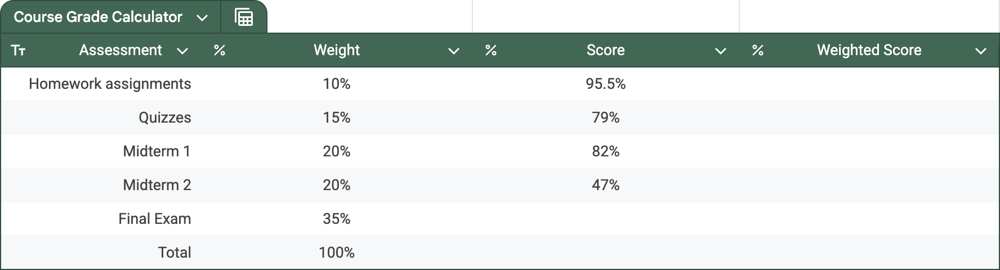

# Google Sheets - Weighted Averages, a Trip to the Museum, and a Course Grade Calculator

This exercise will show you that
Google Sheets can be used as a calculator.
In fact, it will show you that Google Sheets is
better than the calculator on your phone because
it allows you to perform many similar calculations
using different numbers without you having to
retype every aspect of the calculation.

## Motivating Weighted Averages

A museum has the following exhibitions.
 - Ancient Greek Artefacts
 - Middle Eastern Mosaics
 - South American Sculptures
 - Polynesian Paintings

The items in the Ancient Greek Artefacts exhibition
account for 17% of all of the museum's items.
The following table records similar
statistics for all of the exhibitions.

|                Exhibition | Fraction of museum |
| ------------------------: | :----------------: |
|   Ancient Greek Artefacts |         17%        |
|    Middle Eastern Mosaics |         26%        |
| South American Sculptures |         19%        |
|      Polynesian Paintings |         38%        |

You visit this museum and you look around the exhibitions,
but you only manage to see a fraction of each.
The following table details your visit.

|                Exhibition | Fraction of exhibition visited |
| ------------------------: | :----------------------------: |
|   Ancient Greek Artefacts |               62%              |
|    Middle Eastern Mosaics |               85%              |
| South American Sculptures |               55%              |
|      Polynesian Paintings |               22%              |

What fraction of the museum's items have you seen?
It might be tempting to calculate

  \[\frac{62\ +\ 85\ +\ 55\ +\ 22}{4}\ =\ 56\]

and claim that you visited 56% of the items in the museum.

 - **This is incorrect.**
 - This calculation *weights*
   each of the fractions
   62%, 85%, 55%, and 22% equally.
 - However, since Polynesian paintings
   account for more of the museum items
   than the other exhibitions,
   the fraction 22% should
   carry more importance than
   the other fractions 62%, 85%, and 55%.
 - **We need to calculate a *weighted average*.**

The correct calculation is as follows.

  \[
    \left( \frac{17}{100} \times \frac{62}{100} \right)\ +\ 
    \left( \frac{26}{100} \times \frac{85}{100} \right)\ +\ 
    \left( \frac{19}{100} \times \frac{55}{100} \right)\ +\ 
    \left( \frac{38}{100} \times \frac{22}{100} \right)\ =\ \frac{51.45}{100}
  \]

You visited 51.45% of the museum's items!
Said another way...

  \[
    \left( 17\% \times 62\% \right)\ +\ 
    \left( 26\% \times 85\% \right)\ +\ 
    \left( 19\% \times 55\% \right)\ +\ 
    \left( 38\% \times 22\% \right)\ =\ 51.45\%
  \]

 - We have *weighted* 62%, the fraction of the Ancient Greek artefacts that you visited,
   by 17%, the fraction of the items in the museum that the Ancient Greek artefacts account for.
 - We have *weighted* 85%, the fraction of the Middle Eastern mosaics that you visited,
   by 26%, the fraction of the items in the museum that the Middle Eastern mosaics account for.
 - We have *weighted* 55%, the fraction of the South American sculptures that you visited,
   by 19%, the fraction of the items in the museum that the South American sculptures account for.
 - We have *weighted* 22%, the fraction of the Polynesian paintings that you visited,
   by 38%, the fraction of the items in the museum that the Polynesian paintings account for.

Our *weights* are given by the fraction of the items in the museum that each exhibition accounts for.
Our *weighted average* is calculated by the following formula.

  \[
    \text{weighted average}\ =\ \left( \text{weight}_1 \times \text{fraction}_1 \right)\ +\ 
                                \left( \text{weight}_2 \times \text{fraction}_2 \right)\ +\ 
                                \left( \text{weight}_3 \times \text{fraction}_3 \right)\ +\ 
                                \left( \text{weight}_4 \times \text{fraction}_4 \right)
  \]

## Preparing to Calculate Weighted Averages in Google Sheets

Create the following table in Google Sheets.

|                Exhibition | Fraction of museum (weight) | Fraction of exhibition visited | Fraction of museum visited |
| ------------------------: | :-------------------------: | :----------------------------: | :------------------------: |
|   Ancient Greek Artefacts |             17%             |               62%              |                            |
|    Middle Eastern Mosaics |             26%             |               85%              |                            |
| South American Sculptures |             19%             |               55%              |                            |
|      Polynesian Paintings |             38%             |               22%              |                            |
|                     Total |                             |                                |                            |

 - Make the following column headings.
   - Exhibition
   - Fraction of museum (weight)
   - Fraction of exhibition visited
   - Fraction of museum visited
 - Use a table as before.
   - Highlight from `A1` to `D6`.
   - Select `Format > Convert to table` from the top menu.
   - Click at the top of the table (dark green)
     where it says `Table1` and edit it to say `Museum`.
   - Now use the arrows in the column headings.
     - Select `Exhibition > Edit column type > Text`.
     - Select `Fraction of museum (weight) > Edit column type > Number > Percent`.
     - Select `Fraction of exhibition visited > Edit column type > Number > Percent`.
     - Select `Fraction of museum visited > Edit column type > Number > Percent`.
 - Type in the values indicated for the first three columns.
   

## Calculating Weighted Averages in Google Sheets

We have already used a few formulas in Google Sheets
and we have often used the "suggested autofill".
Here, we are a little bit more careful.

 - Typing `=` into cell `B6`
   creates an autocomplete option: `=SUM(B2:B5)`.
   - This is sensible.
   - It uses a function called `SUM`
     to sum the values of cells `B2`, `B3`, `B4`, and `B5`.
   - We find the fractions add to 100% (as they should).

 - Typing an `=` into cell `D2` does
   not provide an autocomplete option,
   but we can type `= B2 * C2` to calculate the
   $\text{weight}_1 \times \text{fraction}_1$ term
   of our weighted average formula.
   We can now accept or reject
   the "suggested autofill" option.

   - If we accept the "suggested autofill" option,
     it will use our formula to deduce...
     - the formula `= B3 * C3` in cell `D3`;
     - the formula `= B4 * C4` in cell `D4`;
     - the formula `= B5 * C5` in cell `D5`;
     - the formula `= B6 * C6` in cell `D6`.

     The formulas for cells `D3`, `D4`, and `D5`
     are what we want. They calculate the
     

     \[
       \text{weight}_2 \times \text{fraction}_2,\ \ 
       \text{weight}_3 \times \text{fraction}_3,\ \ \text{and}\ \ 
       \text{weight}_4 \times \text{fraction}_4
     \]
     

     terms of our weighted average formula, respectively.
     However, the formula for cell `D6` does not make sense,
     and we should delete it.

   - If we reject the "suggested autofill" option,
     then we can click on `D2` and hover our mouse
     where the blue circle is until a cross (+) appears,
     and then click and drag down to cell `D5`.
     In this way, we can be more careful about
     where new formulas are deduced by Sheets.

   - In either scenario,
     we should check the deduced formulas
     to confirm that they are the formulas we hoped for.
     Sometimes, it is easier to check our formulas
     when Google Sheets performs cell highlighting.
     
      - By double-clicking on a cell, we can start to edit it,
        and our formulas are conveniently color-coded.
      - If we do not wish to make an edit,
        we can press `ESC` to safely exit
        without accidentally editing the cell contents.

 - Typing `=` into cell `D6`
   creates an autocomplete option: `=SUM(D2:D5)`.
   - This is sensible.
   - It uses a function called `SUM`
     to sum the values of cells `D2`, `D3`, `D4`, and `D5`.
   - This completes the calculation of the weighted average
     and we see the correct answer: 51.45%.

 - It is good to know how to enter the last formula another way.
   - Click on `D6`.
   - Type `= SUM()` and then press the left arrow
     to go between the parentheses.
   - Then you can highlight from cell `D2` to `D5`,
     and it will fill in `D2:D5` for you.
   - Finally, hit `ENTER`.

 - Cell `C6` is empty.
   - This is okay.
   - There is nothing we can put there that will make sense for the labels
     "Fraction of exhibition visited" and "Total".

## Benefits over a Calculator

Since this calculation could have been done with a calculator,
you might ask...

> What is the advantage of using a spreadsheet?

We now have a dynamic representation of the weighted average calculation
and we can perform other exploratory calculations.

> What if you had seen
  50% of the Polynesian paintings
  instead of just 22%?

By changing the cell `C5` to store 50%,
we immediately obtain a new value of 62.09%
for the fraction of the museum's items you visited.
We can perform similar calculations without having to enter
the formulas over and over again!

> By exploring different fractions,
  find the **minimum fraction**
  (to the nearest whole percent)
  of the Polynesian paintings
  that you would need to see
  in order to have seen more than
  75% of the items in the museum
  (with the other fractions unchanged). 

<textarea id="polynesian" rows="1" cols="6"></textarea>
<input type="button" value="Submit" id="polynesian_submit">

                  
                  
                  
                  
                  
                  
                  
                  
                  
                  
                  
                  
                  
                  
                  
                  

> Why might you want to do this?

- Perhaps you want to gain the most from your museum trip by seeing 75% of the items,
  but you are at the Polynesian Paintings exhibition and
  you do not want to go back to the other exhibitions!
- We can set up and solve this as a math problem,
  but this exploratory and dynamic approach offers an alternative.
  It is easy to edit any of the 8 fractions involved in the calculation.
- There is a scenario that is very similar to this one
  that you have thought about many times in your life:
  you know all of your homework and midterm scores in a course you are taking,
  and you want to know the score that you need on the Final exam to get an A!

## Creating a Course Grade Calculator

Suppose that you are taking a course where
the syllabus specifies the following weights.

|           Assessment | Weight |
| -------------------: | :----: |
| Homework assignments |  10%   |
|              Quizzes |  15%   |
|            Midterm 1 |  20%   |
|            Midterm 2 |  20%   |
|                Final |  35%   |

Suppose that
the professor believes that
difficult exams are important
for motivating students to
learn course material thoroughly,
and that they list the following
grading scheme.

|            Bin           | Grade |
| :----------------------: | :---: |
| 80% and above            |   A   |
| 65% and above, below 80% |   B   |
| 50% and above, below 65% |   C   |
| 35% and above, below 50% |   D   |
|                Below 35% |   F   |

Suppose it is before the Final exam and that
you have earned 95.5% on homework assignments,
79% on quizzes, 82% on midterm 1, and 47% on midterm 2.

 - What score do you need to obtain an A in the class? <!-- 94% / 77% -->
 - What score do you need to obtain a B in the class? <!-- 51% / 50% -->
 - What score do you need to obtain a C in the class? <!-- 8% / 23% -->

It is the day before the exam and
you receive an email from your professor saying,
 > I have decided to count
   only the higher of your two midterm scores.
   Your Final will now be worth 55% of your grade.

By considering the three questions above again,
is this grading scheme better or worse for you?

  

Next: [creating graphics for F1 TV](3-6-f1.md)!!