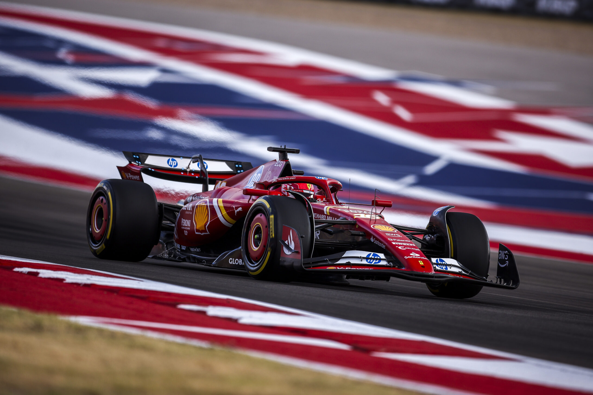
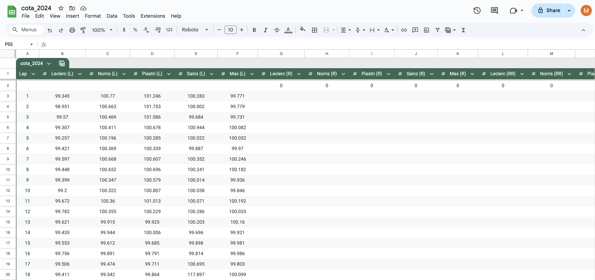
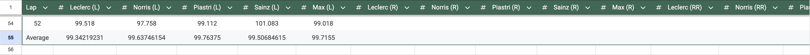
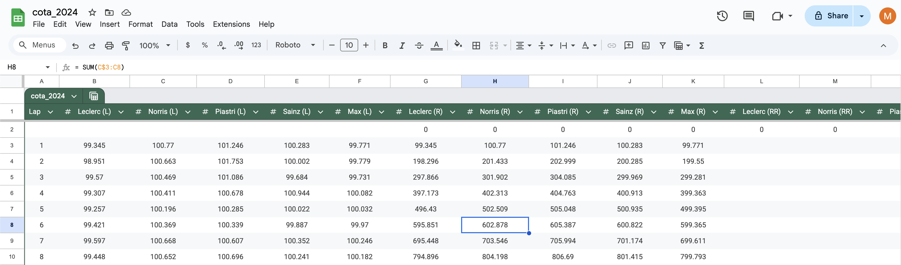
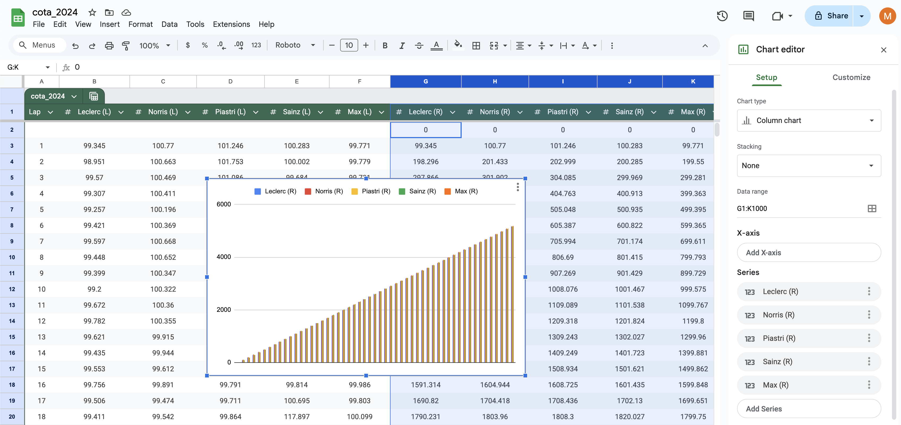
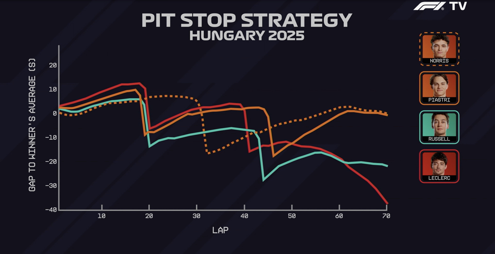
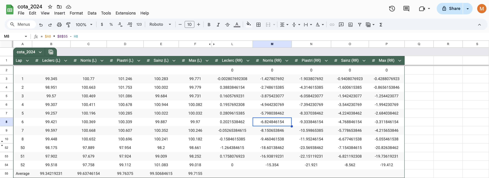
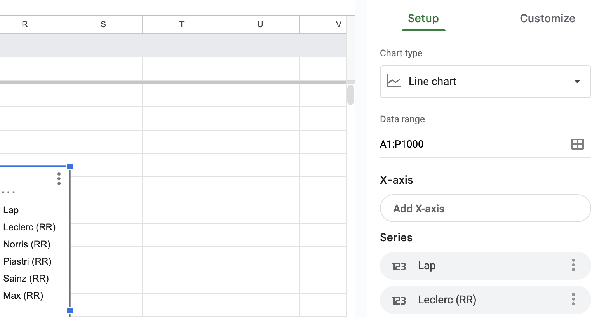
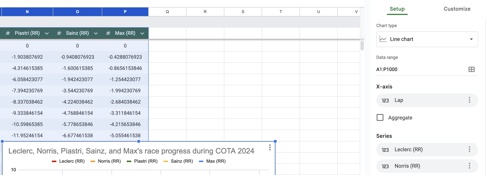
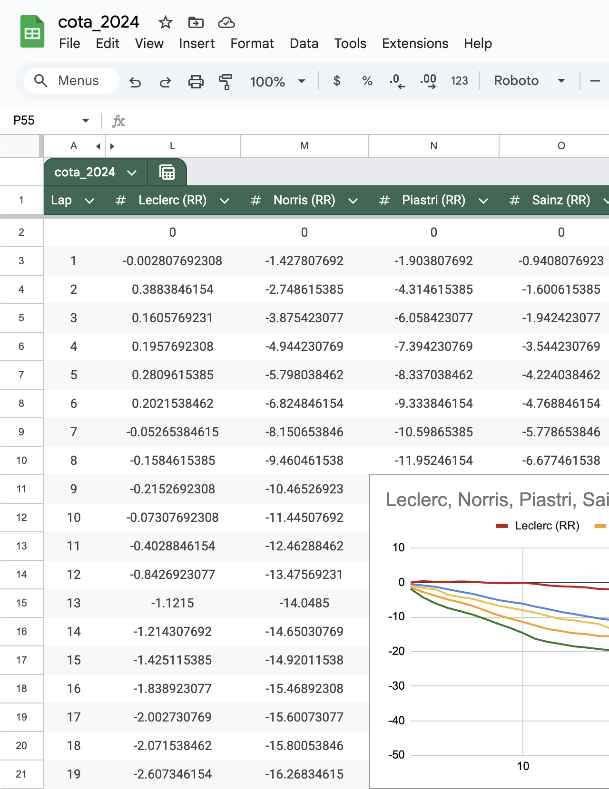

# Creating Graphics For F1 TV

## Preparing the Table

 - Download [this file](./data/cota_2024.csv).
   As you will see shortly,
   this CSV file contains data
   for a Formula 1 Race at the Circuit of the Americas in 2024.
   For those who know and love Formula 1,
   the times of the first five laps were impacted by a safety car,
   and so they have been replaced to make the data nicer to work with.
 - Save the file in the folder `/Users/YOUR_NAME/Documents/UCLA-Classes/PIC-1/3-Spreadsheets`.
 - Through your g.ucla.edu email,
   open [Google Sheets](https://docs.google.com/spreadsheets){:target="_blank"}.
   - Click on the icon with 9 dots, next to UCLA, in the top-right.
   - Select `Sheets`.
 - Click on `Blank spreadsheet`.
 - Select `File > Open`.
 - Select `Upload > Browse`.
 - Open the file that you just downloaded.
 - Select `Format > Convert to table` from the top menu.
 - Click at the top of the table (dark green)
   where it says `Table1` and edit it to say `cota_2024`.
 - Now use the arrows in the column headings.
   - Select `Edit column type > Number > Number` for each column except the first.
   - This is a little bit tedious, but it is useful for helping us to catch errors.
 - Select columns `A` to `P` and then
   select `Format > Alignment > Center` from the top menu.
   

## Processing Formulas

 - The table contains lap (L) times for five drivers.
 - First, we calculate the average lap time of each driver.
   
   - Type `= AVERAGE(B3:B54)` into cell `B55`.
   - Obtain formulas in cells `C55`, `D55`, `E55`, and `F55` by "dragging".
 - We would like to understand each driver's race progress.
   For each lap, we would like to record the drivers' race (R) times at the end of that lap.
   
   - Type `= SUM(B$3:B3)` into `G3`.
   - Obtain formulas in cells `H3`, `I3`, `J3`, and `K3` by "dragging".
   - Obtain formulas in rows `3` to `54` by "dragging" again.
   - These "drags" should have filled up cells `G3` to `K54` with values.
   - The `$` in front of the first `3` that we typed ensures
     that "dragging" always produces a `3` in this position.
     For example, `H8` contains the formula `= SUM(C$3:C8)`.
     `B`s have changed to `C`s and
     the second `3` has changed to an `8`,
     but the first `3` has remained as `3`.
 - Create a quick chart for this data.
   
   - Highlight columns `G` to `K` and select `Insert > Chart`.
   - We can see that the drivers' race (R) times create
     something close to a straight line.
     Using this chart,
     we are sometimes able
     to identify the driver
     who finishes a lap first
     (that is, in the least time),
     but this requires us to zoom in a lot.
     Sometimes the resolution is not good enough
     for us to be able to read this information.
   - This chart is not very convenient, so delete it.
 - On 8/3/2025, Formula 1 TV showed the following graphic
   for the Hungarian Grand Prix. The $y$-axis is ambiguously labeled,
   but the graph was intuitive to read *for those who watched the race*.
   What are some things that are indicated by this graph?
   It is quite reasonable to be confused by it!
   
 - To create a chart for COTA 2024 like the one from Hungary 2025,
   we subtract the drivers' race (R) times from a straight line
   whose slope is given by the average lap time of [Charles Leclerc](https://www.youtube.com/watch?v=S0TeJKUYTxw){:target="_blank"}.
   This gives (the negative of) each driver's relative race (RR) time,
   relative to an imaginary driver that drives at Leclerc's average speed
   throughout the race.
   
   *Note: this screenshot hides columns `G` to `K` and rows `11` to `51`.*
   - Type `= $A3 * $B$55 - G3` into `L3`.
   - Obtain formulas in cells `M3`, `N3`, `O3`, and `P3` by "dragging".
   - Obtain formulas in rows `3` to `54` by "dragging" again.
   - These "drags" should have filled up cells `L3` to `P54` with values.
   - The value in `L54` should be `0`.
   - We typed three `$`s in cell `L3`.
     - The `$` in front of the `A` ensures that
       "dragging" always produces an `A` in this position.
     - The `$`s in front of `B` and `55` ensure that
       "dragging" always produces `B55` in this position.
     - For example, `M8` contains the formula `= $A8 * $B$55 - H8`.
       `G` has changed to an `H`, and the `3`s have changed to `8`s,
       but `A` has remained as `A`, and `B55` has remained as `B55`.
 - Create a nice chart for this data.
   - Hide columns `B` to `K`.
     - Select columns `B` to `K`.
     - Right-click (or two-finger tap) where it says `B`.
     - Select `Hide columns B - K`.
   - Highlight column `A`, together with columns and `L` to `P`,
     and select `Insert > Chart`.
     
   - Using the "Chart editor",
     click `Add X-axis` and select `Lap`.
   - Click on the three dots underneath "Series", next to `Lap`,
     and select `Remove`.
     
   - Click `Customize`, followed by `Chart & axis titles`, and set the "Title text" to be
     `Leclerc, Norris, Piastri, Sainz, and Max's race progress during COTA 2024`.
   - If you are a Formula 1 fan,
     you may feel obliged to click `Customize`, followed by `Series`,
     and to select a more appropriate "Line color" for each driver.
     I liked the following colors.
     - Red for [Leclerc](https://www.youtube.com/watch?v=opyT_D_MW-I){:target="_blank"} (Ferrari)
     - Orange for Norris (McLaren)
     - Green for Piastri (Australia)
     - Gold for Sainz (Spain)
     - Blue for Max (Red Bull)

## Data Analysis

### COTA 2024

Using the chart that you just created, answer the following questions.

 - Who won the race?
 - At this circuit, drivers enter the pits to change their tires
   at the *end* of their lap, and this causes their *next* lap to be much slower.
   - What significant event took place on lap 17?
   - What significant event took place on lap 21?
   - What was the consequence of these two events?
     This is called an "undercut".
 - What significant event took place on lap 48?
 - Was the time difference between
   the drivers involved in the event on lap 48
   more or less than 5 seconds at the end of the race?
 - Norris received a 5 second penalty,
   and this was added to his total time
   after the race.
   Accounting for Norris' penalty,
   what was the finishing order of the drivers?
 - For fans of Formula 1 who remember the exact laps that these events occurred on,
   you might notice that the numbers are incorrect. This is because the data
   was "cleaned" to ignore the safety car at the start of the race.

### Hungary 2025

We can now understand Formula 1 TV's graphic much better!

 - Who won the race?
 - How was Norris' pit stop strategy different than that of
   Piastri, Russell, and Leclerc in Hungary 2025?

## Avoiding Numerical Errors and Being Efficient

The methods that we used above were chosen to demonstrate how `$` can be used in spreadsheets.
In one case, this was the best choice. In the other cases, there were slightly better choices available.

 - We used `$B$55` rather than typing 99.34219231. This is because
   the actual value stroed by cell `B55` is closer to 99.3421923076923.
   If you type 99.34219230769 (accurate to 13 significant figures) in
   the original fomula in `L33`, and then perform the "dragging" again,
   you will see that numerical errors make the value in `L54` non-zero.

 - The use of `= SUM(B$3:B3)` in `G3` is inefficient.
   Suppose that you are asked to perform the following calculations.
   

     \[\begin{aligned}
       1\ +\ 2\phantom{\ +\ 3\ +\ 4\ +\ 5\ +\ 6\ +\ 7\ +\ 8\ } &=\  3\\
       1\ +\ 2\ +\ 3\phantom{\ +\ 4\ +\ 5\ +\ 6\ +\ 7\ +\ 8\ } &=\  6\\
       1\ +\ 2\ +\ 3\ +\ 4\phantom{\ +\ 5\ +\ 6\ +\ 7\ +\ 8\ } &=\ 10\\
       1\ +\ 2\ +\ 3\ +\ 4\ +\ 5\phantom{\ +\ 6\ +\ 7\ +\ 8\ } &=\ 15\\
       1\ +\ 2\ +\ 3\ +\ 4\ +\ 5\ +\ 6\phantom{\ +\ 7\ +\ 8\ } &=\ 21\\
       1\ +\ 2\ +\ 3\ +\ 4\ +\ 5\ +\ 6\ +\ 7\phantom{\ +\ 8\ } &=\ 28\\
       1\ +\ 2\ +\ 3\ +\ 4\ +\ 5\ +\ 6\ +\ 7\ +\ 8\phantom{\ } &=\ 36\\
     \end{aligned}\]
   

   We can count 28 `+`s, so it looks like we need to perform 28 additions.
   However, we can do better and use only 7 additions
   by remembering the result of each calculation to help us with the next.
   

     \[\begin{aligned}
        1\ +\ 2\ &=\  3\\
        3\ +\ 3\ &=\  6\\
        6\ +\ 4\ &=\ 10\\
       10\ +\ 5\ &=\ 15\\
       15\ +\ 6\ &=\ 21\\
       21\ +\ 7\ &=\ 28\\
       28\ +\ 8\ &=\ 36\\
     \end{aligned}\]
   

   We can perform the same trick in Google Sheets
   by typing `= G2 + B3` into `G3` before performing our "dragging".
   The zeros in row `2` provide a natural starting value for the accumulations.
   Moreover, this procedure is closer to how one calculates sums when using Python.

   In this example, such efficiency concerns do not matter much.
   Our computers are very quick, and there is not a lot of data.
   In problems that have lots of data, or in algorithms that
   need to adhere to a schedule (real-time audio algorithms),
   such considerations can be the difference between the code
   finishing its task or adhering to its schedule, or failing to do so.

 - We could have calculated each driver's relative race (RR) times immediately
   from their lap (L) times by typing `= L2 + $B$55 - B3` into `L3` before
   performing our "dragging".