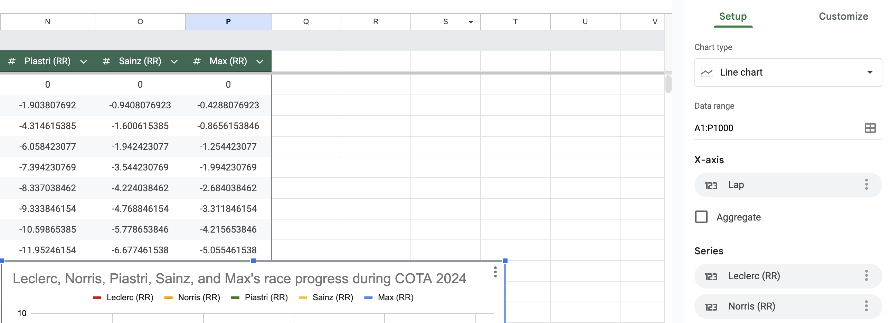

# Google Sheets - Creating Graphics For F1 TV

## Preparing the Table

 - Download [this file](./data/cota_2024.csv).
   As you will see shortly,
   this CSV file contains data
   for a Formula 1 Race at the *Circuit of the Americas (COTA)* in 2024.
 - **NOTE.** The parentheses in the previous bullet point were used to introduce a new abbreviation.
   This formatting is standard practice and you will see it in many scientific articles.
 - **ASIDE.** For those who know and love Formula 1,
   the times of the first five laps were impacted by a safety car,
   and so they have been replaced to make the data nicer to work with.
 - Save the file in the folder `/Users/YOUR_NAME/Documents/UCLA-Classes/PIC-1/3-Spreadsheets`.
 - Through your g.ucla.edu email,
   open [Google Sheets](https://docs.google.com/spreadsheets){:target="_blank"}.
 - Click on `Blank spreadsheet`.
 - Select `File > Open`.
 - Select `Upload > Browse`.
 - Open the file that you just downloaded.
 - Select `Format > Convert to table` from the top menu.
 - Click at the top of the table (dark green)
   where it says `Table1` and edit it to say `cota_2024`.
 - Now use the arrows in the column headings
   to change the datatypes to *number*
   for each column except the first.
   - This is a little bit tedious, but it is useful for helping us catch errors.
 - Select columns `A` to `P` and then
   select `Format > Alignment > Center` from the top menu.
   

## About a Formula One Race

*Formula One (F1)* races involve around 20 drivers
driving their cars around a racetrack.
One complete traverse of a racetrack is referred to as a *lap*.
The number of laps in a race varies from racetrack to racetrack,
but a race consists of between 40 and 80 laps.
The goal is to cross the finish line first.
Since the drivers drive very quickly, up to 234.9 mph, their tires deteriorate lap by lap.
Ignoring some subtleties, new tires are faster than old tires.
Drivers can take *pit stops* when they wish to change their tires.
However, since a pit stop involves stopping, other drivers might overtake them!
Using electronic tracking devices, each lap of a driver's race is timed precisely to within 1 millisecond.

## Processing Formulas

 - The table contains *lap times (L)* in seconds
   for the five top-finishing drivers.
   - The drivers' names are
     Charles **Leclerc**,
     Lando **Norris**,
     Oscar **Piastri**,
     Carlos **Sainz**,
     and **Max** Verstappen
     (a multiple world champion,
     so his first name identifies him
     to anyone who knows a thing
     or two about Formula 1).
   - It also contains some zeros which you can ignore until the very end.
 - First, we calculate the average lap time of each driver.
   
   - Type `= AVERAGE(B3:B54)` into cell `B55`.
   - Obtain formulas in cells `C55`, `D55`, `E55`, and `F55` by "dragging".
 - We would like to understand each driver's race progress lap by lap.
   To do this, for each driver and each lap,
   we will record the driver's race time at the end of that lap.
   A driver's *race time (R)* at the end of their first n laps
   is given by the sum of that driver's first n *lap times (L)*.
   For example, a driver's race time at the end of their first 5 laps
   is given by the sum of that driver's first 5 lap times.

   
   - Type `= SUM(B$3:B3)` into `G3`.
   - Obtain formulas in cells `H3`, `I3`, `J3`, and `K3` by "dragging".
   - Obtain formulas in rows `3` to `54` by "dragging" again.
   - These "drags" should have filled up cells `G3` to `K54` with values.
   - The `$` in front of the first `3` that we typed ensures that
     "dragging" always produces a `3` in this part of the formula.
     For example, `H8` contains the formula `= SUM(C$3:C8)`.
     `B`s have changed to `C`s and
     the second `3` has changed to an `8`,
     but the first `3` has remained as `3`.
 - Create a quick chart for this data.
   
   - Highlight columns `G` to `K` and select `Insert > Chart`.
   - The exact appearance for your chart may differ from the screenshot above.
   - We can see that the drivers' race times (R) create
     something close to a straight line. Why is this?
     Using this chart,
     we are sometimes able
     to identify the driver
     who finishes a lap first
     (that is, in the least time),
     but this requires us to zoom in a lot.
     Sometimes the resolution is not good enough
     for us to be able to read this information.
   - This chart is not very convenient, so delete it.
 - On 8/3/2025, F1 TV showed the following graphic
   for the Hungarian Grand Prix to show the progress
   of the four top-finishing drivers:
   Lando **Norris**,
   Oscar **Piastri**,
   George **Russell**,
   and Charles **Leclerc**.
   The graph was intuitive to read
   *for those who watched the race*.
   However, the $y$-axis is misleadingly labeled
   and it caused an expert of mathematics and a fan of F1
   to stop and ponder the graphic for a good amount of time.
   Therefore, it is quite reasonable to be confused by it,
   but perhaps you can answer the following questions.
    - Who do you think won the race?
      The internet knows!
    - Who was in the lead after lap 10?
    - Who was furthest back of the four drivers after lap 10?
    - Who was in the lead after lap 25?
    - Who was furthest back of the four drivers after lap 25?
    - Who was in the lead after lap 35?
    - Who was furthest back of the four drivers after lap 35?
    - Who was second and third on lap 50?
   
 - To create a chart for COTA 2024 like the one from Hungary 2025,
   we subtract the drivers' race times (R) from a straight line
   whose slope is given by the average lap time of [Charles Leclerc](https://www.youtube.com/watch?v=S0TeJKUYTxw){:target="_blank"}.
   This gives (the negative of) each driver's *relative race time (RR)*,
   relative to an imaginary driver that drives at Leclerc's average speed
   throughout the race.
   
   *Note: this screenshot hides columns `G` to `K` and rows `11` to `51`.*
   - Type `= $A3 * $B$55 - G3` into `L3`.
   - Obtain formulas in cells `M3`, `N3`, `O3`, and `P3` by "dragging".
   - Obtain formulas in rows `3` to `54` by "dragging" again.
   - These "drags" should have filled up cells `L3` to `P54` with values.
   - The value in `L54` should be `0`.
   - We typed three `$`s in cell `L3`.
     - The `$` in front of the `A` ensures that
       "dragging" always produces an `A` in this part of the formula.
     - The `$`s in front of `B` and `55` ensure that
       "dragging" always produces `B55` in this part of the formula.
     - For example, `M8` contains the formula `= $A8 * $B$55 - H8`.
       `G` has changed to an `H`, and the `3`s have changed to `8`s,
       but `A` has remained as `A`, and `B55` has remained as `B55`.
 - Create a nice chart for this data.
   - Hide columns `B` to `K`.
     - Select columns `B` to `K`.
     - Right-click (or two-finger tap) where it says `B`.
     - Select `Hide columns B - K`.
   - Highlight column `A`, together with columns and `L` to `P`,
     and select `Insert > Chart`.
     
   - Using the "Chart editor",
     click `Add X-axis` and select `Lap`.
   - Click on the three dots underneath "Series", next to `Lap`,
     and select `Remove`.
     
   - Click `Customize`, followed by `Chart & axis titles`, and set the "Title text" to be
     `Leclerc, Norris, Piastri, Sainz, and Max's race progress during COTA 2024`.
   - If you are a Formula 1 fan,
     you may feel obliged to click `Customize`, followed by `Series`,
     and to select a more appropriate "Line color" for each driver.
     I liked the following colors.
     - Red for [Leclerc](https://www.youtube.com/watch?v=C04OevmYqkQ){:target="_blank"} (Ferrari)
     - Orange for Norris (McLaren)
     - Green for Piastri (Australia)
     - Gold for Sainz (Spain)
     - Blue for Max (Red Bull)

## Data Analysis

### COTA 2024

Using the chart that you just created, answer the following questions.

 - Who won the race?
 - Between Norris and Max, who was ahead on lap 35?
 - Between Norris and Max, who was ahead on lap 50?
 - Therefore, between Norris and Max, who was faster on average between lap 35 and lap 50?
 - Between lap 30 and lap 38, were any of Max's lap times shorter than Norris'?
   - **Note.** If the chart does not reveal the answer to you, then you can look at the original data.
   - What aspect of the chart supports your answer to this question?
 - What significant event took place on lap 48?
 - Was the time difference between
   the drivers involved in the event on lap 48
   more or less than 5 seconds *at the end of the race*?
 - Norris received a 5-second penalty,
   and this was added to his total time
   after the race.
   Accounting for Norris' penalty,
   what was the finishing order of the drivers?
 - At this circuit, drivers enter the pits
   to change their tires at the *end* of their lap,
   and this causes their *next* lap to be much slower.
   - What significant event took place on lap 17?
   - What significant event took place on lap 21?
   - What was the lasting consequence of these two events for the two drivers involved? 
     This is called an "undercut" and is the result of newer tires being faster than older tires.
 - For fans of Formula 1 who remember the exact laps that these events occurred on,
   you might notice that the lap numbers are incorrect. This is because the data
   was "cleaned" to ignore the safety car at the start of the race.

 

### Hungary 2025

We can now understand Formula 1 TV's graphic much better!

 - Who had the most depressing race? This is a common theme in F1.
 - From lap 22 to lap 26 who was faster -- Norris or Piastri?
 - From lap 52 to lap 58 who was faster -- Norris or Piastri?
 - Ignoring the pit stops, for the most part, who was faster -- Norris or Piastri?
 - Who won the race?
 - How was Norris' pit stop strategy different than that of
   Piastri, Russell, and Leclerc in Hungary 2025?
 - "The driver who drives the fastest always wins the race." True or false? 

## Avoiding Numerical Errors and Being Efficient

The methods that we used above were chosen to demonstrate how `$` can be used in spreadsheets.
In one case, this was the best choice. In the other cases, there were slightly better choices available.

 - We used `$B$55` rather than typing 99.34219231. This is because
   the actual value stored by cell `B55` is closer to 99.3421923076923.
   If you type 99.34219230769 (accurate to 13 significant figures) in
   the original formula in `L33`, and then perform the "dragging" again,
   you will see that numerical errors make the value in `L54` non-zero.

 - The use of `= SUM(B$3:B3)` in `G3` is inefficient.
   Suppose that you are asked to perform the following calculations.
   

     \[\begin{aligned}
       1\ +\ 2\phantom{\ +\ 3\ +\ 4\ +\ 5\ +\ 6\ +\ 7\ +\ 8\ } &=\  3\\
       1\ +\ 2\ +\ 3\phantom{\ +\ 4\ +\ 5\ +\ 6\ +\ 7\ +\ 8\ } &=\  6\\
       1\ +\ 2\ +\ 3\ +\ 4\phantom{\ +\ 5\ +\ 6\ +\ 7\ +\ 8\ } &=\ 10\\
       1\ +\ 2\ +\ 3\ +\ 4\ +\ 5\phantom{\ +\ 6\ +\ 7\ +\ 8\ } &=\ 15\\
       1\ +\ 2\ +\ 3\ +\ 4\ +\ 5\ +\ 6\phantom{\ +\ 7\ +\ 8\ } &=\ 21\\
       1\ +\ 2\ +\ 3\ +\ 4\ +\ 5\ +\ 6\ +\ 7\phantom{\ +\ 8\ } &=\ 28\\
       1\ +\ 2\ +\ 3\ +\ 4\ +\ 5\ +\ 6\ +\ 7\ +\ 8\phantom{\ } &=\ 36\\
     \end{aligned}\]
   

   We can count 28 `+`s, so it looks like we need to perform 28 additions.
   However, we can do better and use only 7 additions
   by remembering the result of each calculation to help us with the next.
   

     \[\begin{aligned}
        1\ +\ 2\ &=\  3\\
        3\ +\ 3\ &=\  6\\
        6\ +\ 4\ &=\ 10\\
       10\ +\ 5\ &=\ 15\\
       15\ +\ 6\ &=\ 21\\
       21\ +\ 7\ &=\ 28\\
       28\ +\ 8\ &=\ 36\\
     \end{aligned}\]
   

   We can perform the same trick in Google Sheets
   by typing `= G2 + B3` into `G3` before performing our "dragging".
   The zeros in row `2` provide a natural starting value for the accumulations.
   Moreover, this procedure is closer to how one calculates sums when using Python.

   In this example, such efficiency concerns do not matter much.
   Our computers are very quick, and there is not a lot of data.
   In problems that have lots of data, or in algorithms that
   need to adhere to a schedule (real-time audio algorithms),
   such considerations can be the difference between the code
   finishing its task or adhering to its schedule, or failing to do so.

 - We could have calculated each driver's relative race (RR) times immediately
   from their lap (L) times by typing `= L2 + $B$55 - B3` into `L3` before
   performing our "dragging".

 - For each of these comments,
   you can edit the discussed formulae to investigate the consequences.

## Summary

Well done!

You analyzed some data that was probably very unfamiliar to you before today,
and you did so by using formulas in Google Sheets that crucially make use of `$`.
